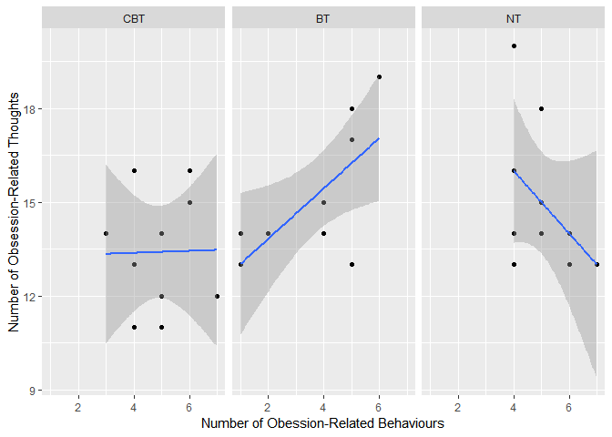
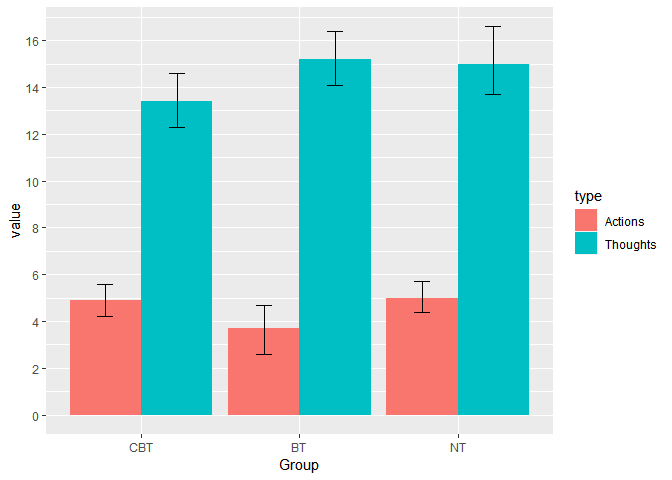
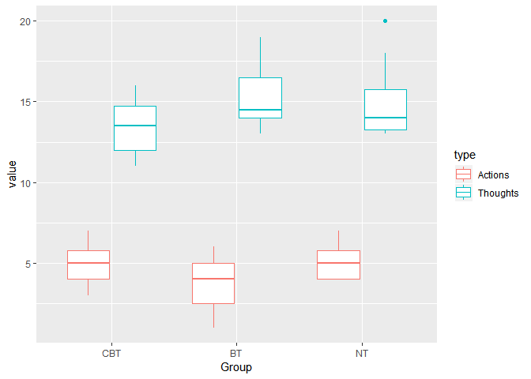
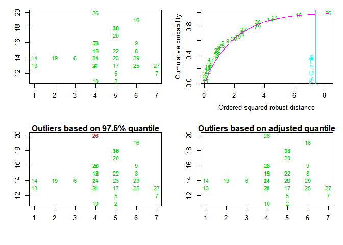

ch016\_2(다변량분산분석)
================
jakinpilla
2020-02-18

  - [R을 이용한 다변량분산분석](#r을-이용한-다변량분산분석)
      - [자료입력](#자료입력)

``` r
library(ez)
library(ggplot2)
library(nlme)
library(pastecs)
library(reshape2)
library(WRS)
library(clinfun)
library(pgirmess)
library(car)
library(tidyverse)
# install.packages('mvoutlier')
library(mvoutlier)
```

### R을 이용한 다변량분산분석

#### 자료입력

``` r
ocdData <- read.delim('OCD.dat', header = T)


ocdData$Group <- factor(ocdData$Group, levels = c('CBT', 'BT', 'No Treatment Control'), 
                        labels = c('CBT', 'BT', 'NT'))


ocd_scatter <- ggplot(ocdData, aes(Actions, Thoughts))
ocd_scatter + 
  geom_point() +
  geom_smooth(method = 'lm') +
  facet_wrap(~ Group, ncol = 3) +
  labs(x = "Number of Obession-Related Behaviours", y = "Number of Obsession-Related Thoughts")
```

<!-- -->

``` r
ocdData %>%
  gather(type, value, -Group) -> molten_ocd_data 

molten_ocd_data %>% str()
```

    ## 'data.frame':    60 obs. of  3 variables:
    ##  $ Group: Factor w/ 3 levels "CBT","BT","NT": 1 1 1 1 1 1 1 1 1 1 ...
    ##  $ type : chr  "Actions" "Actions" "Actions" "Actions" ...
    ##  $ value: int  5 5 4 4 5 3 7 6 6 4 ...

``` r
molten_ocd_data %>%
  ggplot(aes(Group, value, fill = type)) +
  stat_summary(fun.y = mean, geom = 'bar', position = 'dodge') +
  stat_summary(fun.data = mean_cl_boot, geom = 'errorbar', position = position_dodge(width = .90), width = .2) +
  scale_y_continuous(breaks = seq(0, 20, by = 2))
```

<!-- -->

강박관련 행동(Actions)의 경우, CBT와 NT에 비해 BT 그룹의 평균 횟수가 적다.

강박관련 생각(Thoughts)의 경우, BT와 NT에 비해 CBT 그룹의 평균 횟수가 적다.

``` r
molten_ocd_data %>% 
  as_tibble() %>%
  ggplot(aes(Group, value, colour = type)) +
  geom_boxplot()
```

<!-- -->

기술통계량을 살펴본다.

``` r
by(ocdData$Actions, ocdData$Group, stat.desc, basic = F)
```

    ## ocdData$Group: CBT
    ##       median         mean      SE.mean CI.mean.0.95          var 
    ##    5.0000000    4.9000000    0.3785939    0.8564389    1.4333333 
    ##      std.dev     coef.var 
    ##    1.1972190    0.2443304 
    ## -------------------------------------------------------- 
    ## ocdData$Group: BT
    ##       median         mean      SE.mean CI.mean.0.95          var 
    ##    4.0000000    3.7000000    0.5587685    1.2640221    3.1222222 
    ##      std.dev     coef.var 
    ##    1.7669811    0.4775625 
    ## -------------------------------------------------------- 
    ## ocdData$Group: NT
    ##       median         mean      SE.mean CI.mean.0.95          var 
    ##    5.0000000    5.0000000    0.3333333    0.7540524    1.1111111 
    ##      std.dev     coef.var 
    ##    1.0540926    0.2108185

``` r
by(ocdData$Thoughts, ocdData$Group, stat.desc, basic = F)
```

    ## ocdData$Group: CBT
    ##       median         mean      SE.mean CI.mean.0.95          var 
    ##   13.5000000   13.4000000    0.6000000    1.3572943    3.6000000 
    ##      std.dev     coef.var 
    ##    1.8973666    0.1415945 
    ## -------------------------------------------------------- 
    ## ocdData$Group: BT
    ##       median         mean      SE.mean CI.mean.0.95          var 
    ##   14.5000000   15.2000000    0.6633250    1.5005453    4.4000000 
    ##      std.dev     coef.var 
    ##    2.0976177    0.1380012 
    ## -------------------------------------------------------- 
    ## ocdData$Group: NT
    ##       median         mean      SE.mean CI.mean.0.95          var 
    ##   14.0000000   15.0000000    0.7453560    1.6861124    5.5555556 
    ##      std.dev     coef.var 
    ##    2.3570226    0.1571348

가정들을 점검하자. 공분산행렬의 동질성을 점검해주는 함수가 따로 있지는 않다. 행렬의 성분들을 보고 직접 판단해야 한다.

``` r
by(ocdData[, 2:3], ocdData$Group, cov)
```

    ## ocdData$Group: CBT
    ##             Actions   Thoughts
    ## Actions  1.43333333 0.04444444
    ## Thoughts 0.04444444 3.60000000
    ## -------------------------------------------------------- 
    ## ocdData$Group: BT
    ##           Actions Thoughts
    ## Actions  3.122222 2.511111
    ## Thoughts 2.511111 4.400000
    ## -------------------------------------------------------- 
    ## ocdData$Group: NT
    ##            Actions  Thoughts
    ## Actions   1.111111 -1.111111
    ## Thoughts -1.111111  5.555556

행렬의 대각성분은 각 결과변수의 분산이고, 비대각성분들은 공분산이다.

행동횟수의 분산들은 각 그룹마다 1.43, 3.12, 1.11이다.

생각회수의 분산들은 각 그룹마다 각각 3.60, 4.40, 5.56이다.

공분산들은 각 그룹마다 .04, 2.51, -1.11이다. 이는 생각 횟수와 행동 횟수의 관계가 그룹마다 다르다는 사실을
반영한다.

전체적으로 볼때 행렬들이 그룹에 따라 다름을 암시하는 증거가 존재한다.

만일 그룹 크기들이 다르다면 다음 두 사항을 염두에 두어야 한다. - (1) 만일 큰 표본들에서 큰 분산과 공분산이 나오면,
유의확률은 보수적이 된다. - (2) 작은 표본들에서 큰 분산과 공분산이 나오면 유의확률이 느슨해지므로, 다변량분산분석
결과의 유의한 차이를 신중하게 취급하는 것이 바람직하다.

다변량 정규성은 `mvnormtest::mshapiro.test()`로 점검할 수 있다.

``` r
# install.packages('mvnormtest')
library(mvnormtest)
ocdData$Group %>% unique()
```

    ## [1] CBT BT  NT 
    ## Levels: CBT BT NT

``` r
ocdData %>%
  filter(Group == 'CBT') %>%
  select(Actions, Thoughts) %>%
  t() -> cbt; cbt
```

    ##          [,1] [,2] [,3] [,4] [,5] [,6] [,7] [,8] [,9] [,10]
    ## Actions     5    5    4    4    5    3    7    6    6     4
    ## Thoughts   14   11   16   13   12   14   12   15   16    11

``` r
ocdData %>%
  filter(Group == 'BT') %>%
  select(Actions, Thoughts) %>%
  t() -> bt; bt
```

    ##          [,1] [,2] [,3] [,4] [,5] [,6] [,7] [,8] [,9] [,10]
    ## Actions     4    4    1    1    4    6    5    5    2     5
    ## Thoughts   14   15   13   14   15   19   13   18   14    17

``` r
ocdData %>%
  filter(Group == 'NT') %>%
  select(Actions, Thoughts) %>%
  t() -> nt; nt
```

    ##          [,1] [,2] [,3] [,4] [,5] [,6] [,7] [,8] [,9] [,10]
    ## Actions     4    5    5    4    6    4    7    4    6     5
    ## Thoughts   13   15   14   14   13   20   13   16   14    18

``` r
mshapiro.test(cbt)
```

    ## 
    ##  Shapiro-Wilk normality test
    ## 
    ## data:  Z
    ## W = 0.9592, p-value = 0.7767

``` r
mshapiro.test(bt)
```

    ## 
    ##  Shapiro-Wilk normality test
    ## 
    ## data:  Z
    ## W = 0.89122, p-value = 0.175

``` r
mshapiro.test(nt)
```

    ## 
    ##  Shapiro-Wilk normality test
    ## 
    ## data:  Z
    ## W = 0.82605, p-value = 0.02998

CBT 그룹(p = .777)과 BT 그룹(p = .175)은 유의하지 않으므로 다변량정규성에서 문제가 없다. 그러나 NT
그룹(p = .03)의 자료는 다변량정규성에서 유의하게 벗어났다.

`aq.plot()` 함수로 다변량 이상치들을 살펴볼 수 있다.

``` r
library(mvoutlier)
aq.plot(ocdData[, 2:3])
```

<!-- -->

    ## $outliers
    ##  [1] FALSE FALSE FALSE FALSE FALSE FALSE FALSE FALSE FALSE FALSE FALSE
    ## [12] FALSE FALSE FALSE FALSE FALSE FALSE FALSE FALSE FALSE FALSE FALSE
    ## [23] FALSE FALSE FALSE FALSE FALSE FALSE FALSE FALSE
