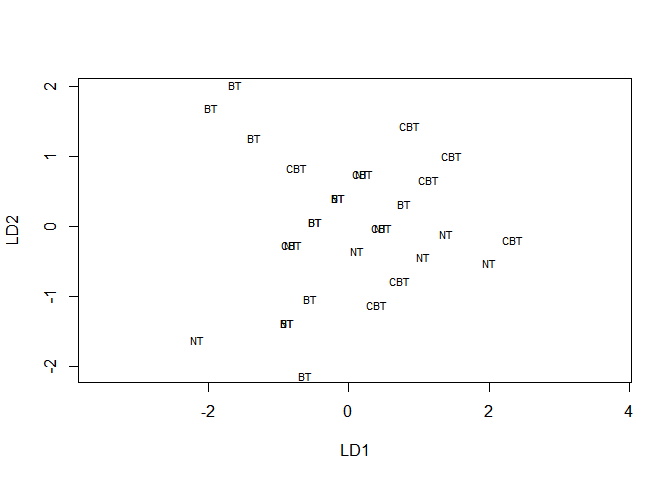

ch016\_2(다변량분산분석)
================
jakinpilla
2020-02-23

  - [R을 이용한 다변량분산분석](#r을-이용한-다변량분산분석)
      - [자료입력](#자료입력)
      - [대비설정](#대비설정)
      - [다변량분산분석 모형](#다변량분산분석-모형)
      - [사후분석: 일변량 검정통계량](#사후분석-일변량-검정통계량)
      - [대비 결과](#대비-결과)
      - [핵심정리](#핵심정리)
      - [강건한 다변량분산분석](#강건한-다변량분산분석)
      - [다변량분산분석 결과의 보고](#다변량분산분석-결과의-보고)
      - [다변량분산분석에 대한 후속 분석으로서의 판별분석](#다변량분산분석에-대한-후속-분석으로서의-판별분석)
      - [추가설명](#추가설명)
      - [일변량분산분석 대 판별분석의 선택](#일변량분산분석-대-판별분석의-선택)
      - [똑똑한 알렉스의 과제](#똑똑한-알렉스의-과제)

``` r
library(ez)
library(ggplot2)
library(nlme)
library(pastecs)
library(reshape2)
library(WRS)
library(clinfun)
library(pgirmess)
library(car)
library(tidyverse)
# install.packages('mvoutlier')
library(mvoutlier)
```

### R을 이용한 다변량분산분석

#### 자료입력

``` r
ocdData <- read.delim('OCD.dat', header = T)


ocdData$Group <- factor(ocdData$Group, levels = c('CBT', 'BT', 'No Treatment Control'), 
                        labels = c('CBT', 'BT', 'NT'))


ocd_scatter <- ggplot(ocdData, aes(Actions, Thoughts))
ocd_scatter + 
  geom_point() +
  geom_smooth(method = 'lm') +
  facet_wrap(~ Group, ncol = 3) +
  labs(x = "Number of Obession-Related Behaviours", y = "Number of Obsession-Related Thoughts")
```

<!-- -->

``` r
ocdData %>%
  gather(type, value, -Group) -> molten_ocd_data 

molten_ocd_data %>% str()
```

    ## 'data.frame':    60 obs. of  3 variables:
    ##  $ Group: Factor w/ 3 levels "CBT","BT","NT": 1 1 1 1 1 1 1 1 1 1 ...
    ##  $ type : chr  "Actions" "Actions" "Actions" "Actions" ...
    ##  $ value: int  5 5 4 4 5 3 7 6 6 4 ...

``` r
molten_ocd_data %>%
  ggplot(aes(Group, value, fill = type)) +
  stat_summary(fun.y = mean, geom = 'bar', position = 'dodge') +
  stat_summary(fun.data = mean_cl_boot, geom = 'errorbar', position = position_dodge(width = .90), width = .2) +
  scale_y_continuous(breaks = seq(0, 20, by = 2))
```

<!-- -->

강박관련 행동(Actions)의 경우, CBT와 NT에 비해 BT 그룹의 평균 횟수가 적다.

강박관련 생각(Thoughts)의 경우, BT와 NT에 비해 CBT 그룹의 평균 횟수가 적다.

``` r
molten_ocd_data %>% 
  as_tibble() %>%
  ggplot(aes(Group, value, colour = type)) +
  geom_boxplot()
```

<!-- -->

기술통계량을 살펴본다.

``` r
by(ocdData$Actions, ocdData$Group, stat.desc, basic = F)
```

    ## ocdData$Group: CBT
    ##       median         mean      SE.mean CI.mean.0.95          var 
    ##    5.0000000    4.9000000    0.3785939    0.8564389    1.4333333 
    ##      std.dev     coef.var 
    ##    1.1972190    0.2443304 
    ## -------------------------------------------------------- 
    ## ocdData$Group: BT
    ##       median         mean      SE.mean CI.mean.0.95          var 
    ##    4.0000000    3.7000000    0.5587685    1.2640221    3.1222222 
    ##      std.dev     coef.var 
    ##    1.7669811    0.4775625 
    ## -------------------------------------------------------- 
    ## ocdData$Group: NT
    ##       median         mean      SE.mean CI.mean.0.95          var 
    ##    5.0000000    5.0000000    0.3333333    0.7540524    1.1111111 
    ##      std.dev     coef.var 
    ##    1.0540926    0.2108185

``` r
by(ocdData$Thoughts, ocdData$Group, stat.desc, basic = F)
```

    ## ocdData$Group: CBT
    ##       median         mean      SE.mean CI.mean.0.95          var 
    ##   13.5000000   13.4000000    0.6000000    1.3572943    3.6000000 
    ##      std.dev     coef.var 
    ##    1.8973666    0.1415945 
    ## -------------------------------------------------------- 
    ## ocdData$Group: BT
    ##       median         mean      SE.mean CI.mean.0.95          var 
    ##   14.5000000   15.2000000    0.6633250    1.5005453    4.4000000 
    ##      std.dev     coef.var 
    ##    2.0976177    0.1380012 
    ## -------------------------------------------------------- 
    ## ocdData$Group: NT
    ##       median         mean      SE.mean CI.mean.0.95          var 
    ##   14.0000000   15.0000000    0.7453560    1.6861124    5.5555556 
    ##      std.dev     coef.var 
    ##    2.3570226    0.1571348

가정들을 점검하자. 공분산행렬의 동질성을 점검해주는 함수가 따로 있지는 않다. 행렬의 성분들을 보고 직접 판단해야 한다.

``` r
by(ocdData[, 2:3], ocdData$Group, cov)
```

    ## ocdData$Group: CBT
    ##             Actions   Thoughts
    ## Actions  1.43333333 0.04444444
    ## Thoughts 0.04444444 3.60000000
    ## -------------------------------------------------------- 
    ## ocdData$Group: BT
    ##           Actions Thoughts
    ## Actions  3.122222 2.511111
    ## Thoughts 2.511111 4.400000
    ## -------------------------------------------------------- 
    ## ocdData$Group: NT
    ##            Actions  Thoughts
    ## Actions   1.111111 -1.111111
    ## Thoughts -1.111111  5.555556

행렬의 대각성분은 각 결과변수의 분산이고, 비대각성분들은 공분산이다.

행동횟수의 분산들은 각 그룹마다 1.43, 3.12, 1.11이다.

생각회수의 분산들은 각 그룹마다 각각 3.60, 4.40, 5.56이다.

공분산들은 각 그룹마다 .04, 2.51, -1.11이다. 이는 생각 횟수와 행동 횟수의 관계가 그룹마다 다르다는 사실을
반영한다.

전체적으로 볼때 행렬들이 그룹에 따라 다름을 암시하는 증거가 존재한다.

만일 그룹 크기들이 다르다면 다음 두 사항을 염두에 두어야 한다. - (1) 만일 큰 표본들에서 큰 분산과 공분산이 나오면,
유의확률은 보수적이 된다. - (2) 작은 표본들에서 큰 분산과 공분산이 나오면 유의확률이 느슨해지므로, 다변량분산분석
결과의 유의한 차이를 신중하게 취급하는 것이 바람직하다.

다변량 정규성은 `mvnormtest::mshapiro.test()`로 점검할 수 있다.

``` r
# install.packages('mvnormtest')
library(mvnormtest)
ocdData$Group %>% unique()
```

    ## [1] CBT BT  NT 
    ## Levels: CBT BT NT

``` r
ocdData %>%
  filter(Group == 'CBT') %>%
  select(Actions, Thoughts) %>%
  t() -> cbt; cbt
```

    ##          [,1] [,2] [,3] [,4] [,5] [,6] [,7] [,8] [,9] [,10]
    ## Actions     5    5    4    4    5    3    7    6    6     4
    ## Thoughts   14   11   16   13   12   14   12   15   16    11

``` r
ocdData %>%
  filter(Group == 'BT') %>%
  select(Actions, Thoughts) %>%
  t() -> bt; bt
```

    ##          [,1] [,2] [,3] [,4] [,5] [,6] [,7] [,8] [,9] [,10]
    ## Actions     4    4    1    1    4    6    5    5    2     5
    ## Thoughts   14   15   13   14   15   19   13   18   14    17

``` r
ocdData %>%
  filter(Group == 'NT') %>%
  select(Actions, Thoughts) %>%
  t() -> nt; nt
```

    ##          [,1] [,2] [,3] [,4] [,5] [,6] [,7] [,8] [,9] [,10]
    ## Actions     4    5    5    4    6    4    7    4    6     5
    ## Thoughts   13   15   14   14   13   20   13   16   14    18

``` r
mshapiro.test(cbt)
```

    ## 
    ##  Shapiro-Wilk normality test
    ## 
    ## data:  Z
    ## W = 0.9592, p-value = 0.7767

``` r
mshapiro.test(bt)
```

    ## 
    ##  Shapiro-Wilk normality test
    ## 
    ## data:  Z
    ## W = 0.89122, p-value = 0.175

``` r
mshapiro.test(nt)
```

    ## 
    ##  Shapiro-Wilk normality test
    ## 
    ## data:  Z
    ## W = 0.82605, p-value = 0.02998

CBT 그룹(p = .777)과 BT 그룹(p = .175)은 유의하지 않으므로 다변량정규성에서 문제가 없다. 그러나 NT
그룹(p = .03)의 자료는 다변량정규성에서 유의하게 벗어났다.

`aq.plot()` 함수로 다변량 이상치들을 살펴볼 수 있다.

``` r
library(mvoutlier)
aq.plot(ocdData[, 2:3])
```

<!-- -->

    ## $outliers
    ##  [1] FALSE FALSE FALSE FALSE FALSE FALSE FALSE FALSE FALSE FALSE FALSE
    ## [12] FALSE FALSE FALSE FALSE FALSE FALSE FALSE FALSE FALSE FALSE FALSE
    ## [23] FALSE FALSE FALSE FALSE FALSE FALSE FALSE FALSE

오른쪽 위 그래프를 제외한 세 그래프에서 빨간색 변호를 찾아봐야 한다. 네 그림 모두 26번 사례를 이상치로 제시한다.

#### 대비설정

지금 자료에서 비치료 대조군은 마지막 범주로 부호화되어 있으므로, 다음과 같이 대비를 설정한다.

``` r
contrasts(ocdData$Group) <- contr.treatment(3, base = 3)
```

혹은 각 대비에 의미있는 이름을 부여하며 직접 대비를 설정할 수 있다.

``` r
CBT_vs_NT <- c(1, 0, 0)
BT_vs_NT <- c(0, 1, 0)
contrasts(ocdData$Group) <- cbind(CBT_vs_NT, BT_vs_NT)
ocdData %>% str()
```

    ## 'data.frame':    30 obs. of  3 variables:
    ##  $ Group   : Factor w/ 3 levels "CBT","BT","NT": 1 1 1 1 1 1 1 1 1 1 ...
    ##   ..- attr(*, "contrasts")= num [1:3, 1:2] 1 0 0 0 1 0
    ##   .. ..- attr(*, "dimnames")=List of 2
    ##   .. .. ..$ : chr  "CBT" "BT" "NT"
    ##   .. .. ..$ : chr  "CBT_vs_NT" "BT_vs_NT"
    ##  $ Actions : int  5 5 4 4 5 3 7 6 6 4 ...
    ##  $ Thoughts: int  14 11 16 13 12 14 12 15 16 11 ...

#### 다변량분산분석 모형

모형 서술에 여러개의 결과변수를 지정하려면 그 변수들을 cbind() 함수를 이용해 하나의 객체로 묶어야 한다.

``` r
outcome <- cbind(ocdData$Actions, ocdData$Thoughts)

ocdModel <- manova(outcome ~ Group, data = ocdData)
```

필라이 대각합

``` r
summary(ocdModel, intercept = T) # 유의하다
```

    ##             Df  Pillai approx F num Df den Df  Pr(>F)    
    ## (Intercept)  1 0.98285   745.23      2     26 < 2e-16 ***
    ## Group        2 0.31845     2.56      4     54 0.04904 *  
    ## Residuals   27                                           
    ## ---
    ## Signif. codes:  0 '***' 0.001 '**' 0.01 '*' 0.05 '.' 0.1 ' ' 1

윌크스 람다

``` r
summary(ocdModel, intercept = T, test = 'Wilks') # 유의하다
```

    ##             Df   Wilks approx F num Df den Df  Pr(>F)    
    ## (Intercept)  1 0.01715   745.23      2     26 < 2e-16 ***
    ## Group        2 0.69851     2.55      4     52 0.04966 *  
    ## Residuals   27                                           
    ## ---
    ## Signif. codes:  0 '***' 0.001 '**' 0.01 '*' 0.05 '.' 0.1 ' ' 1

호텔링 대각합

``` r
summary(ocdModel, intercept = T, test = 'Hotelling') # 유의하지 않다.
```

    ##             Df Hotelling-Lawley approx F num Df den Df Pr(>F)    
    ## (Intercept)  1           57.325   745.23      2     26 <2e-16 ***
    ## Group        2            0.407     2.55      4     50 0.0508 .  
    ## Residuals   27                                                   
    ## ---
    ## Signif. codes:  0 '***' 0.001 '**' 0.01 '*' 0.05 '.' 0.1 ' ' 1

로이의 최대근

``` r
summary(ocdModel, intercept = T, test = 'Roy') # 유의하다
```

    ##             Df    Roy approx F num Df den Df  Pr(>F)    
    ## (Intercept)  1 57.325   745.23      2     26 < 2e-16 ***
    ## Group        2  0.335     4.52      2     27 0.02027 *  
    ## Residuals   27                                          
    ## ---
    ## Signif. codes:  0 '***' 0.001 '**' 0.01 '*' 0.05 '.' 0.1 ' ' 1

표본 크기가 같을때의 필라이 대각합의 강건성을 생각해보면, 필라이 대각합이 말해주는 결론을 믿는 것이 바람직하다.

그러므로 치료의 종류가 강박 장애에 유의한 효과가 있었다고 결론지어야 할 것이다.

하지만 다변량 검정통계량은 어떤 그룹이 어떤 그룹과 다른지는 말해주지 않는다. 그리고 치료의 효과가 강박 관련 생각에 효과가
있었는지, 강박 관련 행동에 효과가 있었는지, 또는 둘의 조합에 효과가 있었는지 말해주지도 않는다. 효과의 본성을
파악하려면 일변량 검정통계량을 수행해봐야 한다.

#### 사후분석: 일변량 검정통계량

``` r
summary.aov(ocdModel)
```

    ##  Response 1 :
    ##             Df Sum Sq Mean Sq F value  Pr(>F)  
    ## Group        2 10.467  5.2333  2.7706 0.08046 .
    ## Residuals   27 51.000  1.8889                  
    ## ---
    ## Signif. codes:  0 '***' 0.001 '**' 0.01 '*' 0.05 '.' 0.1 ' ' 1
    ## 
    ##  Response 2 :
    ##             Df  Sum Sq Mean Sq F value Pr(>F)
    ## Group        2  19.467  9.7333  2.1541 0.1355
    ## Residuals   27 122.000  4.5185

비치료 그룹에 비한 치료 그룹들의 차이는 강박 관련 행동에서나 강박 관련 생각에서나 유의하지 않았다. 이 두 결과에 따르면,
환자들이 겪는 강박 장애의 수준에 대한 치료 종류의 효과가 유의하지 않았다고 결론지어야 할 것이다.

종속변수들의 상호작용 방식을 파악하려면 잠시 후에 설명할 판별함수 분석이란는 것을 수행해야 한다.

#### 대비 결과

``` r
actionModel <- lm(Actions ~ Group, data = ocdData)
thoughtModel <- lm(Thoughts ~ Group, data = ocdData)

summary.lm(actionModel)
```

    ## 
    ## Call:
    ## lm(formula = Actions ~ Group, data = ocdData)
    ## 
    ## Residuals:
    ##    Min     1Q Median     3Q    Max 
    ## -2.700 -0.975  0.100  1.075  2.300 
    ## 
    ## Coefficients:
    ##                Estimate Std. Error t value Pr(>|t|)    
    ## (Intercept)      5.0000     0.4346  11.504 6.47e-12 ***
    ## GroupCBT_vs_NT  -0.1000     0.6146  -0.163   0.8720    
    ## GroupBT_vs_NT   -1.3000     0.6146  -2.115   0.0438 *  
    ## ---
    ## Signif. codes:  0 '***' 0.001 '**' 0.01 '*' 0.05 '.' 0.1 ' ' 1
    ## 
    ## Residual standard error: 1.374 on 27 degrees of freedom
    ## Multiple R-squared:  0.1703, Adjusted R-squared:  0.1088 
    ## F-statistic: 2.771 on 2 and 27 DF,  p-value: 0.08046

``` r
summary.lm(thoughtModel)
```

    ## 
    ## Call:
    ## lm(formula = Thoughts ~ Group, data = ocdData)
    ## 
    ## Residuals:
    ##    Min     1Q Median     3Q    Max 
    ##  -2.40  -1.40  -0.70   1.45   5.00 
    ## 
    ## Coefficients:
    ##                Estimate Std. Error t value Pr(>|t|)    
    ## (Intercept)     15.0000     0.6722  22.315   <2e-16 ***
    ## GroupCBT_vs_NT  -1.6000     0.9506  -1.683    0.104    
    ## GroupBT_vs_NT    0.2000     0.9506   0.210    0.835    
    ## ---
    ## Signif. codes:  0 '***' 0.001 '**' 0.01 '*' 0.05 '.' 0.1 ' ' 1
    ## 
    ## Residual standard error: 2.126 on 27 degrees of freedom
    ## Multiple R-squared:  0.1376, Adjusted R-squared:  0.07372 
    ## F-statistic: 2.154 on 2 and 27 DF,  p-value: 0.1355

이전에 대비들을 직접 설정한 덕분에, 출력에 의미있는 대비 이름들이 표시되었다.(GroupCBT\_vs\_NT,
GroupBT\_vs\_NT)

GroupCBT\_vs\_NT의 경우, 생각회수수의 차이와 행동횟수의 차이가 모두 유의하지 않다.

GroupBT\_vs\_NT의 경우, 생각횟수의 차이는 유의하지 않지만 행동 횟수의 차이는 유의하다. 이는 다소 의외의 결과이다.
행동 횟수에 대한 일변량분산분석이 유의하지 않았으므로 그룹들이 다르지 않을 것이라고 기대했는데, 그와는 반대의 결과가 나왔다.

#### 핵심정리

  - 다변량분석은 여러 종속변수를 동시에 고려해서 그룹들의 차이를 검사할 때 쓰인다.

  - 다변량분산분석은 다변량정규성과 공분산행렬의 동질성을 가정한다. 표본 크기들이 같을 때는 후자의 가정을 무시해도 된다. 그런
    경우 일부 다변량분산분석 검정통계량들이 그 가정의 위반에 대해 강건하기 때문이다. 다변량 정규성은 샤피로-윌크 검정의
    다변량 버전으로 점검할 수 있다.

  - 다변량분산분석에 사용할 수 있는 검정통계량은 네 가지이다. (필라이 대각합, 윌크스 람다, 호텔링 대각합, 로이의
    최대근). 그 검정 결과가 유의하면 종속변수에 대한 그룹들의 차이가 유의한 것이다.

  - 다변량 분석 이후에 일변량분산분석으로 결과를 좀 더 분석할 수 있다. 더 나아가서, 각 분산분석을 대비를 이용해서 좀 더
    분석할 수도 있다.

#### 강건한 다변량분산분석

``` r
ocdData %>% as_tibble()
```

    ## # A tibble: 30 x 3
    ##    Group Actions Thoughts
    ##    <fct>   <int>    <int>
    ##  1 CBT         5       14
    ##  2 CBT         5       11
    ##  3 CBT         4       16
    ##  4 CBT         4       13
    ##  5 CBT         5       12
    ##  6 CBT         3       14
    ##  7 CBT         7       12
    ##  8 CBT         6       15
    ##  9 CBT         6       16
    ## 10 CBT         4       11
    ## # ... with 20 more rows

  - `mulrank()`: 이 함수는 뮌첼과 브루너의 방법을 이용해서 순위화한 자료에 대해 다변량분산분석을 수행한다.

  - `cmanova()`: 이 함수는 순위화한 자료에 대해 최와 마든의 강건한 검정을 수행한다. 이것을 크러스컬-윌리스 검정의
    한 형태이다.

위 함수들은 넓은 형식의 자료를 요구한다.

``` r
ocdData$row <- rep(1:10, 3)

ocdData %>% str()
```

    ## 'data.frame':    30 obs. of  4 variables:
    ##  $ Group   : Factor w/ 3 levels "CBT","BT","NT": 1 1 1 1 1 1 1 1 1 1 ...
    ##   ..- attr(*, "contrasts")= num [1:3, 1:2] 1 0 0 0 1 0
    ##   .. ..- attr(*, "dimnames")=List of 2
    ##   .. .. ..$ : chr  "CBT" "BT" "NT"
    ##   .. .. ..$ : chr  "CBT_vs_NT" "BT_vs_NT"
    ##  $ Actions : int  5 5 4 4 5 3 7 6 6 4 ...
    ##  $ Thoughts: int  14 11 16 13 12 14 12 15 16 11 ...
    ##  $ row     : int  1 2 3 4 5 6 7 8 9 10 ...

``` r
ocdData %>%
  gather(Outcome_Measure, Frequency, -c(Group, row)) %>%
  mutate(group_outcome_measure = paste0(Group, '_', Outcome_Measure)) %>%
  mutate(group_outcome_measure = factor(group_outcome_measure, 
                                        levels = c('CBT_Actions', 'CBT_Thoughts',
                                                   'BT_Actions', 'BT_Thoughts',
                                                   'NT_Actions', 'NT_Thoughts'))) %>%
  select(row, group_outcome_measure, Frequency) %>%
  spread(group_outcome_measure, Frequency) %>%
  select(-row) -> ocdRobust


ocdRobust
```

    ##    CBT_Actions CBT_Thoughts BT_Actions BT_Thoughts NT_Actions NT_Thoughts
    ## 1            5           14          4          14          4          13
    ## 2            5           11          4          15          5          15
    ## 3            4           16          1          13          5          14
    ## 4            4           13          1          14          4          14
    ## 5            5           12          4          15          6          13
    ## 6            3           14          6          19          4          20
    ## 7            7           12          5          13          7          13
    ## 8            6           15          5          18          4          16
    ## 9            6           16          2          14          6          14
    ## 10           4           11          5          17          5          18

점수들은 총 여섯 그룹인데, 우선은 참가자가 받은 치료의 종류에 따라 세 그룹(CBT, BT, NT)으로 나뉘고, 각 그룹 안에서
측정한 결과이 종류에 따라 두 그룹으로 나뉜다.

``` r
mulrank(3, 2, ocdRobust)
```

    ## $test.stat
    ## [1] 1.637357
    ## 
    ## $nu1
    ## [1] 3.643484
    ## 
    ## $p.value
    ##           [,1]
    ## [1,] 0.1675409
    ## 
    ## $N
    ## [1] 30
    ## 
    ## $q.hat
    ##           [,1]      [,2]
    ## [1,] 0.5533333 0.3666667
    ## [2,] 0.3750000 0.5900000
    ## [3,] 0.5716667 0.5433333

``` r
mulrank(3, 2, ocdRobust)$q.hat -> q_hat

rownames(q_hat) <- c('CBT', 'BT', 'NT')
colnames(q_hat) <- c('Actions', 'Thoughts')

q_hat
```

    ##       Actions  Thoughts
    ## CBT 0.5533333 0.3666667
    ## BT  0.3750000 0.5900000
    ## NT  0.5716667 0.5433333

BT 그룹은 행동 횟수의 순위(.38)가 생각 횟수의 순위(.59)보다 낮고, CBT 그룹은 그 반대이다. 즉, 생각 횟수의
순위(.37)가 행동 횟수의 순위(.55)보다 낮다.

즉, CBT는 행동보다 생각에 더 큰 영향을 미쳤고, BT는 생각보다 행동에 더 큰 영향을 미쳤다. 그러나 전반적인 효과는
유의하지 않았다.

``` r
cmanova(3, 2, ocdRobust)
```

    ## $test.stat
    ## [1] 9.057746
    ## 
    ## $df
    ## [1] 4
    ## 
    ## $p.value
    ##           [,1]
    ## [1,] 0.0596722

 = 9.06, p = .060")으로 유효하지 않았다.

#### 다변량분산분석 결과의 보고

``` r
summary(ocdModel, intercept = T) 
```

    ##             Df  Pillai approx F num Df den Df  Pr(>F)    
    ## (Intercept)  1 0.98285   745.23      2     26 < 2e-16 ***
    ## Group        2 0.31845     2.56      4     54 0.04904 *  
    ## Residuals   27                                           
    ## ---
    ## Signif. codes:  0 '***' 0.001 '**' 0.01 '*' 0.05 '.' 0.1 ' ' 1

강박 관련 생각과 행동 횟수에 대한 치료의 효과는 유의했다.  = 2.65, p \< .05")이다.

  - 필라이 대각합으로 판단할 때, 강박 관련 생각과 행동 횟수에 대한 치료의 효과는 유의했다.  = 2.56, p \< .05")이다.

  - 윌크스 람다 통계량으로 판단할 때, 강박 관련 생각과 행동 횟수에 대한 치료의 효과는 유의했다.  = 2.56, p \< .05")이다.

  - 호텔링 대각합으로 판단할 때, 강박 관련 생각과 행동 횟수에 대한 치료의 효과는 유의하지 않았다.  = 2.55, p \> .05")이다.

  - 로이의 최대근으로 판단할 때, 강박 관련 생각과 행동 횟수에 대한 치료의 효과는 유의했다.  = 4.52, p \< .05")이다.

<!-- end list -->

``` r
summary.aov(ocdModel)
```

    ##  Response 1 :
    ##             Df Sum Sq Mean Sq F value  Pr(>F)  
    ## Group        2 10.467  5.2333  2.7706 0.08046 .
    ## Residuals   27 51.000  1.8889                  
    ## ---
    ## Signif. codes:  0 '***' 0.001 '**' 0.01 '*' 0.05 '.' 0.1 ' ' 1
    ## 
    ##  Response 2 :
    ##             Df  Sum Sq Mean Sq F value Pr(>F)
    ## Group        2  19.467  9.7333  2.1541 0.1355
    ## Residuals   27 122.000  4.5185

  - 필라이 대각합으로 판단할 때, 강박 관련 생각과 행동 횟수에 대한 치료의 효과는 유의했다.  = 2.56, p \< .05")이다. 그러나 결과변수들에 대한 개별적인 일변량분산분석에
    따르면 강박 관련 `행동`에 대한 치료의 효과는  = 2.77, p \> .05")로 유의하지 않았고, `생각`에 대한 치료효과도  = 2.15, p \> .05")로 유의하지 않았다.

  - 뮌첼과 브루너의 방법을 R에서 구현한 `mulrank()` 함수를 이용해서 순위화된 자료에 대해 다변량분산분석을 수행했다.
    강박 장애 측정 결과에 대한 치료 종류의 주 효과는 로 유의하지 않았다.

  - 최와 미든의 방법을 R에서 구현한 `cmanova()` 함수를 이용해서 순위화된 자료에 대해 다변량분산분석을 수행했다.
    강박 장애 측정 결과에 대한 치료 종류의 주 효과는  = 9.06, p = .060")으로 유의하지 않았다.

#### 다변량분산분석에 대한 후속 분석으로서의 판별분석

판별함수 분석 : Discriminant function analysis

판별분석에서는 여러 예측변수를 기준으로 여러 그룹을 서로 분리하는(판별하는) 가장 좋은 방법이 무엇인지 살펴본다. 어떤 의미로
이는 다변량분산분석을 거꾸로 적용하는 것과 같다.

다변량분산분석에서는 그룹들을 가장 잘 분리하는 선형 변량을 식별해서 그룹을 예측한다. 그 `선형 변량`이 바로 판별함수 분석의
`함수`이다.

lda() 함수의 `prior = prior probability` 옵션의 경우 그룹들의 표본 크기가 같을 때는 생략해도 된다.

만약 그룹 크기들이 서로 다르면, 각 그룹의 사전확률을 해당 크기에 맞추어 계산해서 prior 옵션에 넣어주어야 한다.

  
 / N")  

``` r
ocdDFA <- lda(Group ~ Actions + Thoughts, data = ocdData)

ocdDFA
```

    ## Call:
    ## lda(Group ~ Actions + Thoughts, data = ocdData)
    ## 
    ## Prior probabilities of groups:
    ##       CBT        BT        NT 
    ## 0.3333333 0.3333333 0.3333333 
    ## 
    ## Group means:
    ##     Actions Thoughts
    ## CBT     4.9     13.4
    ## BT      3.7     15.2
    ## NT      5.0     15.0
    ## 
    ## Coefficients of linear discriminants:
    ##                 LD1        LD2
    ## Actions   0.6030047 -0.4249451
    ## Thoughts -0.3352478 -0.3392631
    ## 
    ## Proportion of trace:
    ##    LD1    LD2 
    ## 0.8219 0.1781

출력 결과에서 주목할 것은 Coefficients of linear discriminants 이다. 이는 선형 판별함수의
계수들이다. 이 값들은 이전에 구한 고유벡터 성분들과 일치한다. 변량들을 선형 회귀방정식으로 표현할 수 있다는
점을 고려한다면 선형 판별함수의 계수들이 회귀의 비표준화 베타 값들에 해당한다는 점을 이해할 수 있다.

이 계수들은 변량에 대한 각 변수의 상대적 기여도를 나타낸다.

LD1 열은 변량 1의 계수들이다. 이 계수들을 보면 부호가 반대인데 이것은 행동 횟수와 생각 횟ㅅ수의 효과가 서로 반대임을
의미한다. 따라서 이 첫 변량을 행동 횟수와 생각 횟수를 구분하는 변량을 간주할 수 있다.

변량 2의 계수들(LD2 열)에 따르면 생각 횟수와 행수 모두 변량 2와 같은 방향으로 강하게 연관되어 있다. 이 변량은 생각
횟수와 행수에 비슷한 방식으로 영향을 미치는 어떠한 것을 대표한다.

즉, 첫 번째 변량은 생각횟수와 행동횟수에 다른 방식으로 영향을 주는 어떤 요인을 기준으로 그룹들을 분리하고, 둘째 변량은 생각
횟수와 행동 횟수에 같은 방식으로 영향을 미치는 어떤 요인을 기준으로 그룹들을 분리한다고 할 수 있다.

proportion of trace를 보면 첫 변량은 전체 변동의 82.2%를 설명하고 둘째 변량은 17.8%만 설명한다.

``` r
predict(ocdDFA)
```

    ## $class
    ##  [1] CBT CBT BT  CBT CBT BT  CBT NT  NT  CBT BT  BT  BT  BT  BT  NT  CBT
    ## [18] NT  BT  NT  CBT NT  CBT BT  CBT BT  CBT BT  CBT NT 
    ## Levels: CBT BT NT
    ## 
    ## $posterior
    ##           CBT         BT         NT
    ## 1  0.41003807 0.20900180 0.38096014
    ## 2  0.69524689 0.08419665 0.22055645
    ## 3  0.17211521 0.48774998 0.34013480
    ## 4  0.42588147 0.28674555 0.28737297
    ## 5  0.60627836 0.11854535 0.27517628
    ## 6  0.23139297 0.53648006 0.23212696
    ## 7  0.68336616 0.02937571 0.28725813
    ## 8  0.37521807 0.14478631 0.47999563
    ## 9  0.28958032 0.18041368 0.53000600
    ## 10 0.62975350 0.16265415 0.20759235
    ## 11 0.32759970 0.35612965 0.31627065
    ## 12 0.24175420 0.42432180 0.33392400
    ## 13 0.12064555 0.78801706 0.09133739
    ## 14 0.07918282 0.83504896 0.08576823
    ## 15 0.24175420 0.42432180 0.33392400
    ## 16 0.11132764 0.29192650 0.59674586
    ## 17 0.50888684 0.16065357 0.33045959
    ## 18 0.11966256 0.41448699 0.46585045
    ## 19 0.14312032 0.70769071 0.14918898
    ## 20 0.17046380 0.36570263 0.46383356
    ## 21 0.42588147 0.28674555 0.28737297
    ## 22 0.31723490 0.26107392 0.42169119
    ## 23 0.41003807 0.20900180 0.38096014
    ## 24 0.32759970 0.35612965 0.31627065
    ## 25 0.56402799 0.08348934 0.35248267
    ## 26 0.03504054 0.67480082 0.29015864
    ## 27 0.59850707 0.04153946 0.35995347
    ## 28 0.17211521 0.48774998 0.34013480
    ## 29 0.46879841 0.11204002 0.41916157
    ## 30 0.11966256 0.41448699 0.46585045
    ## 
    ## $x
    ##           LD1         LD2
    ## 1   0.4602010 -0.01736741
    ## 2   1.4659443  1.00042182
    ## 3  -0.8132992 -0.27094845
    ## 4   0.1924441  0.74684078
    ## 5   1.1306965  0.66115874
    ## 6  -0.7458083  0.83252282
    ## 7   2.3367058 -0.18873149
    ## 8   0.7279579 -0.78157561
    ## 9   0.3927101 -1.12083868
    ## 10  0.8629396  1.42536694
    ## 11 -0.1428037  0.40757770
    ## 12 -0.4780514  0.06831463
    ## 13 -1.6165699  2.02167613
    ## 14 -1.9518176  1.68241305
    ## 15 -0.4780514  0.06831463
    ## 16 -0.6130332 -2.13862792
    ## 17  0.7954487  0.32189566
    ## 18 -0.8807901 -1.37441972
    ## 19 -1.3488130  1.25746794
    ## 20 -0.5455423 -1.03515665
    ## 21  0.1924441  0.74684078
    ## 22  0.1249532 -0.35663049
    ## 23  0.4602010 -0.01736741
    ## 24 -0.1428037  0.40757770
    ## 25  1.3984534 -0.10304945
    ## 26 -2.1542903 -1.62800076
    ## 27  2.0014580 -0.52799457
    ## 28 -0.8132992 -0.27094845
    ## 29  1.0632056 -0.44231253
    ## 30 -0.8807901 -1.37441972

``` r
par(mfrow = c(1, 1))
plot(ocdDFA)
```

<!-- -->

변량 1은 BT그룹과 CBT 그룹을 분리하는 경계선이다.

변량 2는 NT와 나머지 그룹들을 분리하지만 엄격하지는 않다.

변량들은 그룹들의 조합을 유의하게 판별한다.

  - 주된 다변량분산분석 후에 판별분석을 실행해서 두 가지 판별함수를 찾아냈다. 첫 판별함수는 분산의 82.2%를 설명하고,
    둘째 판별함수는 17.8%만 설명했다. 판별함수들의 계수들에 따르면, 판별함수 1은 강박 행동 횟수()와 강박 생각 횟수()를 분리한다. 둘째 변량도 행동 횟수()와 생각 횟수()를 분리한다. 판별점수 그래프를 보면, 첫 판별함수는 BT 그룹과 CBT 그룹을 분리하고, 둘째
    판별함수는 비치료 대조군(NT)과 두 치료 그룹들을 분리한다.

#### 추가설명

#### 일변량분산분석 대 판별분석의 선택

판별분석의 장점은 자료에 깔린 바탕 차원들에 관한 정보를 알 수 있다는 점이다.

#### 똑똑한 알렉스의 과제
