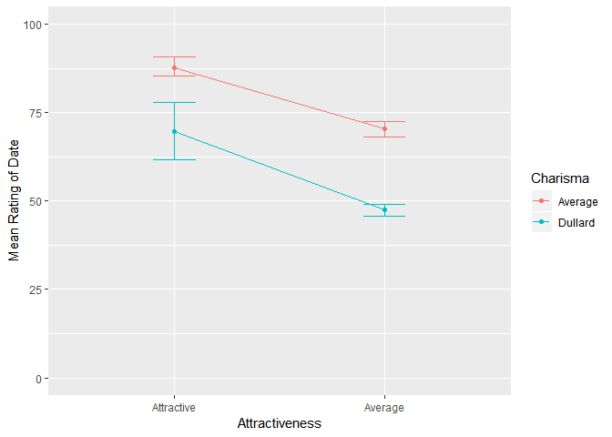

ch001(Tree-Based Method)
================
jakinpilla
2020-02-02

  - [그래프에 상호작용이 나타나지 않아도 대비가 유의한 이유](#그래프에-상호작용이-나타나지-않아도-대비가-유의한-이유)
  - [효과크기 계산](#효과크기-계산)
  - [혼합 분산분석 결과의 보고 ———————————————————-](#혼합-분산분석-결과의-보고--)

``` r
library(ez)
library(ggplot2)
library(nlme)
library(pastecs)
library(reshape2)
library(WRS)
dateData <- read.delim('LooksOrPersonality.dat',  header = T)

speedData <- melt(dateData, 
                  id = c('participant', 'gender'),
                  measured = c('att_high', 'av_high', 'ug_high',
                               'att_some', 'av_some', 'ug_some',
                               'att_none', 'av_none', 'ug_none'))

names(speedData) <- c('participant', 'gender', 'groups', 'dateRating')

speedData$personality <- gl(3, 60, labels = c('Charismatic', 'Average', 'Dullard'))

speedData$looks <- gl(3, 20, 180, labels = c('Attractive', 'Average', 'Ugly'))

library(tidyverse)

speedData %>%
  arrange(participant)
```

    ##     participant gender   groups dateRating personality      looks
    ## 1           P01   Male att_high         86 Charismatic Attractive
    ## 2           P01   Male  av_high         84 Charismatic    Average
    ## 3           P01   Male  ug_high         67 Charismatic       Ugly
    ## 4           P01   Male att_some         88     Average Attractive
    ## 5           P01   Male  av_some         69     Average    Average
    ## 6           P01   Male  ug_some         50     Average       Ugly
    ## 7           P01   Male att_none         97     Dullard Attractive
    ## 8           P01   Male  av_none         48     Dullard    Average
    ## 9           P01   Male  ug_none         47     Dullard       Ugly
    ## 10          P02   Male att_high         91 Charismatic Attractive
    ## 11          P02   Male  av_high         83 Charismatic    Average
    ## 12          P02   Male  ug_high         53 Charismatic       Ugly
    ## 13          P02   Male att_some         83     Average Attractive
    ## 14          P02   Male  av_some         74     Average    Average
    ## 15          P02   Male  ug_some         48     Average       Ugly
    ## 16          P02   Male att_none         86     Dullard Attractive
    ## 17          P02   Male  av_none         50     Dullard    Average
    ## 18          P02   Male  ug_none         46     Dullard       Ugly
    ## 19          P03   Male att_high         89 Charismatic Attractive
    ## 20          P03   Male  av_high         88 Charismatic    Average
    ## 21          P03   Male  ug_high         48 Charismatic       Ugly
    ## 22          P03   Male att_some         99     Average Attractive
    ## 23          P03   Male  av_some         70     Average    Average
    ## 24          P03   Male  ug_some         48     Average       Ugly
    ## 25          P03   Male att_none         90     Dullard Attractive
    ## 26          P03   Male  av_none         45     Dullard    Average
    ## 27          P03   Male  ug_none         48     Dullard       Ugly
    ## 28          P04   Male att_high         89 Charismatic Attractive
    ## 29          P04   Male  av_high         69 Charismatic    Average
    ## 30          P04   Male  ug_high         58 Charismatic       Ugly
    ## 31          P04   Male att_some         86     Average Attractive
    ## 32          P04   Male  av_some         77     Average    Average
    ## 33          P04   Male  ug_some         40     Average       Ugly
    ## 34          P04   Male att_none         87     Dullard Attractive
    ## 35          P04   Male  av_none         47     Dullard    Average
    ## 36          P04   Male  ug_none         53     Dullard       Ugly
    ## 37          P05   Male att_high         80 Charismatic Attractive
    ## 38          P05   Male  av_high         81 Charismatic    Average
    ## 39          P05   Male  ug_high         57 Charismatic       Ugly
    ## 40          P05   Male att_some         88     Average Attractive
    ## 41          P05   Male  av_some         71     Average    Average
    ## 42          P05   Male  ug_some         50     Average       Ugly
    ## 43          P05   Male att_none         82     Dullard Attractive
    ## 44          P05   Male  av_none         50     Dullard    Average
    ## 45          P05   Male  ug_none         45     Dullard       Ugly
    ## 46          P06   Male att_high         80 Charismatic Attractive
    ## 47          P06   Male  av_high         84 Charismatic    Average
    ## 48          P06   Male  ug_high         51 Charismatic       Ugly
    ## 49          P06   Male att_some         96     Average Attractive
    ## 50          P06   Male  av_some         63     Average    Average
    ## 51          P06   Male  ug_some         42     Average       Ugly
    ## 52          P06   Male att_none         92     Dullard Attractive
    ## 53          P06   Male  av_none         48     Dullard    Average
    ## 54          P06   Male  ug_none         43     Dullard       Ugly
    ## 55          P07   Male att_high         89 Charismatic Attractive
    ## 56          P07   Male  av_high         85 Charismatic    Average
    ## 57          P07   Male  ug_high         61 Charismatic       Ugly
    ## 58          P07   Male att_some         87     Average Attractive
    ## 59          P07   Male  av_some         79     Average    Average
    ## 60          P07   Male  ug_some         44     Average       Ugly
    ## 61          P07   Male att_none         86     Dullard Attractive
    ## 62          P07   Male  av_none         50     Dullard    Average
    ## 63          P07   Male  ug_none         45     Dullard       Ugly
    ## 64          P08   Male att_high        100 Charismatic Attractive
    ## 65          P08   Male  av_high         94 Charismatic    Average
    ## 66          P08   Male  ug_high         56 Charismatic       Ugly
    ## 67          P08   Male att_some         86     Average Attractive
    ## 68          P08   Male  av_some         71     Average    Average
    ## 69          P08   Male  ug_some         54     Average       Ugly
    ## 70          P08   Male att_none         84     Dullard Attractive
    ## 71          P08   Male  av_none         54     Dullard    Average
    ## 72          P08   Male  ug_none         47     Dullard       Ugly
    ## 73          P09   Male att_high         90 Charismatic Attractive
    ## 74          P09   Male  av_high         74 Charismatic    Average
    ## 75          P09   Male  ug_high         54 Charismatic       Ugly
    ## 76          P09   Male att_some         92     Average Attractive
    ## 77          P09   Male  av_some         71     Average    Average
    ## 78          P09   Male  ug_some         58     Average       Ugly
    ## 79          P09   Male att_none         78     Dullard Attractive
    ## 80          P09   Male  av_none         38     Dullard    Average
    ## 81          P09   Male  ug_none         45     Dullard       Ugly
    ## 82          P10   Male att_high         89 Charismatic Attractive
    ## 83          P10   Male  av_high         86 Charismatic    Average
    ## 84          P10   Male  ug_high         63 Charismatic       Ugly
    ## 85          P10   Male att_some         80     Average Attractive
    ## 86          P10   Male  av_some         73     Average    Average
    ## 87          P10   Male  ug_some         49     Average       Ugly
    ## 88          P10   Male att_none         91     Dullard Attractive
    ## 89          P10   Male  av_none         48     Dullard    Average
    ## 90          P10   Male  ug_none         39     Dullard       Ugly
    ## 91          P11 Female att_high         89 Charismatic Attractive
    ## 92          P11 Female  av_high         91 Charismatic    Average
    ## 93          P11 Female  ug_high         93 Charismatic       Ugly
    ## 94          P11 Female att_some         88     Average Attractive
    ## 95          P11 Female  av_some         65     Average    Average
    ## 96          P11 Female  ug_some         54     Average       Ugly
    ## 97          P11 Female att_none         55     Dullard Attractive
    ## 98          P11 Female  av_none         48     Dullard    Average
    ## 99          P11 Female  ug_none         52     Dullard       Ugly
    ## 100         P12 Female att_high         84 Charismatic Attractive
    ## 101         P12 Female  av_high         90 Charismatic    Average
    ## 102         P12 Female  ug_high         85 Charismatic       Ugly
    ## 103         P12 Female att_some         95     Average Attractive
    ## 104         P12 Female  av_some         70     Average    Average
    ## 105         P12 Female  ug_some         60     Average       Ugly
    ## 106         P12 Female att_none         50     Dullard Attractive
    ## 107         P12 Female  av_none         44     Dullard    Average
    ## 108         P12 Female  ug_none         45     Dullard       Ugly
    ## 109         P13 Female att_high         99 Charismatic Attractive
    ## 110         P13 Female  av_high        100 Charismatic    Average
    ## 111         P13 Female  ug_high         89 Charismatic       Ugly
    ## 112         P13 Female att_some         80     Average Attractive
    ## 113         P13 Female  av_some         79     Average    Average
    ## 114         P13 Female  ug_some         53     Average       Ugly
    ## 115         P13 Female att_none         51     Dullard Attractive
    ## 116         P13 Female  av_none         48     Dullard    Average
    ## 117         P13 Female  ug_none         44     Dullard       Ugly
    ## 118         P14 Female att_high         86 Charismatic Attractive
    ## 119         P14 Female  av_high         89 Charismatic    Average
    ## 120         P14 Female  ug_high         83 Charismatic       Ugly
    ## 121         P14 Female att_some         86     Average Attractive
    ## 122         P14 Female  av_some         74     Average    Average
    ## 123         P14 Female  ug_some         58     Average       Ugly
    ## 124         P14 Female att_none         52     Dullard Attractive
    ## 125         P14 Female  av_none         48     Dullard    Average
    ## 126         P14 Female  ug_none         47     Dullard       Ugly
    ## 127         P15 Female att_high         89 Charismatic Attractive
    ## 128         P15 Female  av_high         87 Charismatic    Average
    ## 129         P15 Female  ug_high         80 Charismatic       Ugly
    ## 130         P15 Female att_some         83     Average Attractive
    ## 131         P15 Female  av_some         74     Average    Average
    ## 132         P15 Female  ug_some         43     Average       Ugly
    ## 133         P15 Female att_none         58     Dullard Attractive
    ## 134         P15 Female  av_none         50     Dullard    Average
    ## 135         P15 Female  ug_none         48     Dullard       Ugly
    ## 136         P16 Female att_high         80 Charismatic Attractive
    ## 137         P16 Female  av_high         81 Charismatic    Average
    ## 138         P16 Female  ug_high         79 Charismatic       Ugly
    ## 139         P16 Female att_some         86     Average Attractive
    ## 140         P16 Female  av_some         59     Average    Average
    ## 141         P16 Female  ug_some         47     Average       Ugly
    ## 142         P16 Female att_none         51     Dullard Attractive
    ## 143         P16 Female  av_none         47     Dullard    Average
    ## 144         P16 Female  ug_none         40     Dullard       Ugly
    ## 145         P17 Female att_high         82 Charismatic Attractive
    ## 146         P17 Female  av_high         92 Charismatic    Average
    ## 147         P17 Female  ug_high         85 Charismatic       Ugly
    ## 148         P17 Female att_some         81     Average Attractive
    ## 149         P17 Female  av_some         66     Average    Average
    ## 150         P17 Female  ug_some         47     Average       Ugly
    ## 151         P17 Female att_none         50     Dullard Attractive
    ## 152         P17 Female  av_none         45     Dullard    Average
    ## 153         P17 Female  ug_none         47     Dullard       Ugly
    ## 154         P18 Female att_high         97 Charismatic Attractive
    ## 155         P18 Female  av_high         69 Charismatic    Average
    ## 156         P18 Female  ug_high         87 Charismatic       Ugly
    ## 157         P18 Female att_some         95     Average Attractive
    ## 158         P18 Female  av_some         72     Average    Average
    ## 159         P18 Female  ug_some         51     Average       Ugly
    ## 160         P18 Female att_none         45     Dullard Attractive
    ## 161         P18 Female  av_none         48     Dullard    Average
    ## 162         P18 Female  ug_none         46     Dullard       Ugly
    ## 163         P19 Female att_high         95 Charismatic Attractive
    ## 164         P19 Female  av_high         92 Charismatic    Average
    ## 165         P19 Female  ug_high         90 Charismatic       Ugly
    ## 166         P19 Female att_some         98     Average Attractive
    ## 167         P19 Female  av_some         64     Average    Average
    ## 168         P19 Female  ug_some         53     Average       Ugly
    ## 169         P19 Female att_none         54     Dullard Attractive
    ## 170         P19 Female  av_none         53     Dullard    Average
    ## 171         P19 Female  ug_none         45     Dullard       Ugly
    ## 172         P20 Female att_high         95 Charismatic Attractive
    ## 173         P20 Female  av_high         93 Charismatic    Average
    ## 174         P20 Female  ug_high         96 Charismatic       Ugly
    ## 175         P20 Female att_some         79     Average Attractive
    ## 176         P20 Female  av_some         66     Average    Average
    ## 177         P20 Female  ug_some         46     Average       Ugly
    ## 178         P20 Female att_none         52     Dullard Attractive
    ## 179         P20 Female  av_none         39     Dullard    Average
    ## 180         P20 Female  ug_none         47     Dullard       Ugly

``` r
by(speedData$dateRating, 
   list(speedData$looks, speedData$personality, speedData$gender), 
   stat.desc, 
   basic = FALSE)  
```

    ## : Attractive
    ## : Charismatic
    ## : Female
    ##       median         mean      SE.mean CI.mean.0.95          var 
    ##  89.00000000  89.60000000   2.09867683   4.74753683  44.04444444 
    ##      std.dev     coef.var 
    ##   6.63659886   0.07406918 
    ## -------------------------------------------------------- 
    ## : Average
    ## : Charismatic
    ## : Female
    ##       median         mean      SE.mean CI.mean.0.95          var 
    ##  90.50000000  88.40000000   2.63396617   5.95844544  69.37777778 
    ##      std.dev     coef.var 
    ##   8.32933237   0.09422322 
    ## -------------------------------------------------------- 
    ## : Ugly
    ## : Charismatic
    ## : Female
    ##       median         mean      SE.mean CI.mean.0.95          var 
    ##  86.00000000  86.70000000   1.71949605   3.88977031  29.56666667 
    ##      std.dev     coef.var 
    ##   5.43752395   0.06271654 
    ## -------------------------------------------------------- 
    ## : Attractive
    ## : Average
    ## : Female
    ##       median         mean      SE.mean CI.mean.0.95          var 
    ##  86.00000000  87.10000000   2.15225979   4.86874991  46.32222222 
    ##      std.dev     coef.var 
    ##   6.80604307   0.07814056 
    ## -------------------------------------------------------- 
    ## : Average
    ## : Average
    ## : Female
    ##       median         mean      SE.mean CI.mean.0.95          var 
    ##  68.00000000  68.90000000   1.88237439   4.25822670  35.43333333 
    ##      std.dev     coef.var 
    ##   5.95259047   0.08639464 
    ## -------------------------------------------------------- 
    ## : Ugly
    ## : Average
    ## : Female
    ##       median         mean      SE.mean CI.mean.0.95          var 
    ##   52.0000000   51.2000000    1.7243356    3.9007182   29.7333333 
    ##      std.dev     coef.var 
    ##    5.4528280    0.1065005 
    ## -------------------------------------------------------- 
    ## : Attractive
    ## : Dullard
    ## : Female
    ##       median         mean      SE.mean CI.mean.0.95          var 
    ##  51.50000000  51.80000000   1.09341463   2.47347574  11.95555556 
    ##      std.dev     coef.var 
    ##   3.45768066   0.06675059 
    ## -------------------------------------------------------- 
    ## : Average
    ## : Dullard
    ## : Female
    ##       median         mean      SE.mean CI.mean.0.95          var 
    ##  48.00000000  47.00000000   1.18321596   2.67662045  14.00000000 
    ##      std.dev     coef.var 
    ##   3.74165739   0.07960973 
    ## -------------------------------------------------------- 
    ## : Ugly
    ## : Dullard
    ## : Female
    ##       median         mean      SE.mean CI.mean.0.95          var 
    ##  46.50000000  46.10000000   0.97125349   2.19712803   9.43333333 
    ##      std.dev     coef.var 
    ##   3.07137320   0.06662415 
    ## -------------------------------------------------------- 
    ## : Attractive
    ## : Charismatic
    ## : Male
    ##       median         mean      SE.mean CI.mean.0.95          var 
    ##  89.00000000  88.30000000   1.80154255   4.07537238  32.45555556 
    ##      std.dev     coef.var 
    ##   5.69697776   0.06451843 
    ## -------------------------------------------------------- 
    ## : Average
    ## : Charismatic
    ## : Male
    ##       median         mean      SE.mean CI.mean.0.95          var 
    ##  84.00000000  82.80000000   2.21509970   5.01090365  49.06666667 
    ##      std.dev     coef.var 
    ##   7.00476029   0.08459855 
    ## -------------------------------------------------------- 
    ## : Ugly
    ## : Charismatic
    ## : Male
    ##       median         mean      SE.mean CI.mean.0.95          var 
    ##    56.500000    56.800000     1.812304     4.099716    32.844444 
    ##      std.dev     coef.var 
    ##     5.731007     0.100898 
    ## -------------------------------------------------------- 
    ## : Attractive
    ## : Average
    ## : Male
    ##       median         mean      SE.mean CI.mean.0.95          var 
    ##  87.50000000  88.50000000   1.81506045   4.10595200  32.94444444 
    ##      std.dev     coef.var 
    ##   5.73972512   0.06485565 
    ## -------------------------------------------------------- 
    ## : Average
    ## : Average
    ## : Male
    ##       median         mean      SE.mean CI.mean.0.95          var 
    ##  71.00000000  71.80000000   1.39682179   3.15983042  19.51111111 
    ##      std.dev     coef.var 
    ##   4.41713834   0.06152003 
    ## -------------------------------------------------------- 
    ## : Ugly
    ## : Average
    ## : Male
    ##       median         mean      SE.mean CI.mean.0.95          var 
    ##   48.5000000   48.3000000    1.7000000    3.8456672   28.9000000 
    ##      std.dev     coef.var 
    ##    5.3758720    0.1113017 
    ## -------------------------------------------------------- 
    ## : Attractive
    ## : Dullard
    ## : Male
    ##       median         mean      SE.mean CI.mean.0.95          var 
    ##   86.5000000   87.3000000    1.7194961    3.8897703   29.5666667 
    ##      std.dev     coef.var 
    ##    5.4375239    0.0622855 
    ## -------------------------------------------------------- 
    ## : Average
    ## : Dullard
    ## : Male
    ##       median         mean      SE.mean CI.mean.0.95          var 
    ##  48.00000000  47.80000000   1.32329555   2.99350251  17.51111111 
    ##      std.dev     coef.var 
    ##   4.18462795   0.08754452 
    ## -------------------------------------------------------- 
    ## : Ugly
    ## : Dullard
    ## : Male
    ##       median         mean      SE.mean CI.mean.0.95          var 
    ##  45.50000000  45.80000000   1.13333333   2.56377812  12.84444444 
    ##      std.dev     coef.var 
    ##   3.58391468   0.07825141

혼합분산분석 ——————————————————————

``` r
SomevsNone <- c(1, 1, -2)
HivsAv <- c(-1, 1, 0)
contrasts(speedData$personality) <- cbind(SomevsNone, HivsAv)

AttractivevsUgly <- c(1, 1, -2)
AttractivevsAv <- c(-1, 1, -2)
contrasts(speedData$looks) <- cbind(AttractivevsUgly, AttractivevsAv)

speedModel <- ezANOVA(
  data = speedData,
  dv = .(dateRating),
  wid = .(participant),
  between = .(gender),
  within = .(looks, personality),
  type = 3, 
  detailed = T
)

speedModel
```

    ## $ANOVA
    ##                     Effect DFn DFd        SSn       SSd            F
    ## 1              (Intercept)   1  18 846249.800  760.2222 2.003690e+04
    ## 2                   gender   1  18      0.200  760.2222 4.735457e-03
    ## 3                    looks   2  36  20779.633  882.7111 4.237325e+02
    ## 5              personality   2  36  23233.600 1274.0444 3.282498e+02
    ## 4             gender:looks   2  36   3944.100  882.7111 8.042699e+01
    ## 6       gender:personality   2  36   4420.133 1274.0444 6.244868e+01
    ## 7        looks:personality   4  72   4055.267 1992.6222 3.663253e+01
    ## 8 gender:looks:personality   4  72   2669.667 1992.6222 2.411596e+01
    ##              p p<.05          ges
    ## 1 7.013239e-29     * 9.942319e-01
    ## 2 9.458958e-01       4.073486e-05
    ## 3 9.594812e-26     * 8.088849e-01
    ## 5 7.689430e-24     * 8.255493e-01
    ## 4 5.234187e-14     * 4.454748e-01
    ## 6 1.974986e-12     * 4.737685e-01
    ## 7 1.101308e-16     * 4.523510e-01
    ## 8 1.107801e-12     * 3.522328e-01
    ## 
    ## $`Mauchly's Test for Sphericity`
    ##                     Effect         W         p p<.05
    ## 3                    looks 0.9602054 0.7081010      
    ## 4             gender:looks 0.9602054 0.7081010      
    ## 5              personality 0.9293298 0.5363446      
    ## 6       gender:personality 0.9293298 0.5363446      
    ## 7        looks:personality 0.6133545 0.5339382      
    ## 8 gender:looks:personality 0.6133545 0.5339382      
    ## 
    ## $`Sphericity Corrections`
    ##                     Effect       GGe        p[GG] p[GG]<.05       HFe
    ## 3                    looks 0.9617284 7.624114e-25         * 1.0744125
    ## 4             gender:looks 0.9617284 1.487026e-13         * 1.0744125
    ## 5              personality 0.9339944 2.056621e-22         * 1.0380537
    ## 6       gender:personality 0.9339944 9.442426e-12         * 1.0380537
    ## 7        looks:personality 0.7993543 9.003598e-14         * 0.9922411
    ## 8 gender:looks:personality 0.7993543 1.470422e-10         * 0.9922411
    ##          p[HF] p[HF]<.05
    ## 3 9.594812e-26         *
    ## 4 5.234187e-14         *
    ## 5 7.689430e-24         *
    ## 6 1.974986e-12         *
    ## 7 1.426883e-16         *
    ## 8 1.337876e-12         *

일반선형모형으로서의 혼합설계 ———————————————————

``` r
AttractivevsAv <- c(1, 0, 0)
UglyvsAv <- c(0, 0, 1)
contrasts(speedData$looks) <- cbind(AttractivevsAv, UglyvsAv)

HivsAv <- c(1, 0, 0)
DullvsAv <- c(0, 0, 1)
contrasts(speedData$personality) <- cbind(HivsAv, DullvsAv)

speedData$looks
```

    ##   [1] Attractive Attractive Attractive Attractive Attractive Attractive
    ##   [7] Attractive Attractive Attractive Attractive Attractive Attractive
    ##  [13] Attractive Attractive Attractive Attractive Attractive Attractive
    ##  [19] Attractive Attractive Average    Average    Average    Average   
    ##  [25] Average    Average    Average    Average    Average    Average   
    ##  [31] Average    Average    Average    Average    Average    Average   
    ##  [37] Average    Average    Average    Average    Ugly       Ugly      
    ##  [43] Ugly       Ugly       Ugly       Ugly       Ugly       Ugly      
    ##  [49] Ugly       Ugly       Ugly       Ugly       Ugly       Ugly      
    ##  [55] Ugly       Ugly       Ugly       Ugly       Ugly       Ugly      
    ##  [61] Attractive Attractive Attractive Attractive Attractive Attractive
    ##  [67] Attractive Attractive Attractive Attractive Attractive Attractive
    ##  [73] Attractive Attractive Attractive Attractive Attractive Attractive
    ##  [79] Attractive Attractive Average    Average    Average    Average   
    ##  [85] Average    Average    Average    Average    Average    Average   
    ##  [91] Average    Average    Average    Average    Average    Average   
    ##  [97] Average    Average    Average    Average    Ugly       Ugly      
    ## [103] Ugly       Ugly       Ugly       Ugly       Ugly       Ugly      
    ## [109] Ugly       Ugly       Ugly       Ugly       Ugly       Ugly      
    ## [115] Ugly       Ugly       Ugly       Ugly       Ugly       Ugly      
    ## [121] Attractive Attractive Attractive Attractive Attractive Attractive
    ## [127] Attractive Attractive Attractive Attractive Attractive Attractive
    ## [133] Attractive Attractive Attractive Attractive Attractive Attractive
    ## [139] Attractive Attractive Average    Average    Average    Average   
    ## [145] Average    Average    Average    Average    Average    Average   
    ## [151] Average    Average    Average    Average    Average    Average   
    ## [157] Average    Average    Average    Average    Ugly       Ugly      
    ## [163] Ugly       Ugly       Ugly       Ugly       Ugly       Ugly      
    ## [169] Ugly       Ugly       Ugly       Ugly       Ugly       Ugly      
    ## [175] Ugly       Ugly       Ugly       Ugly       Ugly       Ugly      
    ## attr(,"contrasts")
    ##            AttractivevsAv UglyvsAv
    ## Attractive              1        0
    ## Average                 0        0
    ## Ugly                    0        1
    ## Levels: Attractive Average Ugly

``` r
speedData$personality
```

    ##   [1] Charismatic Charismatic Charismatic Charismatic Charismatic
    ##   [6] Charismatic Charismatic Charismatic Charismatic Charismatic
    ##  [11] Charismatic Charismatic Charismatic Charismatic Charismatic
    ##  [16] Charismatic Charismatic Charismatic Charismatic Charismatic
    ##  [21] Charismatic Charismatic Charismatic Charismatic Charismatic
    ##  [26] Charismatic Charismatic Charismatic Charismatic Charismatic
    ##  [31] Charismatic Charismatic Charismatic Charismatic Charismatic
    ##  [36] Charismatic Charismatic Charismatic Charismatic Charismatic
    ##  [41] Charismatic Charismatic Charismatic Charismatic Charismatic
    ##  [46] Charismatic Charismatic Charismatic Charismatic Charismatic
    ##  [51] Charismatic Charismatic Charismatic Charismatic Charismatic
    ##  [56] Charismatic Charismatic Charismatic Charismatic Charismatic
    ##  [61] Average     Average     Average     Average     Average    
    ##  [66] Average     Average     Average     Average     Average    
    ##  [71] Average     Average     Average     Average     Average    
    ##  [76] Average     Average     Average     Average     Average    
    ##  [81] Average     Average     Average     Average     Average    
    ##  [86] Average     Average     Average     Average     Average    
    ##  [91] Average     Average     Average     Average     Average    
    ##  [96] Average     Average     Average     Average     Average    
    ## [101] Average     Average     Average     Average     Average    
    ## [106] Average     Average     Average     Average     Average    
    ## [111] Average     Average     Average     Average     Average    
    ## [116] Average     Average     Average     Average     Average    
    ## [121] Dullard     Dullard     Dullard     Dullard     Dullard    
    ## [126] Dullard     Dullard     Dullard     Dullard     Dullard    
    ## [131] Dullard     Dullard     Dullard     Dullard     Dullard    
    ## [136] Dullard     Dullard     Dullard     Dullard     Dullard    
    ## [141] Dullard     Dullard     Dullard     Dullard     Dullard    
    ## [146] Dullard     Dullard     Dullard     Dullard     Dullard    
    ## [151] Dullard     Dullard     Dullard     Dullard     Dullard    
    ## [156] Dullard     Dullard     Dullard     Dullard     Dullard    
    ## [161] Dullard     Dullard     Dullard     Dullard     Dullard    
    ## [166] Dullard     Dullard     Dullard     Dullard     Dullard    
    ## [171] Dullard     Dullard     Dullard     Dullard     Dullard    
    ## [176] Dullard     Dullard     Dullard     Dullard     Dullard    
    ## attr(,"contrasts")
    ##             HivsAv DullvsAv
    ## Charismatic      1        0
    ## Average          0        0
    ## Dullard          0        1
    ## Levels: Charismatic Average Dullard

모형구축 ——————————————————————–

``` r
baseline <- lme(dateRating ~ 1, 
                random = ~1|participant/looks/personality, 
                data = speedData, 
                method ='ML')

looksM <- update(baseline, 
                 .~. + looks)

personalityM <- update(looksM, .~. + personality)

genderM <- update(personalityM, .~. + gender)

looks_gender <- update(genderM, .~. + looks:gender)

personality_gender <- update(looks_gender, .~. + personality:gender)

looks_personality <- update(personality_gender, .~. + looks:personality)

speedDateModel <- update(looks_personality, .~. + looks:personality:gender)

anova(baseline, 
      looksM,
      personalityM,
      genderM, 
      looks_gender, 
      personality_gender,
      looks_personality, 
      speedDateModel)
```

    ##                    Model df      AIC      BIC    logLik   Test   L.Ratio
    ## baseline               1  5 1575.766 1591.730 -782.8829                 
    ## looksM                 2  7 1511.468 1533.819 -748.7343 1 vs 2  68.29719
    ## personalityM           3  9 1376.704 1405.441 -679.3520 2 vs 3 138.76442
    ## genderM                4 10 1378.702 1410.632 -679.3511 3 vs 4   0.00180
    ## looks_gender           5 12 1343.161 1381.477 -659.5808 4 vs 5  39.54079
    ## personality_gender     6 14 1289.198 1333.899 -630.5988 5 vs 6  57.96394
    ## looks_personality      7 18 1220.057 1277.530 -592.0283 6 vs 7  77.14102
    ## speedDateModel         8 22 1148.462 1218.707 -552.2309 7 vs 8  79.59473
    ##                    p-value
    ## baseline                  
    ## looksM              <.0001
    ## personalityM        <.0001
    ## genderM             0.9662
    ## looks_gender        <.0001
    ## personality_gender  <.0001
    ## looks_personality   <.0001
    ## speedDateModel      <.0001

``` r
summary(speedDateModel)
```

    ## Linear mixed-effects model fit by maximum likelihood
    ##  Data: speedData 
    ##        AIC      BIC    logLik
    ##   1148.462 1218.707 -552.2309
    ## 
    ## Random effects:
    ##  Formula: ~1 | participant
    ##         (Intercept)
    ## StdDev:    1.158402
    ## 
    ##  Formula: ~1 | looks %in% participant
    ##          (Intercept)
    ## StdDev: 0.0005251677
    ## 
    ##  Formula: ~1 | personality %in% looks %in% participant
    ##         (Intercept)  Residual
    ## StdDev:    5.090892 0.1283062
    ## 
    ## Fixed effects: dateRating ~ looks + personality + gender + looks:gender + personality:gender +      looks:personality + looks:personality:gender 
    ##                                                    Value Std.Error  DF
    ## (Intercept)                                         68.9  1.740866 108
    ## looksAttractivevsAv                                 18.2  2.400632  36
    ## looksUglyvsAv                                      -17.7  2.400632  36
    ## personalityHivsAv                                   19.5  2.400632 108
    ## personalityDullvsAv                                -21.9  2.400632 108
    ## genderMale                                           2.9  2.461957  18
    ## looksAttractivevsAv:genderMale                      -1.5  3.395006  36
    ## looksUglyvsAv:genderMale                            -5.8  3.395006  36
    ## personalityHivsAv:genderMale                        -8.5  3.395006 108
    ## personalityDullvsAv:genderMale                      -2.1  3.395006 108
    ## looksAttractivevsAv:personalityHivsAv              -17.0  3.395006 108
    ## looksUglyvsAv:personalityHivsAv                     16.0  3.395006 108
    ## looksAttractivevsAv:personalityDullvsAv            -13.4  3.395006 108
    ## looksUglyvsAv:personalityDullvsAv                   16.8  3.395006 108
    ## looksAttractivevsAv:personalityHivsAv:genderMale     5.8  4.801263 108
    ## looksUglyvsAv:personalityHivsAv:genderMale         -18.5  4.801263 108
    ## looksAttractivevsAv:personalityDullvsAv:genderMale  36.2  4.801263 108
    ## looksUglyvsAv:personalityDullvsAv:genderMale         4.7  4.801263 108
    ##                                                     t-value p-value
    ## (Intercept)                                        39.57799  0.0000
    ## looksAttractivevsAv                                 7.58134  0.0000
    ## looksUglyvsAv                                      -7.37306  0.0000
    ## personalityHivsAv                                   8.12286  0.0000
    ## personalityDullvsAv                                -9.12260  0.0000
    ## genderMale                                          1.17792  0.2542
    ## looksAttractivevsAv:genderMale                     -0.44183  0.6613
    ## looksUglyvsAv:genderMale                           -1.70839  0.0962
    ## personalityHivsAv:genderMale                       -2.50368  0.0138
    ## personalityDullvsAv:genderMale                     -0.61856  0.5375
    ## looksAttractivevsAv:personalityHivsAv              -5.00736  0.0000
    ## looksUglyvsAv:personalityHivsAv                     4.71280  0.0000
    ## looksAttractivevsAv:personalityDullvsAv            -3.94697  0.0001
    ## looksUglyvsAv:personalityDullvsAv                   4.94845  0.0000
    ## looksAttractivevsAv:personalityHivsAv:genderMale    1.20802  0.2297
    ## looksUglyvsAv:personalityHivsAv:genderMale         -3.85315  0.0002
    ## looksAttractivevsAv:personalityDullvsAv:genderMale  7.53968  0.0000
    ## looksUglyvsAv:personalityDullvsAv:genderMale        0.97891  0.3298
    ##  Correlation: 
    ##                                                    (Intr) lksAtA lksUgA
    ## looksAttractivevsAv                                -0.689              
    ## looksUglyvsAv                                      -0.689  0.500       
    ## personalityHivsAv                                  -0.689  0.500  0.500
    ## personalityDullvsAv                                -0.689  0.500  0.500
    ## genderMale                                         -0.707  0.488  0.488
    ## looksAttractivevsAv:genderMale                      0.488 -0.707 -0.354
    ## looksUglyvsAv:genderMale                            0.488 -0.354 -0.707
    ## personalityHivsAv:genderMale                        0.488 -0.354 -0.354
    ## personalityDullvsAv:genderMale                      0.488 -0.354 -0.354
    ## looksAttractivevsAv:personalityHivsAv               0.488 -0.707 -0.354
    ## looksUglyvsAv:personalityHivsAv                     0.488 -0.354 -0.707
    ## looksAttractivevsAv:personalityDullvsAv             0.488 -0.707 -0.354
    ## looksUglyvsAv:personalityDullvsAv                   0.488 -0.354 -0.707
    ## looksAttractivevsAv:personalityHivsAv:genderMale   -0.345  0.500  0.250
    ## looksUglyvsAv:personalityHivsAv:genderMale         -0.345  0.250  0.500
    ## looksAttractivevsAv:personalityDullvsAv:genderMale -0.345  0.500  0.250
    ## looksUglyvsAv:personalityDullvsAv:genderMale       -0.345  0.250  0.500
    ##                                                    prsnHA prsnDA gndrMl
    ## looksAttractivevsAv                                                    
    ## looksUglyvsAv                                                          
    ## personalityHivsAv                                                      
    ## personalityDullvsAv                                 0.500              
    ## genderMale                                          0.488  0.488       
    ## looksAttractivevsAv:genderMale                     -0.354 -0.354 -0.689
    ## looksUglyvsAv:genderMale                           -0.354 -0.354 -0.689
    ## personalityHivsAv:genderMale                       -0.707 -0.354 -0.689
    ## personalityDullvsAv:genderMale                     -0.354 -0.707 -0.689
    ## looksAttractivevsAv:personalityHivsAv              -0.707 -0.354 -0.345
    ## looksUglyvsAv:personalityHivsAv                    -0.707 -0.354 -0.345
    ## looksAttractivevsAv:personalityDullvsAv            -0.354 -0.707 -0.345
    ## looksUglyvsAv:personalityDullvsAv                  -0.354 -0.707 -0.345
    ## looksAttractivevsAv:personalityHivsAv:genderMale    0.500  0.250  0.488
    ## looksUglyvsAv:personalityHivsAv:genderMale          0.500  0.250  0.488
    ## looksAttractivevsAv:personalityDullvsAv:genderMale  0.250  0.500  0.488
    ## looksUglyvsAv:personalityDullvsAv:genderMale        0.250  0.500  0.488
    ##                                                    lkAA:M lkUA:M prHA:M
    ## looksAttractivevsAv                                                    
    ## looksUglyvsAv                                                          
    ## personalityHivsAv                                                      
    ## personalityDullvsAv                                                    
    ## genderMale                                                             
    ## looksAttractivevsAv:genderMale                                         
    ## looksUglyvsAv:genderMale                            0.500              
    ## personalityHivsAv:genderMale                        0.500  0.500       
    ## personalityDullvsAv:genderMale                      0.500  0.500  0.500
    ## looksAttractivevsAv:personalityHivsAv               0.500  0.250  0.500
    ## looksUglyvsAv:personalityHivsAv                     0.250  0.500  0.500
    ## looksAttractivevsAv:personalityDullvsAv             0.500  0.250  0.250
    ## looksUglyvsAv:personalityDullvsAv                   0.250  0.500  0.250
    ## looksAttractivevsAv:personalityHivsAv:genderMale   -0.707 -0.354 -0.707
    ## looksUglyvsAv:personalityHivsAv:genderMale         -0.354 -0.707 -0.707
    ## looksAttractivevsAv:personalityDullvsAv:genderMale -0.707 -0.354 -0.354
    ## looksUglyvsAv:personalityDullvsAv:genderMale       -0.354 -0.707 -0.354
    ##                                                    prDA:M lkAA:HA lkUA:HA
    ## looksAttractivevsAv                                                      
    ## looksUglyvsAv                                                            
    ## personalityHivsAv                                                        
    ## personalityDullvsAv                                                      
    ## genderMale                                                               
    ## looksAttractivevsAv:genderMale                                           
    ## looksUglyvsAv:genderMale                                                 
    ## personalityHivsAv:genderMale                                             
    ## personalityDullvsAv:genderMale                                           
    ## looksAttractivevsAv:personalityHivsAv               0.250                
    ## looksUglyvsAv:personalityHivsAv                     0.250  0.500         
    ## looksAttractivevsAv:personalityDullvsAv             0.500  0.500   0.250 
    ## looksUglyvsAv:personalityDullvsAv                   0.500  0.250   0.500 
    ## looksAttractivevsAv:personalityHivsAv:genderMale   -0.354 -0.707  -0.354 
    ## looksUglyvsAv:personalityHivsAv:genderMale         -0.354 -0.354  -0.707 
    ## looksAttractivevsAv:personalityDullvsAv:genderMale -0.707 -0.354  -0.177 
    ## looksUglyvsAv:personalityDullvsAv:genderMale       -0.707 -0.177  -0.354 
    ##                                                    lkAA:DA lkUA:DA lAA:HA:
    ## looksAttractivevsAv                                                       
    ## looksUglyvsAv                                                             
    ## personalityHivsAv                                                         
    ## personalityDullvsAv                                                       
    ## genderMale                                                                
    ## looksAttractivevsAv:genderMale                                            
    ## looksUglyvsAv:genderMale                                                  
    ## personalityHivsAv:genderMale                                              
    ## personalityDullvsAv:genderMale                                            
    ## looksAttractivevsAv:personalityHivsAv                                     
    ## looksUglyvsAv:personalityHivsAv                                           
    ## looksAttractivevsAv:personalityDullvsAv                                   
    ## looksUglyvsAv:personalityDullvsAv                   0.500                 
    ## looksAttractivevsAv:personalityHivsAv:genderMale   -0.354  -0.177         
    ## looksUglyvsAv:personalityHivsAv:genderMale         -0.177  -0.354   0.500 
    ## looksAttractivevsAv:personalityDullvsAv:genderMale -0.707  -0.354   0.500 
    ## looksUglyvsAv:personalityDullvsAv:genderMale       -0.354  -0.707   0.250 
    ##                                                    lUA:HA: lAA:DA:
    ## looksAttractivevsAv                                               
    ## looksUglyvsAv                                                     
    ## personalityHivsAv                                                 
    ## personalityDullvsAv                                               
    ## genderMale                                                        
    ## looksAttractivevsAv:genderMale                                    
    ## looksUglyvsAv:genderMale                                          
    ## personalityHivsAv:genderMale                                      
    ## personalityDullvsAv:genderMale                                    
    ## looksAttractivevsAv:personalityHivsAv                             
    ## looksUglyvsAv:personalityHivsAv                                   
    ## looksAttractivevsAv:personalityDullvsAv                           
    ## looksUglyvsAv:personalityDullvsAv                                 
    ## looksAttractivevsAv:personalityHivsAv:genderMale                  
    ## looksUglyvsAv:personalityHivsAv:genderMale                        
    ## looksAttractivevsAv:personalityDullvsAv:genderMale  0.250         
    ## looksUglyvsAv:personalityDullvsAv:genderMale        0.500   0.500 
    ## 
    ## Standardized Within-Group Residuals:
    ##         Min          Q1         Med          Q3         Max 
    ## -0.09479343 -0.01471239  0.00142862  0.01218635  0.05289021 
    ## 
    ## Number of Observations: 180
    ## Number of Groups: 
    ##                             participant 
    ##                                      20 
    ##                  looks %in% participant 
    ##                                      60 
    ## personality %in% looks %in% participant 
    ##                                     180

성별의 주 효과 —————————————————————-

``` r
by(speedData$dateRating, speedData$gender, stat.desc, basic = F)
```

    ## speedData$gender: Female
    ##       median         mean      SE.mean CI.mean.0.95          var 
    ##   67.5000000   68.5333333    2.0363856    4.0462549  373.2179775 
    ##      std.dev     coef.var 
    ##   19.3188503    0.2818898 
    ## -------------------------------------------------------- 
    ## speedData$gender: Male
    ##       median         mean      SE.mean CI.mean.0.95          var 
    ##   71.0000000   68.6000000    1.9607764    3.8960210  346.0179775 
    ##      std.dev     coef.var 
    ##   18.6015585    0.2711597

``` r
genderBar <- ggplot(speedData, aes(gender, dateRating))

genderBar + 
  stat_summary(fun.y = mean, 
               geom = 'bar', 
               fill = 'White', 
               colour = 'Black') +
  stat_summary(fun.data = mean_cl_boot, 
               geom = 'pointrange') +
  labs(x = 'Gender', y = 'Mean Rating of Date')
```

<!-- -->

외모의 주효과 —————————————————————–

``` r
by(speedData$dateRating, speedData$looks, stat.desc, basic = F)
```

    ## speedData$looks: Attractive
    ##       median         mean      SE.mean CI.mean.0.95          var 
    ##   86.0000000   82.1000000    1.9040100    3.8099153  217.5152542 
    ##      std.dev     coef.var 
    ##   14.7483984    0.1796394 
    ## -------------------------------------------------------- 
    ## speedData$looks: Average
    ##       median         mean      SE.mean CI.mean.0.95          var 
    ##   70.0000000   67.7833333    2.1808219    4.3638145  285.3590395 
    ##      std.dev     coef.var 
    ##   16.8925735    0.2492143 
    ## -------------------------------------------------------- 
    ## speedData$looks: Ugly
    ##       median         mean      SE.mean CI.mean.0.95          var 
    ##   50.0000000   55.8166667    1.9573838    3.9167159  229.8810734 
    ##      std.dev     coef.var 
    ##   15.1618295    0.2716362

``` r
looksBar <- ggplot(speedData, aes(looks, dateRating))

looksBar + 
  stat_summary(fun.y = mean, 
               geom = 'bar', 
               fill = 'White', 
               colour = 'Black') +
  stat_summary(fun.data = mean_cl_boot, 
               geom = 'pointrange') +
  labs(x = 'looks', y = 'Mean Rating of Date')
```

<!-- -->

성격의 주효과 —————————————————————–

``` r
by(speedData$dateRating, speedData$personality, stat.desc, basic = F)
```

    ## speedData$personality: Charismatic
    ##       median         mean      SE.mean CI.mean.0.95          var 
    ##    86.000000    82.100000     1.703884     3.409464   174.193220 
    ##      std.dev     coef.var 
    ##    13.198228     0.160758 
    ## -------------------------------------------------------- 
    ## speedData$personality: Average
    ##       median         mean      SE.mean CI.mean.0.95          var 
    ##   71.0000000   69.3000000    2.1484852    4.2991090  276.9593220 
    ##      std.dev     coef.var 
    ##   16.6420949    0.2401457 
    ## -------------------------------------------------------- 
    ## speedData$personality: Dullard
    ##       median         mean      SE.mean CI.mean.0.95          var 
    ##   48.0000000   54.3000000    2.0000424    4.0020755  240.0101695 
    ##      std.dev     coef.var 
    ##   15.4922616    0.2853087

``` r
personalityBar <- ggplot(speedData, aes(personality, dateRating))

personalityBar + 
  stat_summary(fun.y = mean, 
               geom = 'bar', 
               fill = 'White', 
               colour = 'Black') +
  stat_summary(fun.data = mean_cl_boot, 
               geom = 'pointrange') +
  labs(x = 'personality', y = 'Mean Rating of Date')
```

<!-- -->

외모와 성격의 상호작용 ————————————————————

``` r
speedData %>% colnames()
```

    ## [1] "participant" "gender"      "groups"      "dateRating"  "personality"
    ## [6] "looks"

``` r
by(speedData$dateRating, list(speedData$personality, speedData$gender), stat.desc, 
   basic = F)
```

    ## : Charismatic
    ## : Female
    ##       median         mean      SE.mean CI.mean.0.95          var 
    ##  89.00000000  88.23333333   1.23612607   2.52816168  45.84022989 
    ##      std.dev     coef.var 
    ##   6.77054133   0.07673451 
    ## -------------------------------------------------------- 
    ## : Average
    ## : Female
    ##       median         mean      SE.mean CI.mean.0.95          var 
    ##   68.0000000   69.0666667    2.9258787    5.9840939  256.8229885 
    ##      std.dev     coef.var 
    ##   16.0256978    0.2320323 
    ## -------------------------------------------------------- 
    ## : Dullard
    ## : Female
    ##       median         mean      SE.mean CI.mean.0.95          var 
    ##  48.00000000  48.30000000   0.76285911   1.56022207  17.45862069 
    ##      std.dev     coef.var 
    ##   4.17835143   0.08650831 
    ## -------------------------------------------------------- 
    ## : Charismatic
    ## : Male
    ##       median         mean      SE.mean CI.mean.0.95          var 
    ##   82.0000000   75.9666667    2.7732231    5.6718781  230.7229885 
    ##      std.dev     coef.var 
    ##   15.1895684    0.1999504 
    ## -------------------------------------------------------- 
    ## : Average
    ## : Male
    ##       median         mean      SE.mean CI.mean.0.95          var 
    ##   71.0000000   69.5333333    3.1965259    6.5376295  306.5333333 
    ##      std.dev     coef.var 
    ##   17.5080934    0.2517942 
    ## -------------------------------------------------------- 
    ## : Dullard
    ## : Male
    ##       median         mean      SE.mean CI.mean.0.95          var 
    ##   49.0000000   60.3000000    3.6348094    7.4340198  396.3551724 
    ##      std.dev     coef.var 
    ##   19.9086708    0.3301604

``` r
genderCharisma <- ggplot(speedData, aes(personality, dateRating, colour=gender))

genderCharisma + 
  stat_summary(fun.y = mean, geom = "point") +
  stat_summary(fun.y = mean, geom = "line", aes(group = gender)) +
  stat_summary(fun.data = mean_cl_boot, geom = "errorbar", width= .2) +
  labs(x = 'Charisma', y = 'Mean Rating of Date', colour = 'Gender') +
  scale_y_continuous(limits = c(0, 100))
```

<!-- -->

``` r
lookscharisma <- ggplot(speedData, aes(looks, dateRating, colour=personality))

lookscharisma + 
  stat_summary(fun.y = mean, geom = "point") +
  stat_summary(fun.y = mean, geom = "line", aes(group = personality)) +
  stat_summary(fun.data = mean_cl_boot, geom = "errorbar", width= .2) +
  labs(x = 'looks', y = 'Mean Rating of Date', colour = 'Gender')
```

<!-- -->

``` r
  #scale_y_continuous(limits = c(0, 100))
```

외모와 성격: 매력적 대 평범함, 높은 카리스마 대 보통 카리스마 ————————————

``` r
speedData %>%
  filter(groups %in% c('att_high', 'att_some', 'av_high', 'av_some')) -> sample_1

sample_1 %>%
  ggplot(aes(looks, dateRating, colour = personality)) +
  stat_summary(fun.y = mean, geom = 'point') +
  stat_summary(fun.y = mean, geom = "line", aes(group = personality)) +
  stat_summary(fun.data = mean_cl_boot, geom = "errorbar", width= .2) +
  labs(x = 'Attractiveness', y = 'Mean Rating of Date', colour = 'Charisma') +
  scale_y_continuous(limits = c(0, 100))
```

<!-- -->

looksAttractivevsAv:personalityHivsAv

Value Std.Error DF t-value p-value

\-17.0 3.395006 108 -5.00736 0.0000

카리스마 수준이 높을 때에 비해 카리스마 수준이 보통일때 외모 수준의 하락에 따른 평가의 하락폭이 더 컸다.

외모와 성격의 상호작용: 추함 대 평법함, 높은 카리스마 대 보통 카리스마 ——————————-
looksUglyvsAv:personalityHivsAv 16.0 3.395006 108 4.71280 0.0000

``` r
speedData %>%
  filter(groups %in% c('av_high', 'av_some', 'ug_high', 'ug_some')) -> sample_2

sample_2 %>%
  ggplot(aes(looks, dateRating, colour = personality)) +
  stat_summary(fun.y = mean, geom = 'point') +
  stat_summary(fun.y = mean, geom = "line", aes(group = personality)) +
  stat_summary(fun.data = mean_cl_boot, geom = "errorbar", width= .2) +
  labs(x = 'Attractiveness', y = 'Mean Rating of Date', colour = 'Charisma') +
  scale_y_continuous(limits = c(0, 100))
```

<!-- -->

높은 카리스마와 보통 카리스마 모두 평범한 외모에서 못생긴 외모로 이동함에 따라 상대한 관한 관심이 떨어졌다. 그런데 그 하락
폭은 외모가 평범한 상대일 때 약간 더 크다.

외모와 성격의 상호작용: 매력적 대 평범함, 어루숙함 대 보통 카리스마 ———————————

``` r
speedData %>%
  filter(groups %in% c('att_some', 'av_some', 'att_none', 'av_none')) -> sample_3

sample_3 %>%
  ggplot(aes(looks, dateRating, colour = personality)) +
  stat_summary(fun.y = mean, geom = 'point') +
  stat_summary(fun.y = mean, geom = "line", aes(group = personality)) +
  stat_summary(fun.data = mean_cl_boot, geom = "errorbar", width= .2) +
  labs(x = 'Attractiveness', y = 'Mean Rating of Date', colour = 'Charisma') +
  scale_y_continuous(limits = c(0, 100))
```

<!-- -->

looksAttractivevsAv:personalityDullvsAv -13.4 3.395006 108 -3.94697
0.0001 외모 수준의 하락에 따른 평가의 하락 폭이 보통 카리스마와 어수룩한 성격에서 유의하게 달랐다. 이러한 유의성은
그래프가 보여주는 것과 모순된다.

### 그래프에 상호작용이 나타나지 않아도 대비가 유의한 이유

고차 상호작용이 유의하다면 개별 주 효과나 더 낮은 차수의 상호작용들은 해석하지 말아야 한다. looks\~personality
상호작용 중 looksAttractivevsAv:personalityDullvsAv에 그래프를 보면 두 선이 평행하다. 흔히
대비가 유의하지 않다고 생각할 수 있다. 하지만 검정 통계량들을 보면 유의하다. 이러한 모순은 더 높은 차수의 상호작요인
looks<sub>personality</sub>gender 상호작용의 영향때문이다.

외모와 성격의 상호작용 4: 추함 대 평범함, 어수룩함 대 보통 카리스마 ———————————-

``` r
speedData %>%
  filter(groups %in% c('av_some', 'av_none', 'ug_some', 'ug_none')) -> sample_4

sample_4 %>%
  ggplot(aes(looks, dateRating, colour = personality)) +
  stat_summary(fun.y = mean, geom = 'point') +
  stat_summary(fun.y = mean, geom = "line", aes(group = personality)) +
  stat_summary(fun.data = mean_cl_boot, geom = "errorbar", width= .2) +
  labs(x = 'Attractiveness', y = 'Mean Rating of Date', colour = 'Charisma') +
  scale_y_continuous(limits = c(0, 100))
```

<!-- -->

``` r
# summary(speedDateModel)
# looksUglyvsAv:personalityDullvsAv                   16.8  3.395006 108  4.94845  0.0000
```

통계적으로 유의하다. 외모 수준의 하락에 따른 평가의 하락 폭이 어수룩한 성격보다 보통 카리스마 성격에서 유의하게 더 컸다.

외모, 성격, 성별의 삼원 상호작용 —————————————————–

``` r
anova(baseline, looksM, personalityM, genderM, looks_gender, personality_gender, 
      looks_personality, speedDateModel)
```

    ##                    Model df      AIC      BIC    logLik   Test   L.Ratio
    ## baseline               1  5 1575.766 1591.730 -782.8829                 
    ## looksM                 2  7 1511.468 1533.819 -748.7343 1 vs 2  68.29719
    ## personalityM           3  9 1376.704 1405.441 -679.3520 2 vs 3 138.76442
    ## genderM                4 10 1378.702 1410.632 -679.3511 3 vs 4   0.00180
    ## looks_gender           5 12 1343.161 1381.477 -659.5808 4 vs 5  39.54079
    ## personality_gender     6 14 1289.198 1333.899 -630.5988 5 vs 6  57.96394
    ## looks_personality      7 18 1220.057 1277.530 -592.0283 6 vs 7  77.14102
    ## speedDateModel         8 22 1148.462 1218.707 -552.2309 7 vs 8  79.59473
    ##                    p-value
    ## baseline                  
    ## looksM              <.0001
    ## personalityM        <.0001
    ## genderM             0.9662
    ## looks_gender        <.0001
    ## personality_gender  <.0001
    ## looks_personality   <.0001
    ## speedDateModel      <.0001

``` r
# speedDateModel         8 22 1148.462 1218.707 -552.2309 7 vs 8  79.59473  <.0001
```

삼원 상호작용은 유의하다. 이것이 최종 모형에서 가장 높은 차수의 유의한 효과이므로 다른 낮은 차수 효과들은 해석할 필요 없이 이
효과만 해석하면 된다.

``` r
speedData %>%
  ggplot(aes(looks, dateRating, colour = personality)) +
  stat_summary(fun.y = mean, geom = 'point') +
  stat_summary(fun.y = mean, geom = "line", aes(group = personality)) +
  stat_summary(fun.data = mean_cl_boot, geom = "errorbar", width= .2) +
  labs(x = 'Attractiveness', y = 'Mean Rating of Date', colour = 'Charisma') +
  scale_y_continuous(limits = c(0, 100)) +
  facet_wrap(~gender)
```

<!-- -->

오른쪽 그래프의 해석(남자들 그래프…) —-

외모가 매력적이면 카리스마 수준에 상관없이 상대에게 높은 관심을 보인다.

여자의 외모가 못생겼을때 남자들은 카리스마 수준에 상관없이 상대에 관심이 없었다. (데이터에서 gender가 Male이라는 의미는
대상자를 평가가 참가자의 성별이 남성이라는 뜻이므로…) 결국 남자는 이쁘면 된다는 의미이다.

카리스마 수준이 영향을 미친 것은 상대의 외모가 평범할 때 뿐이다.

왼쪽 그래프의 해석(여자들 그래프…) —-

여자들은 데이트 상대의 카리스마 수준이 높으면 매력 수준에 무관하게 관심을 많이 보였다.

여자들은 남자들의 성격이 어수룩하면 잘생긴 정도와 무관하게 관심을 두지 않았다.

매력 수준이 영향을 미친 것은 상대의 성격이 보통일 때 뿐이다.

결국 여자들은 매력보다는 카리스마를 우선시한다.

외모, 성격, 성별의 상호작용 1: 매력적 대 평범함, 높은 카리시마 대 보통 카리스마, 남성 대 여성 —————

``` r
# summary(speedDateModel)
```

looksAttractivevsAv:personalityHivsAv:genderMale 5.8 4.801263 108
1.20802 0.2297

``` r
speedData %>%
  filter(groups %in% c('att_high', 'att_some', 'av_high', 'av_some')) -> sample_1

sample_1 %>%
  ggplot(aes(looks, dateRating, colour = personality)) +
  stat_summary(fun.y = mean, geom = 'point') +
  stat_summary(fun.y = mean, geom = "line", aes(group = personality)) +
  stat_summary(fun.data = mean_cl_boot, geom = "errorbar", width= .2) +
  labs(x = 'Attractiveness', y = 'Mean Rating of Date', colour = 'Charisma') +
  scale_y_continuous(limits = c(0, 100)) + 
  facet_wrap(~gender)
```

<!-- -->

외모가 평범할 때는 카리스마가 높은 상대가 보통인 상대보다 높은 평가를 받았다. 가장 중요한 것은, 그러한 패턴이 남녀 모두에게
나타났다는 점이다. 이는 이 대비가 유의하지 않다는 것을 의미한다.

외모, 성격, 성별의 상호작용 2: 추함 대 평범함, 높은 카리스마 대 보통 카리스마, 남성 대 여성 —————-

``` r
speedData %>%
  filter(groups %in% c('av_high', 'av_some', 'ug_high', 'ug_some')) -> sample_2

sample_2 %>%
  ggplot(aes(looks, dateRating, colour = personality)) +
  stat_summary(fun.y = mean, geom = 'point') +
  stat_summary(fun.y = mean, geom = "line", aes(group = personality)) +
  stat_summary(fun.data = mean_cl_boot, geom = "errorbar", width= .2) +
  labs(x = 'Attractiveness', y = 'Mean Rating of Date', colour = 'Charisma') +
  scale_y_continuous(limits = c(0, 100)) +
  facet_wrap(~gender)
```

<!-- -->

데이크 상대가 카리스마적이면, 외모가 평범한 상대에 비해 못생긴 상대의 평가 하락이 여자들보다는 남자들에서 두드러졌다. 이것은
유의미한 대비이다.

외모, 성격, 성별의 상호작용 3: 매력적 대 평범함, 어수룩함 대 보통 카리스마, 남성 대 여성 ——————

``` r
speedData %>%
  filter(groups %in% c('att_some', 'av_some', 'att_none', 'av_none')) -> sample_3

sample_3 %>%
  ggplot(aes(looks, dateRating, colour = personality)) +
  stat_summary(fun.y = mean, geom = 'point') +
  stat_summary(fun.y = mean, geom = "line", aes(group = personality)) +
  stat_summary(fun.data = mean_cl_boot, geom = "errorbar", width= .2) +
  labs(x = 'Attractiveness', y = 'Mean Rating of Date', colour = 'Charisma') +
  scale_y_continuous(limits = c(0, 100)) +
  facet_wrap(~gender)
```

<!-- -->

``` r
summary(speedDateModel)
```

    ## Linear mixed-effects model fit by maximum likelihood
    ##  Data: speedData 
    ##        AIC      BIC    logLik
    ##   1148.462 1218.707 -552.2309
    ## 
    ## Random effects:
    ##  Formula: ~1 | participant
    ##         (Intercept)
    ## StdDev:    1.158402
    ## 
    ##  Formula: ~1 | looks %in% participant
    ##          (Intercept)
    ## StdDev: 0.0005251677
    ## 
    ##  Formula: ~1 | personality %in% looks %in% participant
    ##         (Intercept)  Residual
    ## StdDev:    5.090892 0.1283062
    ## 
    ## Fixed effects: dateRating ~ looks + personality + gender + looks:gender + personality:gender +      looks:personality + looks:personality:gender 
    ##                                                    Value Std.Error  DF
    ## (Intercept)                                         68.9  1.740866 108
    ## looksAttractivevsAv                                 18.2  2.400632  36
    ## looksUglyvsAv                                      -17.7  2.400632  36
    ## personalityHivsAv                                   19.5  2.400632 108
    ## personalityDullvsAv                                -21.9  2.400632 108
    ## genderMale                                           2.9  2.461957  18
    ## looksAttractivevsAv:genderMale                      -1.5  3.395006  36
    ## looksUglyvsAv:genderMale                            -5.8  3.395006  36
    ## personalityHivsAv:genderMale                        -8.5  3.395006 108
    ## personalityDullvsAv:genderMale                      -2.1  3.395006 108
    ## looksAttractivevsAv:personalityHivsAv              -17.0  3.395006 108
    ## looksUglyvsAv:personalityHivsAv                     16.0  3.395006 108
    ## looksAttractivevsAv:personalityDullvsAv            -13.4  3.395006 108
    ## looksUglyvsAv:personalityDullvsAv                   16.8  3.395006 108
    ## looksAttractivevsAv:personalityHivsAv:genderMale     5.8  4.801263 108
    ## looksUglyvsAv:personalityHivsAv:genderMale         -18.5  4.801263 108
    ## looksAttractivevsAv:personalityDullvsAv:genderMale  36.2  4.801263 108
    ## looksUglyvsAv:personalityDullvsAv:genderMale         4.7  4.801263 108
    ##                                                     t-value p-value
    ## (Intercept)                                        39.57799  0.0000
    ## looksAttractivevsAv                                 7.58134  0.0000
    ## looksUglyvsAv                                      -7.37306  0.0000
    ## personalityHivsAv                                   8.12286  0.0000
    ## personalityDullvsAv                                -9.12260  0.0000
    ## genderMale                                          1.17792  0.2542
    ## looksAttractivevsAv:genderMale                     -0.44183  0.6613
    ## looksUglyvsAv:genderMale                           -1.70839  0.0962
    ## personalityHivsAv:genderMale                       -2.50368  0.0138
    ## personalityDullvsAv:genderMale                     -0.61856  0.5375
    ## looksAttractivevsAv:personalityHivsAv              -5.00736  0.0000
    ## looksUglyvsAv:personalityHivsAv                     4.71280  0.0000
    ## looksAttractivevsAv:personalityDullvsAv            -3.94697  0.0001
    ## looksUglyvsAv:personalityDullvsAv                   4.94845  0.0000
    ## looksAttractivevsAv:personalityHivsAv:genderMale    1.20802  0.2297
    ## looksUglyvsAv:personalityHivsAv:genderMale         -3.85315  0.0002
    ## looksAttractivevsAv:personalityDullvsAv:genderMale  7.53968  0.0000
    ## looksUglyvsAv:personalityDullvsAv:genderMale        0.97891  0.3298
    ##  Correlation: 
    ##                                                    (Intr) lksAtA lksUgA
    ## looksAttractivevsAv                                -0.689              
    ## looksUglyvsAv                                      -0.689  0.500       
    ## personalityHivsAv                                  -0.689  0.500  0.500
    ## personalityDullvsAv                                -0.689  0.500  0.500
    ## genderMale                                         -0.707  0.488  0.488
    ## looksAttractivevsAv:genderMale                      0.488 -0.707 -0.354
    ## looksUglyvsAv:genderMale                            0.488 -0.354 -0.707
    ## personalityHivsAv:genderMale                        0.488 -0.354 -0.354
    ## personalityDullvsAv:genderMale                      0.488 -0.354 -0.354
    ## looksAttractivevsAv:personalityHivsAv               0.488 -0.707 -0.354
    ## looksUglyvsAv:personalityHivsAv                     0.488 -0.354 -0.707
    ## looksAttractivevsAv:personalityDullvsAv             0.488 -0.707 -0.354
    ## looksUglyvsAv:personalityDullvsAv                   0.488 -0.354 -0.707
    ## looksAttractivevsAv:personalityHivsAv:genderMale   -0.345  0.500  0.250
    ## looksUglyvsAv:personalityHivsAv:genderMale         -0.345  0.250  0.500
    ## looksAttractivevsAv:personalityDullvsAv:genderMale -0.345  0.500  0.250
    ## looksUglyvsAv:personalityDullvsAv:genderMale       -0.345  0.250  0.500
    ##                                                    prsnHA prsnDA gndrMl
    ## looksAttractivevsAv                                                    
    ## looksUglyvsAv                                                          
    ## personalityHivsAv                                                      
    ## personalityDullvsAv                                 0.500              
    ## genderMale                                          0.488  0.488       
    ## looksAttractivevsAv:genderMale                     -0.354 -0.354 -0.689
    ## looksUglyvsAv:genderMale                           -0.354 -0.354 -0.689
    ## personalityHivsAv:genderMale                       -0.707 -0.354 -0.689
    ## personalityDullvsAv:genderMale                     -0.354 -0.707 -0.689
    ## looksAttractivevsAv:personalityHivsAv              -0.707 -0.354 -0.345
    ## looksUglyvsAv:personalityHivsAv                    -0.707 -0.354 -0.345
    ## looksAttractivevsAv:personalityDullvsAv            -0.354 -0.707 -0.345
    ## looksUglyvsAv:personalityDullvsAv                  -0.354 -0.707 -0.345
    ## looksAttractivevsAv:personalityHivsAv:genderMale    0.500  0.250  0.488
    ## looksUglyvsAv:personalityHivsAv:genderMale          0.500  0.250  0.488
    ## looksAttractivevsAv:personalityDullvsAv:genderMale  0.250  0.500  0.488
    ## looksUglyvsAv:personalityDullvsAv:genderMale        0.250  0.500  0.488
    ##                                                    lkAA:M lkUA:M prHA:M
    ## looksAttractivevsAv                                                    
    ## looksUglyvsAv                                                          
    ## personalityHivsAv                                                      
    ## personalityDullvsAv                                                    
    ## genderMale                                                             
    ## looksAttractivevsAv:genderMale                                         
    ## looksUglyvsAv:genderMale                            0.500              
    ## personalityHivsAv:genderMale                        0.500  0.500       
    ## personalityDullvsAv:genderMale                      0.500  0.500  0.500
    ## looksAttractivevsAv:personalityHivsAv               0.500  0.250  0.500
    ## looksUglyvsAv:personalityHivsAv                     0.250  0.500  0.500
    ## looksAttractivevsAv:personalityDullvsAv             0.500  0.250  0.250
    ## looksUglyvsAv:personalityDullvsAv                   0.250  0.500  0.250
    ## looksAttractivevsAv:personalityHivsAv:genderMale   -0.707 -0.354 -0.707
    ## looksUglyvsAv:personalityHivsAv:genderMale         -0.354 -0.707 -0.707
    ## looksAttractivevsAv:personalityDullvsAv:genderMale -0.707 -0.354 -0.354
    ## looksUglyvsAv:personalityDullvsAv:genderMale       -0.354 -0.707 -0.354
    ##                                                    prDA:M lkAA:HA lkUA:HA
    ## looksAttractivevsAv                                                      
    ## looksUglyvsAv                                                            
    ## personalityHivsAv                                                        
    ## personalityDullvsAv                                                      
    ## genderMale                                                               
    ## looksAttractivevsAv:genderMale                                           
    ## looksUglyvsAv:genderMale                                                 
    ## personalityHivsAv:genderMale                                             
    ## personalityDullvsAv:genderMale                                           
    ## looksAttractivevsAv:personalityHivsAv               0.250                
    ## looksUglyvsAv:personalityHivsAv                     0.250  0.500         
    ## looksAttractivevsAv:personalityDullvsAv             0.500  0.500   0.250 
    ## looksUglyvsAv:personalityDullvsAv                   0.500  0.250   0.500 
    ## looksAttractivevsAv:personalityHivsAv:genderMale   -0.354 -0.707  -0.354 
    ## looksUglyvsAv:personalityHivsAv:genderMale         -0.354 -0.354  -0.707 
    ## looksAttractivevsAv:personalityDullvsAv:genderMale -0.707 -0.354  -0.177 
    ## looksUglyvsAv:personalityDullvsAv:genderMale       -0.707 -0.177  -0.354 
    ##                                                    lkAA:DA lkUA:DA lAA:HA:
    ## looksAttractivevsAv                                                       
    ## looksUglyvsAv                                                             
    ## personalityHivsAv                                                         
    ## personalityDullvsAv                                                       
    ## genderMale                                                                
    ## looksAttractivevsAv:genderMale                                            
    ## looksUglyvsAv:genderMale                                                  
    ## personalityHivsAv:genderMale                                              
    ## personalityDullvsAv:genderMale                                            
    ## looksAttractivevsAv:personalityHivsAv                                     
    ## looksUglyvsAv:personalityHivsAv                                           
    ## looksAttractivevsAv:personalityDullvsAv                                   
    ## looksUglyvsAv:personalityDullvsAv                   0.500                 
    ## looksAttractivevsAv:personalityHivsAv:genderMale   -0.354  -0.177         
    ## looksUglyvsAv:personalityHivsAv:genderMale         -0.177  -0.354   0.500 
    ## looksAttractivevsAv:personalityDullvsAv:genderMale -0.707  -0.354   0.500 
    ## looksUglyvsAv:personalityDullvsAv:genderMale       -0.354  -0.707   0.250 
    ##                                                    lUA:HA: lAA:DA:
    ## looksAttractivevsAv                                               
    ## looksUglyvsAv                                                     
    ## personalityHivsAv                                                 
    ## personalityDullvsAv                                               
    ## genderMale                                                        
    ## looksAttractivevsAv:genderMale                                    
    ## looksUglyvsAv:genderMale                                          
    ## personalityHivsAv:genderMale                                      
    ## personalityDullvsAv:genderMale                                    
    ## looksAttractivevsAv:personalityHivsAv                             
    ## looksUglyvsAv:personalityHivsAv                                   
    ## looksAttractivevsAv:personalityDullvsAv                           
    ## looksUglyvsAv:personalityDullvsAv                                 
    ## looksAttractivevsAv:personalityHivsAv:genderMale                  
    ## looksUglyvsAv:personalityHivsAv:genderMale                        
    ## looksAttractivevsAv:personalityDullvsAv:genderMale  0.250         
    ## looksUglyvsAv:personalityDullvsAv:genderMale        0.500   0.500 
    ## 
    ## Standardized Within-Group Residuals:
    ##         Min          Q1         Med          Q3         Max 
    ## -0.09479343 -0.01471239  0.00142862  0.01218635  0.05289021 
    ## 
    ## Number of Observations: 180
    ## Number of Groups: 
    ##                             participant 
    ##                                      20 
    ##                  looks %in% participant 
    ##                                      60 
    ## personality %in% looks %in% participant 
    ##                                     180

looksAttractivevsAv:personalityDullvsAv:genderMale 36.2 4.801263 108
7.53968 0.0000

상대의 성격이 어수룩할 때는, 매력적인 상대에 비한 평범한 상대의 평가 하락이 여자들보다 남자들에서 더욱 두드러졌다.

외모, 성격, 성별의 상호작용 4: 추함 대 평범함, 어수룩함 대 보통 카리스마 —————————-
looksUglyvsAv:personalityDullvsAv:genderMale 4.7 4.801263 108 0.97891
0.3298

대비가 유의하지 않음

``` r
speedData %>%
  filter(groups %in% c('av_some', 'av_none', 'ug_some', 'ug_none')) -> sample_4

sample_4 %>%
  ggplot(aes(looks, dateRating, colour = personality)) +
  stat_summary(fun.y = mean, geom = 'point') +
  stat_summary(fun.y = mean, geom = "line", aes(group = personality)) +
  stat_summary(fun.data = mean_cl_boot, geom = "errorbar", width= .2) +
  labs(x = 'Attractiveness', y = 'Mean Rating of Date', colour = 'Charisma') +
  scale_y_continuous(limits = c(0, 100)) +
  facet_wrap(~gender)
```

<!-- -->

남자들은 성격이야 어떻든 외모가 매력적인 상대와 데이트하고 싶어 하는 것으로 보인다. 여자들은 그와 거의 완전한 반대이다. 여성
참가자들은 외모와는 무관하게 카리스마가 넘치는 사람과 데이트하고 싶어한다.

### 효과크기 계산

``` r
# install.packages("devtools")
library(devtools)
```

    ## Warning: package 'devtools' was built under R version 3.5.3

    ## Loading required package: usethis

    ## Warning: package 'usethis' was built under R version 3.5.3

``` r
# install_github("Frostarella/DSUR.noof")
library(DSUR.noof)

rcontrast(-1.20802, 108)
```

    ## [1] "r =  0.115464310595437"

``` r
rcontrast(3.85315, 108) # 추함 대 평범함, 높은 카리스마 대 보통 카리스마, 남성 대 여성
```

    ## [1] "r =  0.347643452246021"

``` r
rcontrast(-7.53968, 108) # 매력적 대 평범함, 어수룩함 대 보통 카리스마, 남성 대 여성
```

    ## [1] "r =  0.587236020509728"

``` r
rcontrast(-0.97891, 108) # 추함 대 평범함, 어수룩함 대 보통 카리스마, 남성 대 여성
```

    ## [1] "r =  0.0937805285056477"

### 혼합 분산분석 결과의 보고 ———————————————————-

  - 참가자가 데이트 상대에게 보인 관심에 대한 데이트 상대의 매력의 주 효과들은 khai^2(2) = 68.30, p \<
    .0001로 유의했고, 데이트 상대의 카리스마의 주 효과들은 khai^2(2) = 138.76, p \< .0001로
    유의했다. 그러나 남성 참가자들과 여성 참가자들의 평가는 대체로 같았다.

  - 데이트 상대 매력과 참가자 성별의 상호작용은 khai^2(2) = 39.54, p \< .0001로 유의한 효과를 보였고,
    데이트 상대 카리스마 수준과 참가자 성별의 상호작용은 khai^(2) = 57.96, p \< .0001로 유의했으며,
    데이트 상대 카리스마 수준과 데이트 상대 매력 수준의 상호작용도 khai^2(4) = 77.14, p \<
    .0001로 유의했다.

  - 가장 중요하게는, 외모(매력)와 성격(카리스마), 성별의 상호작용이 khai^2(4) = 79.59, p \< .0001로
    유의했다. 이는 앞에서 서술한 외모\*성격의 상호작용의 효과가 남성 참가자들과 여성 참가자들에서 달랐음을 뜻한다. 이
    상호작용은 데이트 상대의 매력 수준에 따른 차이(평범함 외모 범주 대 기타 범주들)에 대한 데이트 상대의
    카리스마 수준에 따른 차이(보통 카리스마 대 기타 범주들)에 대한 성별 차이에 관한 것이다. 대비들을
    이용해서 이 상호작용을 좀 더 분해했다.

  - 첫 대비는 높은 카리스마 대 보통 카리스마에 대한 매력적 상대와 평범한 상대의 평가 차이의 성별 차이를 비교한다. 이
    대비는 b = 5.8, t(108) = 1.21, p = .230, r = .12로 유의하지 않았다. 이
    결과는, 데이트 상대의 카리스마 수준이 높을 때보다 보통일 때 매력 수준의 하락에 따른 평가 하락폭이 남녀 모두
    컸음을 말해준다.

  - 둘째 대비는 높은 카리스마 대 보통 카리스마에 대한 못생긴 상대와 평범한 상대의 평가 차이의 성별 차이를 비교한다. 이
    대비는 b = -18.5, t(108) = -3.85, p \< .001, r = .35 로 유의했다. 이 결과는,
    데이트 상대의 카리스마가 보통일 때는 매력 수준의 하락에 따른 평가 하락폭이 모두 비슷했지만, 카리스마 수준이 높을 때는
    평범한 외모에 비한 추한 대상에 대한 평가의 하락이 여자들보다 남자들이 훨씬 컸음을 말해준다.

  - 셋째 대비는 어수룩함 대 보통 카리스마에 대한 매력적인 상대와 평범한 상대의 평가 차이의 성별 차이를r 비교한다. 이
    대비는 b = 6.2, t(108) = 7.54, p \< .001, r = .59로 유의했다. 이 결과는,
    카리스마 수준이 보통인 데이트 상대의 경우에는 매력 수준의 하락에 따른 평가의 하락폭이 남녀가 거의 비슷했지만,
    상대의 성격이 어수룩할 때는, 매력적인 상대에 비한 평범한 상대의 평가 하락이 여자들보다 남자들에서 더욱
    두드러졌음을 말해준다.

  - 마지막 대비는 어수룩함 대 보통 카리스마에 대한 못생긴 상대와 평범한 상대의 평가 차이의 성별 차이를 비교한다. 이 대비는
    b = 4.7, t(108) = .98, p = .330, r = .09로 유의하지 않았다. 이 결과는, 남녀 모두 데이트
    상대의 매력 수준 감소에 따른 평가 하락폭이 상대가 어수룩한 성격일 때보다 보통 카리스마일 때 더 컸음을 의미한다.
