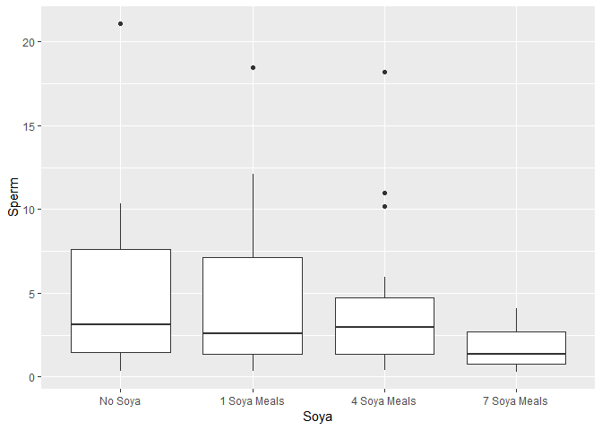

ch015(비모수적 검정)
================
jakinpilla
2020-02-10

  - [비모수적 검정은 언제 사용할까?](#비모수적-검정은-언제-사용할까)
  - [독립적인 두 조건의 비교: 윌콕스 순위합 검정](#독립적인-두-조건의-비교-윌콕스-순위합-검정)
  - [윌콕슨 순위합 검정의 이론](#윌콕슨-순위합-검정의-이론)
  - [자료 입력과 잠정 분석](#자료-입력과-잠정-분석)
  - [R을 이용한 윌콕슨 순위합 검정 실행](#r을-이용한-윌콕슨-순위합-검정-실행)
  - [효과크기 계산](#효과크기-계산)
  - [윌콕슨 순위합 검정 결과의 보고](#윌콕슨-순위합-검정-결과의-보고)
  - [연관된 두 조건의 비교: 윌콕슨 부호순위 검정](#연관된-두-조건의-비교-윌콕슨-부호순위-검정)
  - [월콕슨 부호순위 검정의 이론](#월콕슨-부호순위-검정의-이론)
  - [R을 이용한 검정 실행](#r을-이용한-검정-실행)
  - [윌콕슨 부호순위 검정 결과의 해석](#윌콕슨-부호순위-검정-결과의-해석)
  - [효과크기의 계산](#효과크기의-계산)
  - [윌콕슨 부호순위 검정 결과의 보고](#윌콕슨-부호순위-검정-결과의-보고)
  - [윌콕슨 순위검정 요약](#윌콕슨-순위검정-요약)
  - [여러독립 그룹의 차이: 크러스컬-윌리스 검정](#여러독립-그룹의-차이-크러스컬-윌리스-검정)
  - [크러스컬-윌리스 검정의 이론](#크러스컬-윌리스-검정의-이론)
  - [자료 입력과 잠정 분석](#자료-입력과-잠정-분석-1)
  - [R을 이용한 크러스컬-윌리스 검정 실행](#r을-이용한-크러스컬-윌리스-검정-실행)
  - [크러스컬-윌리스 검정을 위한 사후검정](#크러스컬-윌리스-검정을-위한-사후검정)
  - [추세검정 : 용크헤이러-테르프스크라 검정](#추세검정-용크헤이러-테르프스크라-검정)
  - [효과크기 계산](#효과크기-계산-1)
  - [크리스컬-월리스 검정 결과의 보고](#크리스컬-월리스-검정-결과의-보고)
  - [핵심정리](#핵심정리)

#### 비모수적 검정은 언제 사용할까?

통계적인 가정(정규분포, 분산의 동질성 가정 등)이 성립하지 않을 때 사용한다.

ranking 순위화에 기초

``` r
library(ez)
library(ggplot2)
library(nlme)
library(pastecs)
library(reshape2)
library(WRS)
library(clinfun)
library(pgirmess)
library(car)
library(tidyverse)
```

#### 독립적인 두 조건의 비교: 윌콕스 순위합 검정

Mann-Whitney test

Wilcoxon’s rank-sum test

#### 윌콕슨 순위합 검정의 이론

평균순위 : 1에서 그룹 크기까지의 합

  
}{2} ")  

  
  

W : 검정통계량, p-value, 참값 접근 방식, 정규 근사 접근방식

**참값 접근 방식**은 몬테카를로 방법을 이용해서 유의수준을 구한다. 몬테카를로 방법은 표본과 부합하는 다수의 부분집합을
생성하되, 참가자들을 정확한 그룹에 넣는 것이 아니라 무작위로 선택한 그룹에 넣는다. **참가자들이 무작위로 그룹에
배정되므로 귀무가설이 참이다.** 따라서, 귀무가설이 참인 자료에 기초해서 W값을 계산하면 된다.

R은 사람들을 무작위로 배정해서 한 번만 분석하는 것이 아니라 그러한 과정을 수천번 반복하면서 귀무가설이 참일 때 나타나는 차이가
여러분의 자료에 나타난 차이만큼 큰 경우의 횟수를 센다.

또다른 계산 방법은 **정규 근사 접근 방식**이다. **W 통계량의 표집분포가 정규분포라고 가정한다. 그 가정이 성립한다면 z
값을 계산하는데 쓰이는 표준오차를 구할 수 있으며 따라서 p 값도 구할 수 있다.** R은 기본적으로 표본크기가 40을 넘으면
정규 근사 접근 방식을 사용한다. 그리고 자료에 동순위 점수들이 있으면 좋든 싫든 정규 근사 접근 방식을 사용해야 한다.

정규 근사 접근 방식으로 p 값을 계산할 때는 필요하다면 연속성 수정을 가할 수도 있다. R의 경우 따로 특별히 지정하지 않으면
연속성 수정을 가한다.

#### 자료 입력과 잠정 분석

``` r
gl(2, 10, labels = c('Ecstacy', 'Alcohol'))
```

    ##  [1] Ecstacy Ecstacy Ecstacy Ecstacy Ecstacy Ecstacy Ecstacy Ecstacy
    ##  [9] Ecstacy Ecstacy Alcohol Alcohol Alcohol Alcohol Alcohol Alcohol
    ## [17] Alcohol Alcohol Alcohol Alcohol
    ## Levels: Ecstacy Alcohol

``` r
drugData <- read.delim('Drug.dat',  header = T)

drugData
```

    ##       drug sundayBDI wedsBDI
    ## 1  Ecstasy        15      28
    ## 2  Ecstasy        35      35
    ## 3  Ecstasy        16      35
    ## 4  Ecstasy        18      24
    ## 5  Ecstasy        19      39
    ## 6  Ecstasy        17      32
    ## 7  Ecstasy        27      27
    ## 8  Ecstasy        16      29
    ## 9  Ecstasy        13      36
    ## 10 Ecstasy        20      35
    ## 11 Alcohol        16       5
    ## 12 Alcohol        15       6
    ## 13 Alcohol        20      30
    ## 14 Alcohol        15       8
    ## 15 Alcohol        16       9
    ## 16 Alcohol        13       7
    ## 17 Alcohol        14       6
    ## 18 Alcohol        19      17
    ## 19 Alcohol        18       3
    ## 20 Alcohol        18      10

자가진단

이 자료들의 정규성 가정과 분산의 동질성 가정을 점검하라.

``` r
by(drugData[,c(2:3)], drugData$drug, stat.desc, basic=FALSE, norm=TRUE)
```

    ## drugData$drug: Alcohol
    ##                sundayBDI      wedsBDI
    ## median       16.00000000  7.500000000
    ## mean         16.40000000 10.100000000
    ## SE.mean       0.71802197  2.514181996
    ## CI.mean.0.95  1.62427855  5.687474812
    ## var           5.15555556 63.211111111
    ## std.dev       2.27058485  7.950541561
    ## coef.var      0.13845030  0.787182333
    ## skewness      0.11686189  1.500374383
    ## skew.2SE      0.08504701  1.091907319
    ## kurtosis     -1.49015904  1.079109997
    ## kurt.2SE     -0.55842624  0.404388605
    ## normtest.W    0.95946584  0.753466511
    ## normtest.p    0.77976459  0.003933024
    ## -------------------------------------------------------- 
    ## drugData$drug: Ecstasy
    ##                sundayBDI    wedsBDI
    ## median       17.50000000 33.5000000
    ## mean         19.60000000 32.0000000
    ## SE.mean       2.08806130  1.5129074
    ## CI.mean.0.95  4.72352283  3.4224344
    ## var          43.60000000 22.8888889
    ## std.dev       6.60302961  4.7842334
    ## coef.var      0.33688927  0.1495073
    ## skewness      1.23571300 -0.2191665
    ## skew.2SE      0.89929826 -0.1594999
    ## kurtosis      0.26030385 -1.4810114
    ## kurt.2SE      0.09754697 -0.5549982
    ## normtest.W    0.81063991  0.9411413
    ## normtest.p    0.01952060  0.5657814

일요일, 알코올의 경우 W= .96, 유의하지 않음 이므로 정규성을 가짐

일요일, 엑스터시의 경우 W = .81, 유의함 이므로 정규분포가 아님

수요일, 알코올의 경우 W = .75, 유의함이므로 정규분포가 아님

수요일, 엑스터시의 경우 W = .94, 유의하지 않음 이므로 정규성을 가짐

일요일 자료와 수요일 자료의 표집분포도 정규분포가 아닐 수 있다. 그러므로 비모수적 검정을 사용한다.

``` r
leveneTest(drugData$sundayBDI, drugData$drug, center = "mean")
```

    ## Levene's Test for Homogeneity of Variance (center = "mean")
    ##       Df F value  Pr(>F)  
    ## group  1  3.6436 0.07236 .
    ##       18                  
    ## ---
    ## Signif. codes:  0 '***' 0.001 '**' 0.01 '*' 0.05 '.' 0.1 ' ' 1

``` r
leveneTest(drugData$wedsBDI, drugData$drug, center = "mean")
```

    ## Levene's Test for Homogeneity of Variance (center = "mean")
    ##       Df F value Pr(>F)
    ## group  1  0.5081 0.4851
    ##       18

모두 유의하지 않으므로 분산의 동질성 가정이 성립한다.

``` r
# install.packages('Rcmdr', dependencies = T)
# library(Rcmdr)
```

Rcmdr를 사용하면 자료에 동순위 점수들이 있으면 참값 접근 방식을 사용할 수 없다는 점과 표분 크기가 크면 오랜 시간이
걸린다는 점은 명심하자.

#### R을 이용한 윌콕슨 순위합 검정 실행

``` r
sunModel <- wilcox.test(sundayBDI ~ drug, data = drugData); sunModel
```

    ## Warning in wilcox.test.default(x = c(16L, 15L, 20L, 15L, 16L, 13L, 14L, :
    ## cannot compute exact p-value with ties

    ## 
    ##  Wilcoxon rank sum test with continuity correction
    ## 
    ## data:  sundayBDI by drug
    ## W = 35.5, p-value = 0.2861
    ## alternative hypothesis: true location shift is not equal to 0

``` r
wedModel <- wilcox.test(wedsBDI ~ drug, data = drugData); wedModel
```

    ## Warning in wilcox.test.default(x = c(5L, 6L, 30L, 8L, 9L, 7L, 6L, 17L,
    ## 3L, : cannot compute exact p-value with ties

    ## 
    ##  Wilcoxon rank sum test with continuity correction
    ## 
    ## data:  wedsBDI by drug
    ## W = 4, p-value = 0.000569
    ## alternative hypothesis: true location shift is not equal to 0

Warning in wilcox.test.default(x = c(16L, 15L, 20L, 15L, 16L, 13L, 14L,
:cannot compute exact p-value with ties

기본 설정인 참값 접근 방식을 요구했지만, 동순위 점수들이 있어 그 접근방식을 사용할 수 없었다는 의미이다.

#### 효과크기 계산

나만의 윌콕슨 순위합 검정

``` r
library(dplyr)
drugData %>% 
  filter(drug == 'Alcohol') %>% 
  dplyr::select(sundayBDI) %>%
  pull(sundayBDI) -> g1


drugData %>% 
  filter(drug == 'Ecstasy') %>% 
  dplyr::select(sundayBDI) %>%
  pull(sundayBDI) -> g2

n1 <- length(g1)
n2 <- length(g2)

w <- rank(c(g1, g2))
r1 <- w[1:n1]
r2 <- w[(n1+1):(n1+n2)]

w1 <- sum(r1)
w2 <- sum(r2)

wilc1 <- w1 - n1*(n1+1)/2
wilc2 <- w2 - n2*(n2+1)/2

wilc <- min(wilc1, wilc2)
wilc
```

    ## [1] 35.5

``` r
m1 <- mean(r1)
m2 <- mean(r2)

m1
```

    ## [1] 9.05

``` r
m2
```

    ## [1] 11.95

효과크기를 계산하는 함수를 제작한다.

``` r
rFromWilcox <- function(wilcoxModel, N) {
  z <- qnorm(wilcoxModel$p.value/2)
  r <- z / sqrt(N)
  
  cat(wilcoxModel$data.name, 'Effect Size, r = ', r)
}
```

각 모델에 대해 이 함수를 사용한다.

``` r
rFromWilcox(sunModel, 20) 
```

    ## sundayBDI by drug Effect Size, r =  -0.2385338

``` r
rFromWilcox(wedModel, 20)
```

    ## wedsBDI by drug Effect Size, r =  -0.7705401

``` r
rFromWilcox(wedModel, 20)
```

    ## wedsBDI by drug Effect Size, r =  -0.7705401

일요일 자료의 효과크기는 작은 효과와 중간 효과의 사이이고(.3보다 작다) 수요일 자료의 효과크기는 아주 큰 효과에 해당한다.(큰
효과의 기준 .5보다 크다.)

#### 윌콕슨 순위합 검정 결과의 보고

약물 복용 다음 날(일요일)의 엑스터시 복용자의 우울증 수준(Mdn = 17.50)과 알코올 복용자의 우울증 수준(Mdn =
16.00)의 차이는 W = 35.5, p = .286, r = -.25로 유의하지 않았다. 그러나 주중(수요일)의 엑스터시
복용자의 우울증 수준(Mdn = 33.50)과 알코올 복용자의 우울증 수준(Mdn = 7.50)의 차이는 W = 4,
p \< .001, r = -.78 로 유의했다.

#### 연관된 두 조건의 비교: 윌콕슨 부호순위 검정

Wilcoxon signed-rank test

두 가지 점수 집합을 비교하되, 그 점수들을 같은 참가자들에게서 측정한 상황에 쓰임. 일종의 종속 t 검정의 비모수적 버전에
해당한다.

자가진단 : 일요일에 대한 수요일의 BDI 점수 차이(변화량)을 계산하고, 이 변화량들의 정규성을 알코올 그룹과 엑스터시 그룹
각각 검사하라.

``` r
drugData %>% 
  mutate(diff = wedsBDI - sundayBDI) -> drugData_1

by(drugData_1$diff, drugData_1$drug, stat.desc, basic=FALSE, norm=TRUE)
```

    ## drugData_1$drug: Alcohol
    ##       median         mean      SE.mean CI.mean.0.95          var 
    ##  -7.50000000  -6.30000000   2.09788253   4.74573999  44.01111111 
    ##      std.dev     coef.var     skewness     skew.2SE     kurtosis 
    ##   6.63408706  -1.05302969   1.23907117   0.90174219   0.98664006 
    ##     kurt.2SE   normtest.W   normtest.p 
    ##   0.36973617   0.82795980   0.03161929 
    ## -------------------------------------------------------- 
    ## drugData_1$drug: Ecstasy
    ##       median         mean      SE.mean CI.mean.0.95          var 
    ##   14.0000000   12.4000000    2.5307004    5.7248420   64.0444444 
    ##      std.dev     coef.var     skewness     skew.2SE     kurtosis 
    ##    8.0027773    0.6453853   -0.4140842   -0.3013525   -1.3686700 
    ##     kurt.2SE   normtest.W   normtest.p 
    ##   -0.5128991    0.9087803    0.2727175

#### 월콕슨 부호순위 검정의 이론

만일 차이가 0이면 그 점수는 순위화에서 제외한다. 0이 아니면 그 부호를 기록해두되, 순위는 부호를 무시하고 차이의
크기(절대값)로 결정한다.

모든 점수 차이를 매긴 후에는, 양의 순위들의 합과 음의 순위들의 합을 따로 구한다.

양, 음 순위합 중 더 작은 것이 최종적인 검정통계량 T가 된다.

엑스터시 그룹의 경우 이고 이다. 그래서 최종 T는 0이다.

알코올 그룹의 경우 이고 이다. 그래서 최종 T는 8이다.

검정통계량 T의 유의확률은 이전처럼
평균()과
표준오차()로 구한다. 이전 절의 윌콕슨 순위합 검정에서처럼, 평균과 표준오차 둘 다 표본크기 n의
함수이다.

  
}{4}")  

  
(2n+1)}{24}}")  

엑스터시 그룹에서는 차이가 0인 두 점수를 배재했었다. 따라서 n은 10이 아니라 8이어야 한다.   
}{4} = 18")  
  
(16+1)}{24}} = 7.14")  

알코올 그룹에서는 점수가 제외된 참가자가 없었으므로 10을 그대로 사용한다.   
}{4} = 18")  
  
(20+1)}{24}} = 9.81")  

검정통계량과 검정통계량의 평균, 그리고 표준오차를 알고 있으면 검정통계량을 z 점수로 손쉽게 변환할 수 있다.

  
  

여기에 각각 수치를 대입하여 각각의 z점수를 구해보자.

  
  

  
  

만일 z 점수의 크기가 1.96보다 크면 해당 검정은 p \< .05 수준에서 유의한 것이다. 엑스터시 그룹과 알코올 그룹 모두,
수요일과 일요일의 우울증 점수의 차이는 유의하다.

#### R을 이용한 검정 실행

자가진단: 데이터프레임의 점수들을 약물종류에 따라 분리하라

``` r
drugData %>%
  filter(drug == 'Ecstasy') -> ecstasyData


drugData %>%
  filter(drug == 'Alcohol') -> alcoholData
```

`윌콕스 부호순위 검정`을 수행한다. paired = TRUE 옵션을 지정하지 않으면 R은 `윌콕슨 순위합 검정`을 실시하므로
주의하자.

``` r
alcoholModel <- wilcox.test(alcoholData$wedsBDI, alcoholData$sundayBDI, paired = T, 
                            correct = F)
```

    ## Warning in wilcox.test.default(alcoholData$wedsBDI,
    ## alcoholData$sundayBDI, : cannot compute exact p-value with ties

``` r
alcoholModel
```

    ## 
    ##  Wilcoxon signed rank test
    ## 
    ## data:  alcoholData$wedsBDI and alcoholData$sundayBDI
    ## V = 8, p-value = 0.04657
    ## alternative hypothesis: true location shift is not equal to 0

``` r
ecstasyModel <- wilcox.test(ecstasyData$wedsBDI, ecstasyData$sundayBDI, paried = T, 
                            correct = FALSE)
```

    ## Warning in wilcox.test.default(ecstasyData$wedsBDI,
    ## ecstasyData$sundayBDI, : cannot compute exact p-value with ties

``` r
ecstasyModel
```

    ## 
    ##  Wilcoxon rank sum test
    ## 
    ## data:  ecstasyData$wedsBDI and ecstasyData$sundayBDI
    ## W = 92, p-value = 0.001426
    ## alternative hypothesis: true location shift is not equal to 0

#### 윌콕슨 부호순위 검정 결과의 해석

중앙값들에 근거할 때,

알코올의 경우, `V = 8`은 앞에서 설명한
 값에
해당한다. `p = .047`로 유의하다. 즉 알코올을 복용한 경우, 일요일(복용 다음날) 보다 주중의 우울증 점수가
유의하게 더 낮다.

엑스터시의 경우, `p = 0.001426`로 유의하다. 즉, 엑스터시를 복용한 경우 일요일(복용 다음날 보다)보다 주중의 우울증
점수가 더 유의하게 높다.

두 그룹의 결과를 비교해보면, 우울증에 대한 알코올 복용과 엑스터시 복용의 효과가 정반대임을 알 수 있다. 알코올을 먹으면 그
다음날은 약간 우울해지지만, 주중이 되면 우울증 수준이 떨어진다.

엑스터시를 먹으면 그 다음날 우울증이 심해지지만, 알코올과는 달리 주중이 되면 우울증 수준이 오히려 더 높아진다. 같은 참가자들로
이루어진 그룹들의 이러한 반대되는 효과를 상호작용이라고 한다.

#### 효과크기의 계산

이전에 만들어 둔 rFromWilcox() 함수를 재활용할 수 있다.

각 그룹의 참가자는 10명이지만, 그 사람들을 두 번 측정했기 때문에 관측값은 20개이다.

``` r
rFromWilcox(alcoholModel, 20)
```

    ## alcoholData$wedsBDI and alcoholData$sundayBDI Effect Size, r =  -0.4450246

``` r
rFromWilcox(ecstasyModel, 20)
```

    ## ecstasyData$wedsBDI and ecstasyData$sundayBDI Effect Size, r =  -0.7131541

우울증 수준 변화에 대한 알코올 복용 효과는 중간 효과와 큰 효과 사이이다.

우울증 수준 변화에 대한 엑스터시 복용의 효과는 큰 효과이다.

#### 윌콕슨 부호순위 검정 결과의 보고

엑스터시 복용자의 경우, 수요일의 우울증 수준(Mdn = 33.50)이 일요일의 우울증 수준(Mdn= 17.50)에 비해 p =
.047, r = -.56으로 유의하게 높았다. 그러나 알코올 복용자는 그 반대였다. 알코올 복용시에는 수요일의 우울증
수준(Mdn = 7.50)이 일요일의 우울증 수준(Mdn = 16.00)에 비해 p = .012, r = -.45로
유의하게 낮았다.

#### 윌콕슨 순위검정 요약

  - 윌콕슨 부호순위 검정은 두 조건을 검사한다. 이 검정은 각 조건에 같은 참가자들이 참여하되 그 자료가 종속 t 검정의 어떤
    가정을 위반할 때 쓰인다.

  - 이 검정에서도 p 값으로 유의성을 판정한다. 만일 그 값이 .05보다 작으면 두 그룹의 차이가 유의한 것이다.

  - 결과를 보고할 때는 유의확률을 명시한다. 또한 중앙값과 해당 범위들도 보고하는 것이 좋다.

#### 여러독립 그룹의 차이: 크러스컬-윌리스 검정

#### 크러스컬-윌리스 검정의 이론

순위화된 자료에 기초한다. 순위들을 매긴 후 점수들을 그룹별로 모아서 각 그룹의 순위들을 모두 더한다.

그러한 순위합을 라고 표기한다.(i는 특정그룹을 식별하는 색인임)

  
} \\sum_{i=1}^{k} \\frac{R^2_{i}}{n_{i}} - 3 \\left(N + 1 \\right) ")  

  
} \\left( \\frac{927^2}{20} + \\frac{883^2}{20} + \\frac{883^2}{20} + \\frac{547^2}{20} \\right) - 3 \\left( 81 \\right)")  

이 검정통계량은 카이제곱 분포를 따른다. 자유도는 그룹 수에서 1을 뺀 것이다.(k - 1)

#### 자료 입력과 잠정 분석

``` r
soyaData <- read.delim("Soya.dat", header = T)
soyaData %>% str()
```

    ## 'data.frame':    80 obs. of  3 variables:
    ##  $ Soya : int  1 1 1 1 1 1 1 1 1 1 ...
    ##  $ Sperm: num  0.351 0.576 0.884 0.923 1.217 ...
    ##  $ Ranks: int  4 9 17 18 22 30 31 33 41 46 ...

대조군(콩 식사 없음)을 요인의 첫 수준으로 삼는 것이 좋다. 앞에서 자료를 직접 입력할 때는 그렇게 했지만, 지금은 그렇지
않다. 순서를 다음과 같이 바꾼다.

``` r
soyaData %>%
  mutate(Soya = case_when(
    Soya == 1 ~ 'No Soya',
    Soya == 2 ~ '1 Soya Meals',
    Soya == 3 ~ '4 Soya Meals',
    Soya == 4 ~ '7 Soya Meals'
  )) -> soyaData

soyaData$Soya <- factor(soyaData$Soya, 
                        levels = c('No Soya', '1 Soya Meals', '4 Soya Meals', '7 Soya Meals'))
soyaData %>% str()
```

    ## 'data.frame':    80 obs. of  3 variables:
    ##  $ Soya : Factor w/ 4 levels "No Soya","1 Soya Meals",..: 1 1 1 1 1 1 1 1 1 1 ...
    ##  $ Sperm: num  0.351 0.576 0.884 0.923 1.217 ...
    ##  $ Ranks: int  4 9 17 18 22 30 31 33 41 46 ...

``` r
soyaData$Soya
```

    ##  [1] No Soya      No Soya      No Soya      No Soya      No Soya     
    ##  [6] No Soya      No Soya      No Soya      No Soya      No Soya     
    ## [11] No Soya      No Soya      No Soya      No Soya      No Soya     
    ## [16] No Soya      No Soya      No Soya      No Soya      No Soya     
    ## [21] 1 Soya Meals 1 Soya Meals 1 Soya Meals 1 Soya Meals 1 Soya Meals
    ## [26] 1 Soya Meals 1 Soya Meals 1 Soya Meals 1 Soya Meals 1 Soya Meals
    ## [31] 1 Soya Meals 1 Soya Meals 1 Soya Meals 1 Soya Meals 1 Soya Meals
    ## [36] 1 Soya Meals 1 Soya Meals 1 Soya Meals 1 Soya Meals 1 Soya Meals
    ## [41] 4 Soya Meals 4 Soya Meals 4 Soya Meals 4 Soya Meals 4 Soya Meals
    ## [46] 4 Soya Meals 4 Soya Meals 4 Soya Meals 4 Soya Meals 4 Soya Meals
    ## [51] 4 Soya Meals 4 Soya Meals 4 Soya Meals 4 Soya Meals 4 Soya Meals
    ## [56] 4 Soya Meals 4 Soya Meals 4 Soya Meals 4 Soya Meals 4 Soya Meals
    ## [61] 7 Soya Meals 7 Soya Meals 7 Soya Meals 7 Soya Meals 7 Soya Meals
    ## [66] 7 Soya Meals 7 Soya Meals 7 Soya Meals 7 Soya Meals 7 Soya Meals
    ## [71] 7 Soya Meals 7 Soya Meals 7 Soya Meals 7 Soya Meals 7 Soya Meals
    ## [76] 7 Soya Meals 7 Soya Meals 7 Soya Meals 7 Soya Meals 7 Soya Meals
    ## Levels: No Soya 1 Soya Meals 4 Soya Meals 7 Soya Meals

분포의 정규성 검정 결과를 살펴보자.

``` r
by(soyaData$Sperm, soyaData$Soya, stat.desc, basic=FALSE, norm=TRUE)
```

    ## soyaData$Soya: No Soya
    ##       median         mean      SE.mean CI.mean.0.95          var 
    ##  3.095420117  4.986762754  1.136899297  2.379557577 25.850800249 
    ##      std.dev     coef.var     skewness     skew.2SE     kurtosis 
    ##  5.084368225  1.019572913  1.546389232  1.509841004  2.328806660 
    ##     kurt.2SE   normtest.W   normtest.p 
    ##  1.173339941  0.805230950  0.001035023 
    ## -------------------------------------------------------- 
    ## soyaData$Soya: 1 Soya Meals
    ##       median         mean      SE.mean CI.mean.0.95          var 
    ##   2.59506207   4.60524515   1.04483162   2.18685770  21.83346208 
    ##      std.dev     coef.var     skewness     skew.2SE     kurtosis 
    ##   4.67262903   1.01463199   1.35039755   1.31848150   1.42280617 
    ##     kurt.2SE   normtest.W   normtest.p 
    ##   0.71686299   0.82591018   0.00216007 
    ## -------------------------------------------------------- 
    ## soyaData$Soya: 4 Soya Meals
    ##       median         mean      SE.mean CI.mean.0.95          var 
    ## 2.942865e+00 4.110071e+00 9.860858e-01 2.063901e+00 1.944730e+01 
    ##      std.dev     coef.var     skewness     skew.2SE     kurtosis 
    ## 4.409910e+00 1.072952e+00 1.822886e+00 1.779803e+00 2.794321e+00 
    ##     kurt.2SE   normtest.W   normtest.p 
    ## 1.407884e+00 7.425520e-01 1.351186e-04 
    ## -------------------------------------------------------- 
    ## soyaData$Soya: 7 Soya Meals
    ##       median         mean      SE.mean CI.mean.0.95          var 
    ##   1.33255849   1.65301216   0.24790153   0.51886386   1.22910334 
    ##      std.dev     coef.var     skewness     skew.2SE     kurtosis 
    ##   1.10864933   0.67068432   0.60898948   0.59459628  -0.91487836 
    ##     kurt.2SE   normtest.W   normtest.p 
    ##  -0.46094995   0.91229932   0.07051093

콩을 먹지 않은 그룹은  = .805, p = .001"), 매주 1회 그룹은  = .826, p = .002"), 매주 4회 그룹은  = .826, p = .002"), 매주 4회 그룹은  = .743, p \< .001")로 유의하다. 즉, 정규분포로부터 벗어나 있다.

``` r
leveneTest(soyaData$Sperm, soyaData$Soya)
```

    ## Levene's Test for Homogeneity of Variance (center = median)
    ##       Df F value  Pr(>F)  
    ## group  3  2.8601 0.04239 *
    ##       76                  
    ## ---
    ## Signif. codes:  0 '***' 0.001 '**' 0.01 '*' 0.05 '.' 0.1 ' ' 1

 = 2.86, p = .042") 동질성 가정이 위반되었다.

#### R을 이용한 크러스컬-윌리스 검정 실행

``` r
kruskal.test(Sperm ~ Soya, data = soyaData)
```

    ## 
    ##  Kruskal-Wallis rank sum test
    ## 
    ## data:  Sperm by Soya
    ## Kruskal-Wallis chi-squared = 8.6589, df = 3, p-value = 0.03419

각 그룹의 평균 순위를 구해 구면 크러스컬-윌리스 검정을 해석하는데 도움이 된다.

``` r
soyaData$Ranks <- rank(soyaData$Sperm)


by(soyaData$Ranks, soyaData$Soya, mean)
```

    ## soyaData$Soya: No Soya
    ## [1] 46.35
    ## -------------------------------------------------------- 
    ## soyaData$Soya: 1 Soya Meals
    ## [1] 44.15
    ## -------------------------------------------------------- 
    ## soyaData$Soya: 4 Soya Meals
    ## [1] 44.15
    ## -------------------------------------------------------- 
    ## soyaData$Soya: 7 Soya Meals
    ## [1] 27.35

``` r
soyaData %>%
  group_by(Soya) %>%
  summarise(mean_sperm  = mean(Sperm))
```

    ## # A tibble: 4 x 2
    ##   Soya         mean_sperm
    ##   <fct>             <dbl>
    ## 1 No Soya            4.99
    ## 2 1 Soya Meals       4.61
    ## 3 4 Soya Meals       4.11
    ## 4 7 Soya Meals       1.65

``` r
soyaData %>%
  ggplot(aes(Soya, Sperm)) +
  geom_boxplot()
```

<!-- -->

#### 크러스컬-윌리스 검정을 위한 사후검정

비모수적 사후 검정을 수행하는 한 가지 방법은 모든 가능한 비교에 대해 윌콕슨 순위합 검정을 수행하는 것이다. 이 방법은 서로
다른 그룹의 평균 순위와의 차이를 어떤 임계값과 비교하는 것이다. 그 임계값은 z 점수(수행하는 비교 횟수에 맞게
수정된)와 전체 표본 크기, 그리고 비교하는 두 그룹의 표본 크기에 기초한 상수로 계산한다.

  
  

  
} \\sqrt{ \\frac{N(N + 1)}{12} \\left( \\frac{1}{n_{u}} + \\frac{1}{n_{v}} \\right)} ")  

은 그냥 비교하는 두 그룹의 평균 순위 차이의
크기이다.

우변에서 k는 그룹의 수이고, N은 전체표본크기이다.
는 비교하는
첫 그룹의 참가자 수이고 는 둘째 그룹의 참가자 수이다.

는 통상
0.05이고 그룹의 수 k는 4이므로  = 0.05 / 4(4-1) = .00417") 이다.

의 의미는 모든 z중 자신보다 큰 값의 비율이 .00417인 z 값의 의미이므로 정규분포 확률표를 참고하면
2.64를 근사값으로 얻을 수 있다.

만일 두 그룹의 평균 순위 차이의 크기가 임계 차이보다 크면, 두 그룹의 차이는 유의한 것이다.

이 모든 계산을 해 주는 `kruskalmc()` 함수를 이용한다.

``` r
library(pgirmess)
kruskalmc(Sperm ~ Soya, data = soyaData)
```

    ## Multiple comparison test after Kruskal-Wallis 
    ## p.value: 0.05 
    ## Comparisons
    ##                           obs.dif critical.dif difference
    ## No Soya-1 Soya Meals          2.2     19.38715      FALSE
    ## No Soya-4 Soya Meals          2.2     19.38715      FALSE
    ## No Soya-7 Soya Meals         19.0     19.38715      FALSE
    ## 1 Soya Meals-4 Soya Meals     0.0     19.38715      FALSE
    ## 1 Soya Meals-7 Soya Meals    16.8     19.38715      FALSE
    ## 4 Soya Meals-7 Soya Meals    16.8     19.38715      FALSE

결과 중 difference 열이 TRUE이면 차이가 유의한 것이고, FALSE이면 유의하지 않은 것이다.

결과적으로 지금 예제에서는 모든 차이가 임계 차이보다 작으므로, 그 열이 모두 FALSE이고 즉 모든 차이가 유의하지 않은 것이
되었다.

하지만 이처럼 모든 그룹을 다른 모든 그룹과 비교할 때는 차이들의 유의성이 너무 엄격하게 판정된다. 그렇지 않으면 제1종 오류율이
상승하기 때문이다. 특정 그룹들만 집중해서 비교한다면 이러한 문제점을 완화할 수 있다.

대조군은 ’No Soya’이므로 이것을 기준으로 다음과 같이 비교한다.

  - 검정1: ‘No Soya’ vs ‘1 Soya Meals’

  - 검정2: ‘No Soya’ vs ‘4 Soya Meals’

  - 검정3: ‘No Soya’ vs ‘7 Soya Meals’

이런 검정은 6회가 아니라 3회만 수행되므로 모든 결과가 덜 엄격히 판정된다. 그리고 이는 `kruskalmc()` 함수에
`cont` 옵션을 지정하기만 하면 자동으로 실현된다.

cont 옵션은 one-tailed, two-tailed 두 가지 중 택일한다.

``` r
kruskalmc(Sperm ~ Soya, data = soyaData, cont = 'two-tailed')
```

    ## Multiple comparison test after Kruskal-Wallis, treatments vs control (two-tailed) 
    ## p.value: 0.05 
    ## Comparisons
    ##                      obs.dif critical.dif difference
    ## No Soya-1 Soya Meals     2.2     17.59209      FALSE
    ## No Soya-4 Soya Meals     2.2     17.59209      FALSE
    ## No Soya-7 Soya Meals    19.0     17.59209       TRUE

이번에는 ‘No Soya’ 대 ‘7 Soya Meals’ 그룹의 차이가 유의하게 나왔다. 이번 검정에서는 비교가 3회 뿐이라서
임계 차이를 계산할 때 그 세 검정의 평균순위들만 쓰여서 임계 차이가 적어졌기 때문이다.

이 예는 맹목적으로 모든 그룹을 모든 그룹과 비교하는 것보다는 적절한 그룹들을 선택해서 집중적으로 비교하는 것이 더 낫다는 점을
잘 보여준다.

#### 추세검정 : 용크헤이러-테르프스크라 검정

용크헤이러-테르프스크라 검정은 비교하는 그룹들의 중앙값들에 어떤 순서 있는 패턴이 존재하는지를 검사한다.

이 검정은 그룹들의 중앙값들이 부호화 변수에 지정된 수준들의 순서를 기준으로 특정한 순서(오름차순인지 또는 내림차순)를 따르는지의
여부를 판정한다.

지금 예에서는 정자 수 중앙값들이 그룹들에 따라 증가 또는 감소하는 순서인지 판정한다.

``` r
jonckheere.test(soyaData$Sperm, as.numeric(soyaData$Soya))
```

    ## 
    ##  Jonckheere-Terpstra test
    ## 
    ## data:  
    ## JT = 912, p-value = 0.01308
    ## alternative hypothesis: two.sided

JT는 검정통계량이다. 표본이 클 때는 이 검정통계량의 표집분포가 정규분포이고 그 평균과 표준편차를 손쉽게 정의, 계산할 수
있다. (JT = 912, Mean = 1.200, sd = 116.33)

p \< .05이므로 통계적으로 유의한 추세가 존재한다. 즉 콩 식품 섭취량이 증가할 수록 정자 수가 감소한다.

#### 효과크기 계산

자유도가 2 이상인 카이제곱 통계량을 손쉽게 효과크기 r로 변환하는 방법은 없다.

#### 크리스컬-월리스 검정 결과의 보고

  - 콩 식품 섭취는 정자 수에 유의하게 영향을 미쳤다.  = 8.66, p = .034")

  - 그룹들 사이의 집중된 평균 순위 비교에 따르면, 콩 식품을 전혀 먹지 않았을 때에 비해 매주 1회 또는 4회 먹었을 때의
    정자 수 차이는 유의하지 않았다. 그러나 콩 식품을 전혀 먹지 않았을 때에 비해 매주 7회 먹었을 때는 정자수가
    유의하게 감소했다.

  - 만일 콩 식품을 매일 먹는다면 정자수가 유의하게 감소하지만, 그 보다 적게 먹는다면 유의한 차이가 생기지는 않을 것이다.

  - 융크헤이러 검정에 따르면, 자료에 유의한 추세가 존재한다. 콩 식품을 먹을수록 정자 수 중앙값이 감소했다. 

#### 핵심정리

  - 크러스컬-월리스 검정은 여러 조건을 비교한다. 이 검정은 각 조건에서 서로 다른 참가자들을 측정한 자료가 일원 독립
    분산분석의 어떤 가정을 위반할 때 쓰인다.

  - p 값으로 유의성을 판정한다.
