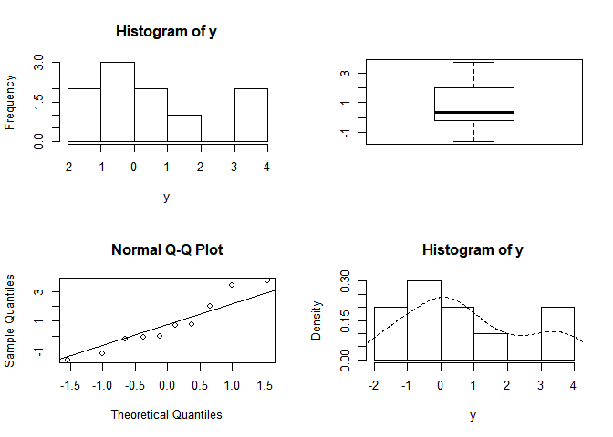

ch015(비모수적 검정)
================
jakinpilla
2020-02-14

  - [총 SSCP 행렬(T)](#총-sscp-행렬t)

종속변수들의 관계: 교차곱

세가지 교차곱: 총교차곱, 모형교차곱, 잔차교차곱…

총교차곱

  
} - \\overline{X}_{total(Actions)} \\right) \\left( x_{i(Thoughts)} - \\overline{X}_{total(Thoughts)} \\right)")  

  
![ CP\_{M} = \\sum\_{grp=1}^{k} n \\left\[ \\left(
\\overline{x}\_{grp(Actions)} - \\overline{X}\_{total(Actions)}}
\\right) \\left( \\overline{x}\_{grp(Thoughts)} -
\\overline{X}\_{total(Thoughts)}} \\right) \\right\]
](https://latex.codecogs.com/png.latex?%20CP_%7BM%7D%20%3D%20%5Csum_%7Bgrp%3D1%7D%5E%7Bk%7D%20n%20%5Cleft%5B%20%5Cleft%28%20%5Coverline%7Bx%7D_%7Bgrp%28Actions%29%7D%20-%20%5Coverline%7BX%7D_%7Btotal%28Actions%29%7D%7D%20%5Cright%29%20%5Cleft%28%20%5Coverline%7Bx%7D_%7Bgrp%28Thoughts%29%7D%20-%20%5Coverline%7BX%7D_%7Btotal%28Thoughts%29%7D%7D%20%5Cright%29%20%5Cright%5D%20
" CP_{M} = \\sum_{grp=1}^{k} n \\left[ \\left( \\overline{x}_{grp(Actions)} - \\overline{X}_{total(Actions)}} \\right) \\left( \\overline{x}_{grp(Thoughts)} - \\overline{X}_{total(Thoughts)}} \\right) \\right] ")  

  
} - \\overline{X}_{grp(Actions)} \\right) \\left( x_{i(Thoughts)} - \\overline{X}_{grp(Thoughts)} \\right)")  

#### 총 SSCP 행렬(T)

|              |                                      열 1 Actions                                       |                                       열 2 Thoughts                                        |
| :----------: | :------------------------------------------------------------------------------------: | :---------------------------------------------------------------------------------------: |
| 행 1 Actions  |  |                       |
| 행 2 Thoughts |                    |  |

  
  

``` r
library(tidyverse)
```

    ## Warning: package 'ggplot2' was built under R version 3.5.3

    ## Warning: package 'tibble' was built under R version 3.5.3

    ## Warning: package 'tidyr' was built under R version 3.5.3

    ## Warning: package 'purrr' was built under R version 3.5.3

    ## Warning: package 'dplyr' was built under R version 3.5.3

    ## Warning: package 'stringr' was built under R version 3.5.3

    ## Warning: package 'forcats' was built under R version 3.5.3

``` r
sleep
```

    ##    extra group ID
    ## 1    0.7     1  1
    ## 2   -1.6     1  2
    ## 3   -0.2     1  3
    ## 4   -1.2     1  4
    ## 5   -0.1     1  5
    ## 6    3.4     1  6
    ## 7    3.7     1  7
    ## 8    0.8     1  8
    ## 9    0.0     1  9
    ## 10   2.0     1 10
    ## 11   1.9     2  1
    ## 12   0.8     2  2
    ## 13   1.1     2  3
    ## 14   0.1     2  4
    ## 15  -0.1     2  5
    ## 16   4.4     2  6
    ## 17   5.5     2  7
    ## 18   1.6     2  8
    ## 19   4.6     2  9
    ## 20   3.4     2 10

``` r
sleep %>%
  filter(group == 1) %>%
  select(extra) %>% pull() -> y

summary(y)
```

    ##    Min. 1st Qu.  Median    Mean 3rd Qu.    Max. 
    ##  -1.600  -0.175   0.350   0.750   1.700   3.700

``` r
sd(y)
```

    ## [1] 1.78901

``` r
par(mfrow=c(2, 2))
hist(y)
boxplot(y)
qqnorm(y); qqline(y)
hist(y, prob = T); lines(density(y), lty = 2)
```

<!-- -->

``` r
par(mfrow=c(1, 1))

t.test(y)
```

    ## 
    ##  One Sample t-test
    ## 
    ## data:  y
    ## t = 1.3257, df = 9, p-value = 0.2176
    ## alternative hypothesis: true mean is not equal to 0
    ## 95 percent confidence interval:
    ##  -0.5297804  2.0297804
    ## sample estimates:
    ## mean of x 
    ##      0.75
