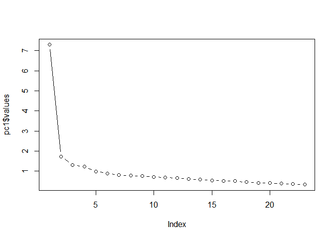
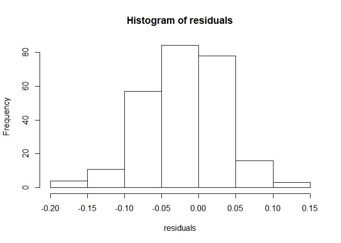

ch017\_1(탐색적인자분석)
================
jakinpilla
2020-02-26

  - [이번 장에서 배우는 내용](#이번-장에서-배우는-내용)
  - [인자분석은 언제 사용하는가?](#인자분석은-언제-사용하는가)
  - [인자](#인자)
  - [인자의 시각적 표현](#인자의-시각적-표현)
  - [인자의 수학적 표현](#인자의-수학적-표현)
  - [인자점수](#인자점수)
      - [회귀법](#회귀법)
  - [인자점수의 용도](#인자점수의-용도)
  - [인자를 찾아내는 여러 방법](#인자를-찾아내는-여러-방법)
  - [공통성](#공통성)
  - [주성분분석의 이론](#주성분분석의-이론)
  - [인자추출: 고유값과 scree plot](#인자추출-고유값과-scree-plot)
  - [해석의 개선: 인자회전](#해석의-개선-인자회전)
  - [인자 회전 방법의 선택](#인자-회전-방법의-선택)
  - [인자적재값의 실질적 중요도](#인자적재값의-실질적-중요도)
  - [연구예제](#연구예제)
  - [표본크기](#표본크기)
  - [변수들의 상관관계](#변수들의-상관관계)
      - [상관관계가 충분히 높지 않은 것](#상관관계가-충분히-높지-않은-것)
      - [상관관계가 너무 높은 것](#상관관계가-너무-높은-것)
  - [자료의 분포](#자료의-분포)
  - [R Commander를 이용한 인자분석 실행](#r-commander를-이용한-인자분석-실행)
  - [R을 이용한 인자분석 실행](#r을-이용한-인자분석-실행)
  - [초기 분석 및 분석](#초기-분석-및-분석)
      - [바틀렛 검정](#바틀렛-검정)
      - [KMO 검정](#kmo-검정)
      - [상관행렬의 판별식](#상관행렬의-판별식)
  - [회전](#회전)
  - [요점정리](#요점정리)
  - [직교회전(배리맥스)](#직교회전배리맥스)
  - [사각회전](#사각회전)
  - [회전결과의 해석](#회전결과의-해석)

``` r
library(ez)
library(ggplot2)
library(nlme)
library(pastecs)
library(reshape2)
library(WRS)
library(clinfun)
library(pgirmess)
library(car)
library(tidyverse)
# install.packages('mvoutlier')
library(mvoutlier)
```

#### 이번 장에서 배우는 내용

인자분석

#### 인자분석은 언제 사용하는가?

latent variable: 잠재변수 /직접 측정할 수 없는 것

인자분석을 통해 (1) 일단의 변수들의 구조를 이해하는 것, (2) 바탕 변수를 측정하는 설문을 구축하는 것, (3) 주어진 자료
집합을, 원래의 정보를 최재한 유지하면서도 좀 더 다루기 쉬운 크기로 줄이는 것 등을 할 수 있다.

#### 인자

만일 변수들의 부분집합들 사이의 서로 연관된 변수들의 군집에서 비롯된 자료 집합의 군집을 형성하고 있다면, 그런 변수들이 동일한
바탕 차원의 여러 측면을 측정한 것일 가능성이 있다. 이러한 바탕 차원을 인자(factor)라고 부른다. (잠재변수라고도
한다.)

인자분석(factor analysis)은 그보다 작은 크기의 인자 집합으로 축약된다. 이를 통해서 상관 행렬에 있는 공통의 변동을
최소한의 탐색적 구인(explanatory construct)들을 이용해서 최대한 많이 설명한다는 극도의 절약이 이루어진다.

심리학의 특성론(trait theory) 연구자들은 성격의 특성을 평가할 때 인자분석을 즐겨 사용한다.

#### 인자의 시각적 표현

그래프의 분류축으로 시각화, 한 변수의 위치는 두 인자와의 상관 정도에 따라 결정된다.

같은 축에 대해 좌표성분이 큰 변수들은 어떤 공통의 바탕 측명의 서로 다른 측명을 측정한 것이라고 가정할 수 있다. 분류축에 따른
한 변수의 좌표성분을 인자적재값(factor loading)이라고 부른다.

#### 인자의 수학적 표현

인자를 서술하는 직선방정식은 선형모형을 서술하는 직선방정식과 본질적으로 같다.

인자행렬(인자분석), 성분행렬(주성분분석)

#### 인자점수

factor score

##### 회귀법

b들에 인자적재값들이 아니라 인자점수 계수들을 대입한다. 그러한 여러 인자점수 계산법은 인자점수 계수들을 대입한다는 점이 다르다.
인자 점수 계산법은 인자점수 계수를 계산하는 방법에 따라 나뉘는데, 가장 간단한 방법은 회귀법이다. 이 방법에서는 변수들의 초기
상관관계를 고려해서 인자적재값들을 수정한다. 이에 의해 측정 단위의 차이가 사라지고 변수 분산들이 안정화된다.

인자점수 계수들의 행렬(B)

상관행렬(R)

인자적재값 행렬(A)

  
  

인자적재값 행렬에 상관행렬의 역행렬을 곱한다는 것은 개념적으로 각 인자적재값을 그에 대응되는 각 상관계수로 나누는 것과 같다.
결과적인 인자점수행렬은 원래의 변수 쌍들의 관계를 고려해서 수정된 각 변수와 각 인자의 관계를 나타낸다. 그런 차원에서 이
행렬은 변수들과 인자들의 유일한 관계를 좀 더 순수하게 대표하는 측도라 할 수 있다.

#### 인자점수의 용도

  - 1)  원래의 점수들 대신 인자점수들에 대해 추가적인 분석을 수행할 수 있다.

  - 2)  회귀분석의 공선성 문제를 극복할 수 있다.

#### 인자를 찾아내는 여러 방법

목적에 따라 인자를 찾아내는 방법이 달라짐 - 첫째, 자료 표본에서 발견한 사실들을 모집단으로 일반화할 것이지… - 둘째, 특정
가설없이 자료를 탐색하는 것이 목적인지 아니면 어떤 특정한 가설을 검증하려는 것인지…

특정 기법들은 사용된 표본이 곧 모집합이며, 분석 결과를 해당 표본 이상으로는 일반화할 수는 없다고 가정한다. (주성분분석, 주축
인자분석 등)

한편, 참가자들이 무작위로 선택되었으며 측정된 변수들이 우리가 관심이 있는 변수들의 모집단을 구성한다고 가정하는 접근 방식들도
있다. 그러한 가정 하에서는 표본에서 얻은 결과를 그 보다 큰 모집단으로 일반화하는 기법이 가능하다. 그러나 모든 발견은
오직 측정된 변수들의 집합에 대해서만 참이라는 제약이 따른다.(최대가능도법, 알파 인자추출 등)

#### 공통성

특정 변수의 총 변동은 두 부분으로 구성되는데, 하나는 다른 변수(측도)들과 공유하는 부분이고, 다른 하나는 그 변수에만 해당하는
부분이다. 전자를 공통분산(common variance)이라고 부르고 후자를 유일분산(unique varianve)라고 부른다.
또한 신뢰성 있게 설명할 수 없는 분산도 있는데 이러한 분산을 임의분산(random variance)라고 부른다.

인자분석에서 우리의 관심사는 자료에 있는 공통의 바탕 차원들을 발견하는 것이므로, 기본적으로는 공통분산에만 관심을 둔다.

첫째는 분산 전체가 공통분산이라고 가정하는 것이다. 모든 변수의 공통성이 1이라고 가정한다. 이러한 가정에서 인자분석을 수행하는
것은 원래의 자료를 여러 선형 성분들로 분해하는 것에 해당한다. 이를 주성분분석이라고 한다.

둘째는 각 변수의 공통성 값을 추정함으로써 공통분산의 양을 추정하는 것이다. 공통성을 추정하는 방법은 여러가지인데, 각 변수와
다른 모든 변수의 다중상관곱을 이용하는 방법들이 있다.(알파 인자추출 등)

#### 주성분분석의 이론

주성분분석은 다변량분산분석과 비슷한 방식으로 진행된다. 우선 변수들의 관계를 나타내는 행렬을 구하고, 그 행렬의 고유값들을
계산해서 행렬의 선형 성분(변량 또는 인자)들을 구한다. 그로부터 고유벡터들을 구하는데 고유벡터의 성분들은 해당
인자의 각 변수의 인자적재값이다. 또한 고유값은 해당 고유벡터의 실질적 중요도를 나타낸다.

#### 인자추출: 고유값과 scree plot

#### 해석의 개선: 인자회전

사각회전은 바탕 인자들이 이론적으로 관련이 있을 만한 좋은 이유가 있을 때만 사용해야 한다.

인자변환행렬(factor transformation matrix)이 필요하다.

#### 인자 회전 방법의 선택

R은 직교회전을 위한 방법 네 가지와 사각회전을 위한 다섯가지 방법을 지원한다.

  - 직교회전: varimax, quartimax, BartlerT, geominT
  - 사각회전: oblimin, promax, simplimax, BentlerQ, geominQ
  - 쿼티맥스(quartimax): 한 변수의 인자적재값들이 모든 인자에 대해 최대한 넓게 퍼지는 회전각을 찾음
  - 배리맥스(varimax): 인자들 안에서의 적재값들의 분산이 최대가 되는 각도를 찾음.
  - 프로맥스(promax):프로맥스는 계산이 빠르다. 이 방법은 아주 큰 자료 집합에 맞게 설계된 것임
  - 인자들이 상관되어 있다고 가정할 이론적 근거가 있다면 직접 오블리민(direct oblimin)을 선택한다.

#### 인자적재값의 실질적 중요도

인자적재값은 주어진 인자에 대한 주어진 변수의 실질적 중요도를 나타내는 측도이다.

스티븐스는 표본 크기가 50이면 .722보다 큰 인자적재값을 유의하다고 간주하고, 표본크기가 100이면 .512, 표본크기가
200이면 .364, 600이면 .21, 1000이면 .162보다 큰 인자적재값을 유의하다고 간주하였다.

해당변수의 중요도는 인자적재값을 제곱해서 구할 수 있는데, 그러한 제곱은 인자의 변동 중 변수가 설명하는 부분의 비율에 대한
추정값에 해당한다.(결정계수와 비슷하다.)

#### 연구예제

인자분석의 한 가지 용도는 설문지 개발이다.

피험자의 어떤 능력이나 특성을 측정하려면 피험자에게 묻는 질문들이 측정하고자 하는 구인(construct)과 관련이 있어야 한다.

#### 표본크기

변수당 참가자 수가 적어도 10\~15는 되어야 한다.

신뢰성 있는 인자 해를 결정하는데 가장 중요한 것은 절대 표본 크기와 인자적재값의 절대크기이다.

공통성이 작으면 표본 크기의 중요성이 증가한다.

표본 크기가 300이상이면 안정적인 해가 나올 가능성이 크다.

KMO: 변수들 사이의 상관계수의 제곱과 변수들 사이의 편상관계수의 제곱의 비를 나타냄.

KMO가 0이면 편상관계수들의 합이 상관계수들의 합에 비해 큰 것인데, 이는 상관계수들이 넓게 퍼져 있는 패턴에 해당한다.

KMO가 1에 가까우면 상관계수들이 비교적 한데 몰려 있는 것이며, 신뢰성 있는 인자들이 나올 가능성이 크다.

#### 변수들의 상관관계

상관관계가 충분히 높지 않은 것과 상관관계가 너무 높은 것 모두 문제이다.

##### 상관관계가 충분히 높지 않은 것

바틀렛 검정: 모집단의 상관행렬이 단위행렬과 비슷한지를 검사한다. 단위행렬은 비대각성분이 모두 0인 행렬이다. 모집단 상관행렬이
단위행렬을 닮았다는 것은 모든 변수가 다른 모든 변수와 별로 관계가 없다는 뜻이다. 바틀럿 검정은 자료의 상관행렬이 단위행렬과
유의하게 다른지를 검사한다. 따라서, 바틀렛 검정 결과가 유의하다면 변수들의 상관계수들이 0와 유의하게 다른 것이다. 즉 바틀렛
검정결과가 유의하면 좋은 것이다.

##### 상관관계가 너무 높은 것

적당한 수준의 다중공선성은 인자분석에 문제가 되지 않지만, 다중공선성이 너무 높은 상황과 특이성 즉 변수들이 완벽하게 상관된
상황은 피해야 한다.

다중공선성이 존재하면, 상관관계가 높은 변수들로 이루어진 인자에 대한 유일 기여를 결정하는 것이 불가능해진다.

다중공선성은  행렬의 판별식으로 검출할 수
있다.

상관행렬에 다중공선성 분제가 존재한다는 근거를 확보했다면, 분석을 더 진행하기 전에 먼저 상관행렬에서 상관계수가 아주 큰 변수들을
찾아서 둘 중 하나를 제거하는 것을 고려할 필요가 있다.

#### 자료의 분포

인자분석을 위해서는 변수들의 상관관계가 적당해야 할 뿐만 아니라, 변수들이 대체로 정규분포를 따라야 한다.

분석결과를 수집된 표본 이상으로 일반화하려 할 때에는 정규성 가정이 가장 중요하다.

이분적 변수들이 있다면 다분상관계수들로 상관행렬을 만들어야 한다.

#### R Commander를 이용한 인자분석 실행

비추천

#### R을 이용한 인자분석 실행

``` r
# install.packages('corpcor')
# install.packages('GPArotation')

library(corpcor)
library(GPArotation)
library(psych)
```

    ## Warning: package 'psych' was built under R version 3.5.3

    ## 
    ## Attaching package: 'psych'

    ## The following object is masked from 'package:car':
    ## 
    ##     logit

    ## The following object is masked from 'package:pgirmess':
    ## 
    ##     shannon

    ## The following objects are masked from 'package:WRS':
    ## 
    ##     omega, skew

    ## The following objects are masked from 'package:ggplot2':
    ## 
    ##     %+%, alpha

#### 초기 분석 및 분석

``` r
raqData <- read.delim('raq.dat', header = T)

raqMatrix <- cor(raqData)

round(raqMatrix, 2)
```

    ##       Q01   Q02   Q03   Q04   Q05   Q06   Q07   Q08   Q09   Q10   Q11
    ## Q01  1.00 -0.10 -0.34  0.44  0.40  0.22  0.31  0.33 -0.09  0.21  0.36
    ## Q02 -0.10  1.00  0.32 -0.11 -0.12 -0.07 -0.16 -0.05  0.31 -0.08 -0.14
    ## Q03 -0.34  0.32  1.00 -0.38 -0.31 -0.23 -0.38 -0.26  0.30 -0.19 -0.35
    ## Q04  0.44 -0.11 -0.38  1.00  0.40  0.28  0.41  0.35 -0.12  0.22  0.37
    ## Q05  0.40 -0.12 -0.31  0.40  1.00  0.26  0.34  0.27 -0.10  0.26  0.30
    ## Q06  0.22 -0.07 -0.23  0.28  0.26  1.00  0.51  0.22 -0.11  0.32  0.33
    ## Q07  0.31 -0.16 -0.38  0.41  0.34  0.51  1.00  0.30 -0.13  0.28  0.34
    ## Q08  0.33 -0.05 -0.26  0.35  0.27  0.22  0.30  1.00  0.02  0.16  0.63
    ## Q09 -0.09  0.31  0.30 -0.12 -0.10 -0.11 -0.13  0.02  1.00 -0.13 -0.12
    ## Q10  0.21 -0.08 -0.19  0.22  0.26  0.32  0.28  0.16 -0.13  1.00  0.27
    ## Q11  0.36 -0.14 -0.35  0.37  0.30  0.33  0.34  0.63 -0.12  0.27  1.00
    ## Q12  0.35 -0.19 -0.41  0.44  0.35  0.31  0.42  0.25 -0.17  0.25  0.34
    ## Q13  0.35 -0.14 -0.32  0.34  0.30  0.47  0.44  0.31 -0.17  0.30  0.42
    ## Q14  0.34 -0.16 -0.37  0.35  0.32  0.40  0.44  0.28 -0.12  0.25  0.33
    ## Q15  0.25 -0.16 -0.31  0.33  0.26  0.36  0.39  0.30 -0.19  0.30  0.36
    ## Q16  0.50 -0.17 -0.42  0.42  0.39  0.24  0.39  0.32 -0.19  0.29  0.37
    ## Q17  0.37 -0.09 -0.33  0.38  0.31  0.28  0.39  0.59 -0.04  0.22  0.59
    ## Q18  0.35 -0.16 -0.38  0.38  0.32  0.51  0.50  0.28 -0.15  0.29  0.37
    ## Q19 -0.19  0.20  0.34 -0.19 -0.17 -0.17 -0.27 -0.16  0.25 -0.13 -0.20
    ## Q20  0.21 -0.20 -0.32  0.24  0.20  0.10  0.22  0.18 -0.16  0.08  0.26
    ## Q21  0.33 -0.20 -0.42  0.41  0.33  0.27  0.48  0.30 -0.14  0.19  0.35
    ## Q22 -0.10  0.23  0.20 -0.10 -0.13 -0.17 -0.17 -0.08  0.26 -0.13 -0.16
    ## Q23  0.00  0.10  0.15 -0.03 -0.04 -0.07 -0.07 -0.05  0.17 -0.06 -0.09
    ##       Q12   Q13   Q14   Q15   Q16   Q17   Q18   Q19   Q20   Q21   Q22
    ## Q01  0.35  0.35  0.34  0.25  0.50  0.37  0.35 -0.19  0.21  0.33 -0.10
    ## Q02 -0.19 -0.14 -0.16 -0.16 -0.17 -0.09 -0.16  0.20 -0.20 -0.20  0.23
    ## Q03 -0.41 -0.32 -0.37 -0.31 -0.42 -0.33 -0.38  0.34 -0.32 -0.42  0.20
    ## Q04  0.44  0.34  0.35  0.33  0.42  0.38  0.38 -0.19  0.24  0.41 -0.10
    ## Q05  0.35  0.30  0.32  0.26  0.39  0.31  0.32 -0.17  0.20  0.33 -0.13
    ## Q06  0.31  0.47  0.40  0.36  0.24  0.28  0.51 -0.17  0.10  0.27 -0.17
    ## Q07  0.42  0.44  0.44  0.39  0.39  0.39  0.50 -0.27  0.22  0.48 -0.17
    ## Q08  0.25  0.31  0.28  0.30  0.32  0.59  0.28 -0.16  0.18  0.30 -0.08
    ## Q09 -0.17 -0.17 -0.12 -0.19 -0.19 -0.04 -0.15  0.25 -0.16 -0.14  0.26
    ## Q10  0.25  0.30  0.25  0.30  0.29  0.22  0.29 -0.13  0.08  0.19 -0.13
    ## Q11  0.34  0.42  0.33  0.36  0.37  0.59  0.37 -0.20  0.26  0.35 -0.16
    ## Q12  1.00  0.49  0.43  0.33  0.41  0.33  0.49 -0.27  0.30  0.44 -0.17
    ## Q13  0.49  1.00  0.45  0.34  0.36  0.41  0.53 -0.23  0.20  0.37 -0.20
    ## Q14  0.43  0.45  1.00  0.38  0.42  0.35  0.50 -0.25  0.23  0.40 -0.17
    ## Q15  0.33  0.34  0.38  1.00  0.45  0.37  0.34 -0.21  0.21  0.30 -0.17
    ## Q16  0.41  0.36  0.42  0.45  1.00  0.41  0.42 -0.27  0.27  0.42 -0.16
    ## Q17  0.33  0.41  0.35  0.37  0.41  1.00  0.38 -0.16  0.21  0.36 -0.13
    ## Q18  0.49  0.53  0.50  0.34  0.42  0.38  1.00 -0.26  0.24  0.43 -0.16
    ## Q19 -0.27 -0.23 -0.25 -0.21 -0.27 -0.16 -0.26  1.00 -0.25 -0.27  0.23
    ## Q20  0.30  0.20  0.23  0.21  0.27  0.21  0.24 -0.25  1.00  0.47 -0.10
    ## Q21  0.44  0.37  0.40  0.30  0.42  0.36  0.43 -0.27  0.47  1.00 -0.13
    ## Q22 -0.17 -0.20 -0.17 -0.17 -0.16 -0.13 -0.16  0.23 -0.10 -0.13  1.00
    ## Q23 -0.05 -0.05 -0.05 -0.06 -0.08 -0.09 -0.08  0.12 -0.03 -0.07  0.23
    ##       Q23
    ## Q01  0.00
    ## Q02  0.10
    ## Q03  0.15
    ## Q04 -0.03
    ## Q05 -0.04
    ## Q06 -0.07
    ## Q07 -0.07
    ## Q08 -0.05
    ## Q09  0.17
    ## Q10 -0.06
    ## Q11 -0.09
    ## Q12 -0.05
    ## Q13 -0.05
    ## Q14 -0.05
    ## Q15 -0.06
    ## Q16 -0.08
    ## Q17 -0.09
    ## Q18 -0.08
    ## Q19  0.12
    ## Q20 -0.03
    ## Q21 -0.07
    ## Q22  0.23
    ## Q23  1.00

``` r
cortest.bartlett(raqData)
```

    ## R was not square, finding R from data

    ## $chisq
    ## [1] 19334.49
    ## 
    ## $p.value
    ## [1] 0
    ## 
    ## $df
    ## [1] 253

##### 바틀렛 검정

 = 19.334, p \< .001")이므로 통계적으로 유의하다. 즉 이 R 행렬이 단위행렬과
다르다는 대립가설을 채택할 수 있다. 따라서 이 자료는 인자분석을 하기에 적합하다.

##### KMO 검정

``` r
library(DSUR.noof)
kmo(raqData)
```

    ## $overall
    ## [1] 0.9302245
    ## 
    ## $report
    ## [1] "The KMO test yields a degree of common variance marvelous."
    ## 
    ## $individual
    ##       Q01       Q02       Q03       Q04       Q05       Q06       Q07 
    ## 0.9297610 0.8747754 0.9510378 0.9553403 0.9600892 0.8913314 0.9416800 
    ##       Q08       Q09       Q10       Q11       Q12       Q13       Q14 
    ## 0.8713055 0.8337295 0.9486858 0.9059338 0.9548324 0.9482270 0.9671722 
    ##       Q15       Q16       Q17       Q18       Q19       Q20       Q21 
    ## 0.9404402 0.9336439 0.9306205 0.9479508 0.9407021 0.8890514 0.9293369 
    ##       Q22       Q23 
    ## 0.8784508 0.7663994 
    ## 
    ## $AIS
    ##               [,1]         [,2]         [,3]         [,4]          [,5]
    ##  [1,]  0.627153118 -0.014264007  0.032684206 -0.103441650 -1.037583e-01
    ##  [2,] -0.014264007  0.811755252 -0.109450940 -0.028631346  7.727771e-03
    ##  [3,]  0.032684206 -0.109450940  0.601893661  0.050984914  2.433620e-02
    ##  [4,] -0.103441650 -0.028631346  0.050984914  0.614852103 -8.837819e-02
    ##  [5,] -0.103758317  0.007727771  0.024336201 -0.088378188  7.090423e-01
    ##  [6,]  0.012088782 -0.036374795 -0.024815703 -0.004017651 -2.243144e-02
    ##  [7,]  0.013059119  0.010812929  0.040454676 -0.049445748 -2.717225e-02
    ##  [8,] -0.027742025 -0.021089865 -0.003996693 -0.041960612 -1.634178e-02
    ##  [9,] -0.011472364 -0.153262421 -0.097431470  0.020499303 -1.470427e-02
    ## [10,] -0.008658329 -0.009762474 -0.011244544  0.004236945 -7.030633e-02
    ## [11,] -0.022064941  0.023201921  0.034186816 -0.011953216 -1.886611e-05
    ## [12,] -0.003979867  0.021383623  0.051009738 -0.091752577 -3.723802e-02
    ## [13,] -0.049926946 -0.005077376 -0.018181988  0.013383379  2.645271e-03
    ## [14,] -0.024527325  0.016237776  0.041983788 -0.002600799 -1.725476e-02
    ## [15,]  0.056809108  0.026845165  0.005124834 -0.039445344  9.636461e-03
    ## [16,] -0.153020286 -0.007522866  0.045802079 -0.020823640 -5.903514e-02
    ## [17,] -0.026661898 -0.018384278  0.019122891 -0.019771474 -1.076964e-02
    ## [18,] -0.013045034  0.011714556  0.021451839 -0.013716299  1.493170e-03
    ## [19,]  0.008672592 -0.023479847 -0.083483937 -0.023826851 -1.327839e-02
    ## [20,] -0.010925121  0.045232762  0.051626828 -0.002724226 -8.176177e-03
    ## [21,]  0.003767931  0.027566236  0.040049040 -0.050058353 -2.857293e-02
    ## [22,]  0.001054318 -0.099886582 -0.004649695 -0.023288160  2.654928e-02
    ## [23,] -0.044822472 -0.002060071 -0.056616249 -0.012816343 -3.825819e-03
    ##               [,6]         [,7]          [,8]         [,9]        [,10]
    ##  [1,]  0.012088782  0.013059119 -0.0277420250 -0.011472364 -0.008658329
    ##  [2,] -0.036374795  0.010812929 -0.0210898651 -0.153262421 -0.009762474
    ##  [3,] -0.024815703  0.040454676 -0.0039966925 -0.097431470 -0.011244544
    ##  [4,] -0.004017651 -0.049445748 -0.0419606124  0.020499303  0.004236945
    ##  [5,] -0.022431442 -0.027172245 -0.0163417807 -0.014704269 -0.070306334
    ##  [6,]  0.573142384 -0.151630513  0.0131467843  0.007177224 -0.078722167
    ##  [7,] -0.151630513  0.530473739 -0.0075535688 -0.019180626 -0.021520785
    ##  [8,]  0.013146784 -0.007553569  0.5098493087 -0.062208913  0.032887772
    ##  [9,]  0.007177224 -0.019180626 -0.0622089131  0.780016094  0.033713150
    ## [10,] -0.078722167 -0.021520785  0.0328877721  0.033713150  0.802646950
    ## [11,] -0.043447306  0.022508629 -0.2015734127  0.022405846 -0.056533948
    ## [12,]  0.026094115 -0.023976511  0.0180486093 -0.001900561 -0.012680730
    ## [13,] -0.092109464 -0.020888782  0.0009523293  0.039655398 -0.040009293
    ## [14,] -0.058639638 -0.030671484 -0.0130510906 -0.029714559 -0.008056592
    ## [15,] -0.078628196 -0.045137483 -0.0193594501  0.048849295 -0.067752682
    ## [16,]  0.056645166 -0.010577284 -0.0031974354  0.033607617 -0.053707659
    ## [17,]  0.022254595 -0.041541853 -0.1503268370 -0.042750313  0.007880771
    ## [18,] -0.131528207 -0.045065228  0.0122084002 -0.003463633 -0.016681035
    ## [19,] -0.010287564  0.044062049  0.0298246527 -0.087018152 -0.007303013
    ## [20,]  0.033270691  0.029839248  0.0127751183  0.028689911  0.032694075
    ## [21,]  0.021641617 -0.111906752 -0.0108148909 -0.019980361  0.011249010
    ## [22,]  0.027530455  0.008498244 -0.0148291041 -0.101440618  0.015269216
    ## [23,]  0.013362232 -0.005620156  0.0015036112 -0.078101774  0.012521640
    ##               [,11]        [,12]         [,13]         [,14]        [,15]
    ##  [1,] -2.206494e-02 -0.003979867 -0.0499269456 -0.0245273252  0.056809108
    ##  [2,]  2.320192e-02  0.021383623 -0.0050773761  0.0162377764  0.026845165
    ##  [3,]  3.418682e-02  0.051009738 -0.0181819885  0.0419837881  0.005124834
    ##  [4,] -1.195322e-02 -0.091752577  0.0133833788 -0.0026007994 -0.039445344
    ##  [5,] -1.886611e-05 -0.037238024  0.0026452706 -0.0172547624  0.009636461
    ##  [6,] -4.344731e-02  0.026094115 -0.0921094642 -0.0586396376 -0.078628196
    ##  [7,]  2.250863e-02 -0.023976511 -0.0208887824 -0.0306714840 -0.045137483
    ##  [8,] -2.015734e-01  0.018048609  0.0009523293 -0.0130510906 -0.019359450
    ##  [9,]  2.240585e-02 -0.001900561  0.0396553976 -0.0297145589  0.048849295
    ## [10,] -5.653395e-02 -0.012680730 -0.0400092935 -0.0080565924 -0.067752682
    ## [11,]  4.697590e-01 -0.002719009 -0.0503430182  0.0185809852 -0.028830917
    ## [12,] -2.719009e-03  0.575501008 -0.1114757308 -0.0483506266 -0.016190501
    ## [13,] -5.034302e-02 -0.111475731  0.5494652433 -0.0569919843 -0.004979672
    ## [14,]  1.858099e-02 -0.048350627 -0.0569919843  0.6070035304 -0.058969619
    ## [15,] -2.883092e-02 -0.016190501 -0.0049796722 -0.0589696187  0.655546920
    ## [16,]  2.466825e-03 -0.022213223  0.0140605358 -0.0461504852 -0.137812029
    ## [17,] -1.121229e-01  0.003157819 -0.0475192420 -0.0157657049 -0.049220560
    ## [18,] -1.091403e-02 -0.079021863 -0.0896507793 -0.0805449780  0.021891662
    ## [19,] -3.541011e-03  0.027194136  0.0059297117  0.0304844455  0.006757464
    ## [20,] -4.786649e-02 -0.041898800  0.0113005163  0.0007480665 -0.025874233
    ## [21,] -2.321623e-03 -0.044445498 -0.0182731673 -0.0363989731  0.020844352
    ## [22,]  2.142715e-02  0.012477538  0.0354047137  0.0205919013  0.018362943
    ## [23,]  6.291945e-03 -0.020240842 -0.0212023173 -0.0190981192 -0.018244263
    ##              [,16]        [,17]        [,18]        [,19]         [,20]
    ##  [1,] -0.153020286 -0.026661898 -0.013045034  0.008672592 -0.0109251211
    ##  [2,] -0.007522866 -0.018384278  0.011714556 -0.023479847  0.0452327615
    ##  [3,]  0.045802079  0.019122891  0.021451839 -0.083483937  0.0516268279
    ##  [4,] -0.020823640 -0.019771474 -0.013716299 -0.023826851 -0.0027242256
    ##  [5,] -0.059035136 -0.010769643  0.001493170 -0.013278387 -0.0081761769
    ##  [6,]  0.056645166  0.022254595 -0.131528207 -0.010287564  0.0332706908
    ##  [7,] -0.010577284 -0.041541853 -0.045065228  0.044062049  0.0298392484
    ##  [8,] -0.003197435 -0.150326837  0.012208400  0.029824653  0.0127751183
    ##  [9,]  0.033607617 -0.042750313 -0.003463633 -0.087018152  0.0286899108
    ## [10,] -0.053707659  0.007880771 -0.016681035 -0.007303013  0.0326940755
    ## [11,]  0.002466825 -0.112122917 -0.010914029 -0.003541011 -0.0478664911
    ## [12,] -0.022213223  0.003157819 -0.079021863  0.027194136 -0.0418987996
    ## [13,]  0.014060536 -0.047519242 -0.089650779  0.005929712  0.0113005163
    ## [14,] -0.046150485 -0.015765705 -0.080544978  0.030484446  0.0007480665
    ## [15,] -0.137812029 -0.049220560  0.021891662  0.006757464 -0.0258742335
    ## [16,]  0.536854026 -0.039461084 -0.046937807  0.030364853 -0.0033168730
    ## [17,] -0.039461084  0.505549313 -0.017196614 -0.029607073  0.0093954885
    ## [18,] -0.046937807 -0.017196614  0.507773950  0.018885098 -0.0015453311
    ## [19,]  0.030364853 -0.029607073  0.018885098  0.791081637  0.0689982743
    ## [20,] -0.003316873  0.009395489 -0.001545331  0.068998274  0.7297949321
    ## [21,] -0.046249347 -0.021343045 -0.037757448  0.020677430 -0.2039767910
    ## [22,] -0.002181511  0.006514419 -0.015627644 -0.093130611 -0.0087193817
    ## [23,]  0.016098449  0.037100122  0.015381707 -0.032641178 -0.0229392353
    ##              [,21]        [,22]        [,23]
    ##  [1,]  0.003767931  0.001054318 -0.044822472
    ##  [2,]  0.027566236 -0.099886582 -0.002060071
    ##  [3,]  0.040049040 -0.004649695 -0.056616249
    ##  [4,] -0.050058353 -0.023288160 -0.012816343
    ##  [5,] -0.028572928  0.026549277 -0.003825819
    ##  [6,]  0.021641617  0.027530455  0.013362232
    ##  [7,] -0.111906752  0.008498244 -0.005620156
    ##  [8,] -0.010814891 -0.014829104  0.001503611
    ##  [9,] -0.019980361 -0.101440618 -0.078101774
    ## [10,]  0.011249010  0.015269216  0.012521640
    ## [11,] -0.002321623  0.021427154  0.006291945
    ## [12,] -0.044445498  0.012477538 -0.020240842
    ## [13,] -0.018273167  0.035404714 -0.021202317
    ## [14,] -0.036398973  0.020591901 -0.019098119
    ## [15,]  0.020844352  0.018362943 -0.018244263
    ## [16,] -0.046249347 -0.002181511  0.016098449
    ## [17,] -0.021343045  0.006514419  0.037100122
    ## [18,] -0.037757448 -0.015627644  0.015381707
    ## [19,]  0.020677430 -0.093130611 -0.032641178
    ## [20,] -0.203976791 -0.008719382 -0.022939235
    ## [21,]  0.546465907 -0.016292080  0.009011910
    ## [22,] -0.016292080  0.832994213 -0.153800018
    ## [23,]  0.009011910 -0.153800018  0.914348653
    ## 
    ## $AIR
    ##               [,1]         [,2]         [,3]         [,4]          [,5]
    ##  [1,]  0.929761030 -0.019991353  0.053197504 -0.166580176 -1.555966e-01
    ##  [2,] -0.019991353  0.874775439 -0.156583882 -0.040526946  1.018605e-02
    ##  [3,]  0.053197504 -0.156583882  0.951037838  0.083810123  3.725262e-02
    ##  [4,] -0.166580176 -0.040526946  0.083810123  0.955340346 -1.338516e-01
    ##  [5,] -0.155596577  0.010186046  0.037252619 -0.133851633  9.600892e-01
    ##  [6,]  0.020163434 -0.053328178 -0.042250849 -0.006767926 -3.518762e-02
    ##  [7,]  0.022640977  0.016477785  0.071594044 -0.086578823 -4.430549e-02
    ##  [8,] -0.049060328 -0.032782369 -0.007214728 -0.074943776 -2.717956e-02
    ##  [9,] -0.016402662 -0.192606681 -0.142196068  0.029600700 -1.977223e-02
    ## [10,] -0.012203517 -0.012094420 -0.016177808  0.006031221 -9.319575e-02
    ## [11,] -0.040651671  0.037572822  0.064292632 -0.022241387 -3.268952e-05
    ## [12,] -0.006624586  0.031285686  0.086670274 -0.154244574 -5.829449e-02
    ## [13,] -0.085050739 -0.007602504 -0.031616325  0.023025567  4.238029e-03
    ## [14,] -0.039752806  0.023132278  0.069458617 -0.004257218 -2.630130e-02
    ## [15,]  0.088599095  0.036800323  0.008158644 -0.062131025  1.413447e-02
    ## [16,] -0.263714560 -0.011395743  0.080574423 -0.036244591 -9.568555e-02
    ## [17,] -0.047350276 -0.028698042  0.034666651 -0.035462712 -1.798802e-02
    ## [18,] -0.023116560  0.018246436  0.038803369 -0.024548017  2.488502e-03
    ## [19,]  0.012312649 -0.029300299 -0.120985239 -0.034164154 -1.772959e-02
    ## [20,] -0.016148755  0.058767894  0.077895996 -0.004066842 -1.136616e-02
    ## [21,]  0.006436276  0.041388851  0.069831391 -0.086359414 -4.590258e-02
    ## [22,]  0.001458692 -0.121471280 -0.006566645 -0.032540847  3.454583e-02
    ## [23,] -0.059190649 -0.002391188 -0.076317703 -0.017093180 -4.751519e-03
    ##               [,6]         [,7]         [,8]         [,9]        [,10]
    ##  [1,]  0.020163434  0.022640977 -0.049060328 -0.016402662 -0.012203517
    ##  [2,] -0.053328178  0.016477785 -0.032782369 -0.192606681 -0.012094420
    ##  [3,] -0.042250849  0.071594044 -0.007214728 -0.142196068 -0.016177808
    ##  [4,] -0.006767926 -0.086578823 -0.074943776  0.029600700  0.006031221
    ##  [5,] -0.035187615 -0.044305485 -0.027179557 -0.019772226 -0.093195746
    ##  [6,]  0.891331392 -0.274994113  0.024320212  0.010734293 -0.116065594
    ##  [7,] -0.274994113  0.941679984 -0.014524438 -0.029818037 -0.032981005
    ##  [8,]  0.024320212 -0.014524438  0.871305451 -0.098646099  0.051410433
    ##  [9,]  0.010734293 -0.029818037 -0.098646099  0.833729475  0.042607424
    ## [10,] -0.116065594 -0.032981005  0.051410433  0.042607424  0.948685759
    ## [11,] -0.083732492  0.045089926 -0.411883847  0.037014508 -0.092068161
    ## [12,]  0.045434763 -0.043394132  0.033319600 -0.002836658 -0.018657736
    ## [13,] -0.164135635 -0.038691099  0.001799269  0.060573186 -0.060246038
    ## [14,] -0.099417859 -0.054051436 -0.023460123 -0.043183904 -0.011542330
    ## [15,] -0.128275927 -0.076542651 -0.033486535  0.068313199 -0.093403322
    ## [16,]  0.102118277 -0.019820478 -0.006111569  0.051934725 -0.081817431
    ## [17,]  0.041343446 -0.080218060 -0.296096886 -0.068077838  0.012371565
    ## [18,] -0.243810514 -0.086830924  0.023993999 -0.005503575 -0.026129164
    ## [19,] -0.015278145  0.068017723  0.046961702 -0.110776444 -0.009164929
    ## [20,]  0.051443456  0.047957387  0.020943227  0.038025680  0.042717552
    ## [21,]  0.038670243 -0.207846545 -0.020488949 -0.030603423  0.016985193
    ## [22,]  0.039843834  0.012784279 -0.022754799 -0.125845912  0.018673832
    ## [23,]  0.018458306 -0.008069758  0.002202210 -0.092481145  0.014616488
    ##               [,11]        [,12]        [,13]        [,14]        [,15]
    ##  [1,] -4.065167e-02 -0.006624586 -0.085050739 -0.039752806  0.088599095
    ##  [2,]  3.757282e-02  0.031285686 -0.007602504  0.023132278  0.036800323
    ##  [3,]  6.429263e-02  0.086670274 -0.031616325  0.069458617  0.008158644
    ##  [4,] -2.224139e-02 -0.154244574  0.023025567 -0.004257218 -0.062131025
    ##  [5,] -3.268952e-05 -0.058294488  0.004238029 -0.026301304  0.014134472
    ##  [6,] -8.373249e-02  0.045434763 -0.164135635 -0.099417859 -0.128275927
    ##  [7,]  4.508993e-02 -0.043394132 -0.038691099 -0.054051436 -0.076542651
    ##  [8,] -4.118838e-01  0.033319600  0.001799269 -0.023460123 -0.033486535
    ##  [9,]  3.701451e-02 -0.002836658  0.060573186 -0.043183904  0.068313199
    ## [10,] -9.206816e-02 -0.018657736 -0.060246038 -0.011542330 -0.093403322
    ## [11,]  9.059338e-01 -0.005229377 -0.099090396  0.034796500 -0.051954001
    ## [12,] -5.229377e-03  0.954832379 -0.198238120 -0.081805679 -0.026359390
    ## [13,] -9.909040e-02 -0.198238120  0.948226989 -0.098684298 -0.008297146
    ## [14,]  3.479650e-02 -0.081805679 -0.098684298  0.967172178 -0.093482608
    ## [15,] -5.195400e-02 -0.026359390 -0.008297146 -0.093482608  0.940440197
    ## [16,]  4.912162e-03 -0.039963215  0.025888307 -0.080844887 -0.232304235
    ## [17,] -2.300780e-01  0.005854400 -0.090160774 -0.028460074 -0.085499366
    ## [18,] -2.234664e-02 -0.146180354 -0.169726145 -0.145080035  0.037943870
    ## [19,] -5.808701e-03  0.040303389  0.008993999  0.043991831  0.009383637
    ## [20,] -8.175110e-02 -0.064651427  0.017845460  0.001123943 -0.037408060
    ## [21,] -4.582184e-03 -0.079254366 -0.033347416 -0.063199259  0.034826111
    ## [22,]  3.425358e-02  0.018021248  0.052332319  0.028958752  0.024849600
    ## [23,]  9.600446e-03 -0.027902917 -0.029912816 -0.025635340 -0.023565058
    ##              [,16]       [,17]        [,18]        [,19]        [,20]
    ##  [1,] -0.263714560 -0.04735028 -0.023116560  0.012312649 -0.016148755
    ##  [2,] -0.011395743 -0.02869804  0.018246436 -0.029300299  0.058767894
    ##  [3,]  0.080574423  0.03466665  0.038803369 -0.120985239  0.077895996
    ##  [4,] -0.036244591 -0.03546271 -0.024548017 -0.034164154 -0.004066842
    ##  [5,] -0.095685554 -0.01798802  0.002488502 -0.017729586 -0.011366160
    ##  [6,]  0.102118277  0.04134345 -0.243810514 -0.015278145  0.051443456
    ##  [7,] -0.019820478 -0.08021806 -0.086830924  0.068017723  0.047957387
    ##  [8,] -0.006111569 -0.29609689  0.023993999  0.046961702  0.020943227
    ##  [9,]  0.051934725 -0.06807784 -0.005503575 -0.110776444  0.038025680
    ## [10,] -0.081817431  0.01237157 -0.026129164 -0.009164929  0.042717552
    ## [11,]  0.004912162 -0.23007798 -0.022346645 -0.005808701 -0.081751099
    ## [12,] -0.039963215  0.00585440 -0.146180354  0.040303389 -0.064651427
    ## [13,]  0.025888307 -0.09016077 -0.169726145  0.008993999  0.017845460
    ## [14,] -0.080844887 -0.02846007 -0.145080035  0.043991831  0.001123943
    ## [15,] -0.232304235 -0.08549937  0.037943870  0.009383637 -0.037408060
    ## [16,]  0.933643945 -0.07574590 -0.089899957  0.046594261 -0.005299078
    ## [17,] -0.075745901  0.93062054 -0.033941105 -0.046816943  0.015468108
    ## [18,] -0.089899957 -0.03394110  0.947950841  0.029797058 -0.002538551
    ## [19,]  0.046594261 -0.04681694  0.029797058  0.940702074  0.090808637
    ## [20,] -0.005299078  0.01546811 -0.002538551  0.090808637  0.889051429
    ## [21,] -0.085387827 -0.04060627 -0.071678001  0.031448821 -0.322997230
    ## [22,] -0.003262183  0.01003859 -0.024029089 -0.114725725 -0.011183153
    ## [23,]  0.022977354  0.05456795  0.022574254 -0.038379495 -0.028081649
    ##              [,21]        [,22]        [,23]
    ##  [1,]  0.006436276  0.001458692 -0.059190649
    ##  [2,]  0.041388851 -0.121471280 -0.002391188
    ##  [3,]  0.069831391 -0.006566645 -0.076317703
    ##  [4,] -0.086359414 -0.032540847 -0.017093180
    ##  [5,] -0.045902583  0.034545829 -0.004751519
    ##  [6,]  0.038670243  0.039843834  0.018458306
    ##  [7,] -0.207846545  0.012784279 -0.008069758
    ##  [8,] -0.020488949 -0.022754799  0.002202210
    ##  [9,] -0.030603423 -0.125845912 -0.092481145
    ## [10,]  0.016985193  0.018673832  0.014616488
    ## [11,] -0.004582184  0.034253576  0.009600446
    ## [12,] -0.079254366  0.018021248 -0.027902917
    ## [13,] -0.033347416  0.052332319 -0.029912816
    ## [14,] -0.063199259  0.028958752 -0.025635340
    ## [15,]  0.034826111  0.024849600 -0.023565058
    ## [16,] -0.085387827 -0.003262183  0.022977354
    ## [17,] -0.040606268  0.010038594  0.054567953
    ## [18,] -0.071678001 -0.024029089  0.022574254
    ## [19,]  0.031448821 -0.114725725 -0.038379495
    ## [20,] -0.322997230 -0.011183153 -0.028081649
    ## [21,]  0.929336944 -0.024147602  0.012749096
    ## [22,] -0.024147602  0.878450848 -0.176229853
    ## [23,]  0.012749096 -0.176229853  0.766399409

전반적인 KMO 값은 .93인데, 이는 뛰어난 범위에 해당한다. 따라서 지금 예제의 표본 크기와 자료가 인자분석에 적합하다고
확신해도 좋다.

##### 상관행렬의 판별식

``` r
det(raqMatrix)
```

    ## [1] 0.0005271037

``` r
raqData %>% cor()  %>% det() 
```

    ## [1] 0.0005271037

  - 상관행렬에서 다른 어떤 변수와도 상관되지 않은 변수나 하나 이상의 변수와 아주 높게 상관된 변수를 찾아본다. 그리고
    인자분석의 경우에는 상관행렬의 판별식이 .00001보다 큰 지 확인한다. .00001보다 크다면 다중공선성
    문제는 없는 것이다.

  - KMO 검정과 바클렛 검정을 수행해서, 해당 검정통계량들이 최소한의 값인 .5보다 큰 지 확인한다. 만일 .5보다 크지
    않다면 자료를 더 수집해 봐야 할 것이다. 이후 과정을 위해서는 바틀렛의 구형성 검정 결과가 반드시 유의해야 한다.

<!-- end list -->

``` r
pc1 <- principal(raqData, nfactors=23, rotate = 'none')
pc1 <- principal(raqMatrix, nfactors = 23, rotate = 'none')

length(raqData)
```

    ## [1] 23

h2는 공통성, u2는 유일성을 의미

u2: 이 값에는 각 변수에 대해 고유한 변동의 양을 나타낸다. 그 값은 1 빼기 공통성 값과 값다.

출력 결과에서 SS loadings 행에 나온 수치들이 바로 각 인자의 고유값이다.

Cumulative Propotion에서 인자 1은 총 변동의 32%를 설명한다.

고유값이 1보다 큰 성분이 네 개 있다. 카이저 기준을 적용한다면 네 개의 인자를 추출해야 한다.

``` r
plot(pc1$values, type = 'b')
```

<!-- -->

4개의 성분으로 정할 수 있다.

``` r
pc2 <- principal(raqData, nfactors = 4, rotate = 'none')


pc2
```

    ## Principal Components Analysis
    ## Call: principal(r = raqData, nfactors = 4, rotate = "none")
    ## Standardized loadings (pattern matrix) based upon correlation matrix
    ##       PC1   PC2   PC3   PC4   h2   u2 com
    ## Q01  0.59  0.18 -0.22  0.12 0.43 0.57 1.6
    ## Q02 -0.30  0.55  0.15  0.01 0.41 0.59 1.7
    ## Q03 -0.63  0.29  0.21 -0.07 0.53 0.47 1.7
    ## Q04  0.63  0.14 -0.15  0.15 0.47 0.53 1.3
    ## Q05  0.56  0.10 -0.07  0.14 0.34 0.66 1.2
    ## Q06  0.56  0.10  0.57 -0.05 0.65 0.35 2.1
    ## Q07  0.69  0.04  0.25  0.10 0.55 0.45 1.3
    ## Q08  0.55  0.40 -0.32 -0.42 0.74 0.26 3.5
    ## Q09 -0.28  0.63 -0.01  0.10 0.48 0.52 1.5
    ## Q10  0.44  0.03  0.36 -0.10 0.33 0.67 2.1
    ## Q11  0.65  0.25 -0.21 -0.40 0.69 0.31 2.2
    ## Q12  0.67 -0.05  0.05  0.25 0.51 0.49 1.3
    ## Q13  0.67  0.08  0.28 -0.01 0.54 0.46 1.4
    ## Q14  0.66  0.02  0.20  0.14 0.49 0.51 1.3
    ## Q15  0.59  0.01  0.12 -0.11 0.38 0.62 1.2
    ## Q16  0.68  0.01 -0.14  0.08 0.49 0.51 1.1
    ## Q17  0.64  0.33 -0.21 -0.34 0.68 0.32 2.4
    ## Q18  0.70  0.03  0.30  0.13 0.60 0.40 1.4
    ## Q19 -0.43  0.39  0.10 -0.01 0.34 0.66 2.1
    ## Q20  0.44 -0.21 -0.40  0.30 0.48 0.52 3.2
    ## Q21  0.66 -0.06 -0.19  0.28 0.55 0.45 1.6
    ## Q22 -0.30  0.47 -0.12  0.38 0.46 0.54 2.8
    ## Q23 -0.14  0.37 -0.02  0.51 0.41 0.59 2.0
    ## 
    ##                        PC1  PC2  PC3  PC4
    ## SS loadings           7.29 1.74 1.32 1.23
    ## Proportion Var        0.32 0.08 0.06 0.05
    ## Cumulative Var        0.32 0.39 0.45 0.50
    ## Proportion Explained  0.63 0.15 0.11 0.11
    ## Cumulative Proportion 0.63 0.78 0.89 1.00
    ## 
    ## Mean item complexity =  1.8
    ## Test of the hypothesis that 4 components are sufficient.
    ## 
    ## The root mean square of the residuals (RMSR) is  0.06 
    ##  with the empirical chi square  4006.15  with prob <  0 
    ## 
    ## Fit based upon off diagonal values = 0.96

``` r
pc2 %>% str()
```

    ## List of 29
    ##  $ values      : num [1:23] 7.29 1.739 1.317 1.227 0.988 ...
    ##  $ rotation    : chr "none"
    ##  $ n.obs       : int 2571
    ##  $ communality : Named num [1:23] 0.435 0.414 0.53 0.469 0.343 ...
    ##   ..- attr(*, "names")= chr [1:23] "Q01" "Q02" "Q03" "Q04" ...
    ##  $ loadings    : 'loadings' num [1:23, 1:4] 0.586 -0.303 -0.629 0.634 0.556 ...
    ##   ..- attr(*, "dimnames")=List of 2
    ##   .. ..$ : chr [1:23] "Q01" "Q02" "Q03" "Q04" ...
    ##   .. ..$ : chr [1:4] "PC1" "PC2" "PC3" "PC4"
    ##  $ fit         : num 0.888
    ##  $ fit.off     : num 0.965
    ##  $ fn          : chr "principal"
    ##  $ Call        : language principal(r = raqData, nfactors = 4, rotate = "none")
    ##  $ uniquenesses: Named num [1:23] 0.565 0.586 0.47 0.531 0.657 ...
    ##   ..- attr(*, "names")= chr [1:23] "Q01" "Q02" "Q03" "Q04" ...
    ##  $ complexity  : Named num [1:23] 1.56 1.72 1.69 1.34 1.23 ...
    ##   ..- attr(*, "names")= chr [1:23] "Q01" "Q02" "Q03" "Q04" ...
    ##  $ chi         : num 4006
    ##  $ EPVAL       : num 0
    ##  $ R2          : Named num [1:4] 1 1 1 1
    ##   ..- attr(*, "names")= chr [1:4] "PC1" "PC2" "PC3" "PC4"
    ##  $ objective   : num 1.03
    ##  $ residual    : num [1:23, 1:23] 0.5654 0.0129 0.035 -0.0113 0.0269 ...
    ##   ..- attr(*, "dimnames")=List of 2
    ##   .. ..$ : chr [1:23] "Q01" "Q02" "Q03" "Q04" ...
    ##   .. ..$ : chr [1:23] "Q01" "Q02" "Q03" "Q04" ...
    ##  $ rms         : num 0.0555
    ##  $ factors     : int 4
    ##  $ dof         : num 167
    ##  $ null.dof    : num 253
    ##  $ null.model  : num 7.55
    ##  $ criteria    : Named num [1:3] 1.03 NA NA
    ##   ..- attr(*, "names")= chr [1:3] "objective" "" ""
    ##  $ STATISTIC   : num 2634
    ##  $ PVAL        : num 0
    ##  $ weights     : num [1:23, 1:4] 0.0804 -0.0415 -0.0863 0.087 0.0762 ...
    ##   ..- attr(*, "dimnames")=List of 2
    ##   .. ..$ : chr [1:23] "Q01" "Q02" "Q03" "Q04" ...
    ##   .. ..$ : chr [1:4] "PC1" "PC2" "PC3" "PC4"
    ##  $ r.scores    : num [1:4, 1:4] 1.00 -6.33e-16 -5.63e-16 3.00e-16 -6.18e-16 ...
    ##   ..- attr(*, "dimnames")=List of 2
    ##   .. ..$ : chr [1:4] "PC1" "PC2" "PC3" "PC4"
    ##   .. ..$ : chr [1:4] "PC1" "PC2" "PC3" "PC4"
    ##  $ Vaccounted  : num [1:5, 1:4] 7.29 0.317 0.317 0.63 0.63 ...
    ##   ..- attr(*, "dimnames")=List of 2
    ##   .. ..$ : chr [1:5] "SS loadings" "Proportion Var" "Cumulative Var" "Proportion Explained" ...
    ##   .. ..$ : chr [1:4] "PC1" "PC2" "PC3" "PC4"
    ##  $ Structure   : 'loadings' num [1:23, 1:4] 0.586 -0.303 -0.629 0.634 0.556 ...
    ##   ..- attr(*, "dimnames")=List of 2
    ##   .. ..$ : chr [1:23] "Q01" "Q02" "Q03" "Q04" ...
    ##   .. ..$ : chr [1:4] "PC1" "PC2" "PC3" "PC4"
    ##  $ scores      : num [1:2571, 1:4] 1.17376 0.57008 0.00651 -0.63758 0.58769 ...
    ##   ..- attr(*, "dimnames")=List of 2
    ##   .. ..$ : NULL
    ##   .. ..$ : chr [1:4] "PC1" "PC2" "PC3" "PC4"
    ##  - attr(*, "class")= chr [1:2] "psych" "principal"

h2, u2 값이 달라졌음을 알 수 있다.

공통성은 주어진 변수 안에 있는 공통분산의 비율이다. 초기 주성분분석은 모든 분산이 같다고 가정한다. 즉, 추출 이전에는 모든
공통성 값이 1이다. 본질적으로 이는 한 변수에 연관된 모든 분산이 공통분산이라고 가정하는 것에 해당한다. 그러나 특정
인자들을 추출하고 나면, 공통분산이 실제로 어느 정도나 되는지를 좀 더 정확하게 알 수 있다. 출력의 공통성 값은 바로
그러한 공통분산을 반영한 수치이다.

공통성 값을 바탕 인자들이 설명하는 변동의 비율이라고 이해할 수도 있다. 추출 이후의 공통성 값들은 각 변수의 변동 중 유지된
인자들이 설명할 수 있는 부분의 양을 나타낸다.

카이저 기준은 변수가 30개 미만이고 추출 이후의 공통성들이 모두 .7보다 크다는 조건을 만족하거나 표본 크기가 250을 넘고
평균 공통성이 .6보다 크다는 조건을 만족하는 경우에 정확하다.

자료에서는 .7보다 큰 것은 하나뿐이고 출력 자료의 공통성 값들의 평균은 .503 이므로 카이저 기준이 정확하지 않을 수 있다.

추출한 인자 갯수가 적절했는지 파악하는 또다른 방법은 자료의 상관행렬과 모형에 의해 재산출된 상관행렬을 비교하는 것이다.

``` r
factor.model(pc2$loadings) # 재산출된 상관행렬
```

    ##             Q01          Q02        Q03         Q04         Q05
    ## Q01  0.43464771 -0.111636074 -0.3716794  0.44716461  0.37550322
    ## Q02 -0.11163607  0.413752507  0.3799395 -0.13354715 -0.12227648
    ## Q03 -0.37167937  0.379939525  0.5297160 -0.39939156 -0.34516042
    ## Q04  0.44716461 -0.133547151 -0.3993916  0.46858901  0.39888753
    ## Q05  0.37550322 -0.122276484 -0.3451604  0.39888753  0.34304982
    ## Q06  0.21760552 -0.033441882 -0.2001039  0.27808185  0.27299167
    ## Q07  0.36644642 -0.147925337 -0.3728248  0.41862954  0.38007195
    ## Q08  0.41181921  0.002192083 -0.2696970  0.39016517  0.31226436
    ## Q09 -0.04246234  0.429519882  0.3517323 -0.07309082 -0.07967396
    ## Q10  0.17173803 -0.061197253 -0.1805323  0.21245063  0.20521831
    ## Q11  0.42277932 -0.097445016 -0.3567336  0.41917547  0.34795479
    ## Q12  0.40210628 -0.218619477 -0.4403153  0.44770631  0.39683529
    ## Q13  0.34701213 -0.121503001 -0.3415923  0.39539216  0.35989552
    ## Q14  0.36177770 -0.155470420 -0.3726637  0.41054747  0.37047663
    ## Q15  0.31063735 -0.157735981 -0.3373397  0.34298665  0.30628761
    ## Q16  0.43981716 -0.217208343 -0.4579373  0.46574136  0.39996260
    ## Q17  0.43911863 -0.048005376 -0.3305180  0.43432809  0.35928569
    ## Q18  0.36751099 -0.148975964 -0.3762310  0.42444047  0.38795144
    ## Q19 -0.20401189  0.356622376  0.4027106 -0.23108005 -0.20667757
    ## Q20  0.34188157 -0.300644116 -0.4398512  0.35259967  0.29207743
    ## Q21  0.44947140 -0.253841295 -0.4884398  0.48012673  0.41218387
    ## Q22 -0.02540710  0.333255040  0.2746056 -0.04967508 -0.06032908
    ## Q23  0.04463384  0.246450010  0.1582187  0.04179013  0.02794118
    ##             Q06         Q07          Q08          Q09          Q10
    ## Q01  0.21760552  0.36644642  0.411819208 -0.042462336  0.171738031
    ## Q02 -0.03344188 -0.14792534  0.002192083  0.429519882 -0.061197253
    ## Q03 -0.20010386 -0.37282477 -0.269697049  0.351732252 -0.180532318
    ## Q04  0.27808185  0.41862954  0.390165173 -0.073090821  0.212450635
    ## Q05  0.27299167  0.38007195  0.312264356 -0.079673961  0.205218307
    ## Q06  0.65393170  0.52785229  0.183132927 -0.108139105  0.461386919
    ## Q07  0.52785229  0.54529426  0.267300720 -0.161349734  0.381682084
    ## Q08  0.18313293  0.26730072  0.739463533  0.055050238  0.179642261
    ## Q09 -0.10813911 -0.16134973  0.055050238  0.484480464 -0.116116943
    ## Q10  0.46138692  0.38168208  0.179642261 -0.116116943  0.334772629
    ## Q11  0.29044092  0.36259375  0.690505230 -0.070934844  0.259174992
    ## Q12  0.38805946  0.49471908  0.228479425 -0.194559410  0.283414277
    ## Q13  0.54452697  0.53332150  0.313307107 -0.146592088  0.398381059
    ## Q14  0.47748170  0.51426108  0.248801466 -0.159416328  0.345445181
    ## Q15  0.40647424  0.42450482  0.338622960 -0.174458085  0.313670399
    ## Q16  0.30027827  0.43941436  0.389953326 -0.174555436  0.238999940
    ## Q17  0.29015699  0.36533784  0.694965210 -0.009490076  0.251693206
    ## Q18  0.56151302  0.56987999  0.249935402 -0.167640428  0.402936909
    ## Q19 -0.14669067 -0.25448215 -0.103547770  0.363299676 -0.137087332
    ## Q20 -0.02059787  0.21932597  0.163697353 -0.218302425  0.005763346
    ## Q21  0.24358663  0.43039145  0.281644411 -0.190609390  0.188404570
    ## Q22 -0.20857863 -0.17860562 -0.098936369  0.417410067 -0.196897339
    ## Q23 -0.08172834 -0.03718917 -0.136397897  0.323173951 -0.110354373
    ##             Q11         Q12         Q13         Q14        Q15         Q16
    ## Q01  0.42277932  0.40210628  0.34701213  0.36177770  0.3106374  0.43981716
    ## Q02 -0.09744502 -0.21861948 -0.12150300 -0.15547042 -0.1577360 -0.21720834
    ## Q03 -0.35673363 -0.44031527 -0.34159232 -0.37266375 -0.3373397 -0.45793728
    ## Q04  0.41917547  0.44770631  0.39539216  0.41054747  0.3429867  0.46574136
    ## Q05  0.34795479  0.39683529  0.35989552  0.37047663  0.3062876  0.39996260
    ## Q06  0.29044092  0.38805946  0.54452697  0.47748170  0.4064742  0.30027827
    ## Q07  0.36259375  0.49471908  0.53332150  0.51426108  0.4245048  0.43941436
    ## Q08  0.69050523  0.22847942  0.31330711  0.24880147  0.3386230  0.38995333
    ## Q09 -0.07093484 -0.19455941 -0.14659209 -0.15941633 -0.1744581 -0.17455544
    ## Q10  0.25917499  0.28341428  0.39838106  0.34544518  0.3136704  0.23899994
    ## Q11  0.68960485  0.31498695  0.40272330  0.33796172  0.4099098  0.44369385
    ## Q12  0.31498695  0.51332808  0.45861070  0.48101252  0.3740130  0.46631477
    ## Q13  0.40272330  0.45861070  0.53582844  0.49713997  0.4331515  0.41927324
    ## Q14  0.33796172  0.48101252  0.49713997  0.48826489  0.3970315  0.42920785
    ## Q15  0.40990975  0.37401302  0.43315152  0.39703148  0.3779918  0.37771638
    ## Q16  0.44369385  0.46631477  0.41927324  0.42920785  0.3777164  0.48708221
    ## Q17  0.68091896  0.31913746  0.40216094  0.34151831  0.3985621  0.44327281
    ## Q18  0.35336883  0.51339903  0.55626959  0.53668488  0.4368906  0.44559249
    ## Q19 -0.19758703 -0.30240363 -0.23110548 -0.25380320 -0.2363846 -0.29864109
    ## Q20  0.19954807  0.35431844  0.16313984  0.24109139  0.1753740  0.37267020
    ## Q21  0.34168692  0.50269454  0.38424510  0.43102649  0.3355732  0.49417269
    ## Q22 -0.20939817 -0.13628805 -0.20275835 -0.15900744 -0.2301370 -0.15220588
    ## Q23 -0.20225574  0.01064464 -0.07881433 -0.02160693 -0.1411178 -0.04929954
    ##              Q17         Q18        Q19          Q20         Q21
    ## Q01  0.439118626  0.36751099 -0.2040119  0.341881574  0.44947140
    ## Q02 -0.048005376 -0.14897596  0.3566224 -0.300644116 -0.25384130
    ## Q03 -0.330517999 -0.37623095  0.4027106 -0.439851221 -0.48843978
    ## Q04  0.434328091  0.42444047 -0.2310801  0.352599665  0.48012673
    ## Q05  0.359285691  0.38795144 -0.2066776  0.292077427  0.41218387
    ## Q06  0.290156995  0.56151302 -0.1466907 -0.020597870  0.24358663
    ## Q07  0.365337839  0.56987999 -0.2544822  0.219325968  0.43039145
    ## Q08  0.694965210  0.24993540 -0.1035478  0.163697353  0.28164441
    ## Q09 -0.009490076 -0.16764043  0.3632997 -0.218302425 -0.19060939
    ## Q10  0.251693206  0.40293691 -0.1370873  0.005763346  0.18840457
    ## Q11  0.680918957  0.35336883 -0.1975870  0.199548074  0.34168692
    ## Q12  0.319137456  0.51339903 -0.3024036  0.354318445  0.50269454
    ## Q13  0.402160942  0.55626959 -0.2311055  0.163139843  0.38424510
    ## Q14  0.341518308  0.53668488 -0.2538032  0.241091387  0.43102649
    ## Q15  0.398562097  0.43689063 -0.2363846  0.175374036  0.33557316
    ## Q16  0.443272811  0.44559249 -0.2986411  0.372670199  0.49417269
    ## Q17  0.682808495  0.35671329 -0.1616461  0.195845945  0.34748021
    ## Q18  0.356713295  0.59733779 -0.2594527  0.215333086  0.43875752
    ## Q19 -0.161646069 -0.25945271  0.3432423 -0.308446600 -0.32371645
    ## Q20  0.195845945  0.21533309 -0.3084466  0.483996456  0.45736041
    ## Q21  0.347480209  0.43875752 -0.3237164  0.457360405  0.54990692
    ## Q22 -0.145293282 -0.18325900  0.2940585 -0.067835550 -0.09589523
    ## Q23 -0.140473618 -0.03159523  0.1955688  0.021249601  0.03195553
    ##             Q22         Q23
    ## Q01 -0.02540710  0.04463384
    ## Q02  0.33325504  0.24645001
    ## Q03  0.27460562  0.15821872
    ## Q04 -0.04967508  0.04179013
    ## Q05 -0.06032908  0.02794118
    ## Q06 -0.20857863 -0.08172834
    ## Q07 -0.17860562 -0.03718917
    ## Q08 -0.09893637 -0.13639790
    ## Q09  0.41741007  0.32317395
    ## Q10 -0.19689734 -0.11035437
    ## Q11 -0.20939817 -0.20225574
    ## Q12 -0.13628805  0.01064464
    ## Q13 -0.20275835 -0.07881433
    ## Q14 -0.15900744 -0.02160693
    ## Q15 -0.23013697 -0.14111776
    ## Q16 -0.15220588 -0.04929954
    ## Q17 -0.14529328 -0.14047362
    ## Q18 -0.18325900 -0.03159523
    ## Q19  0.29405853  0.19556881
    ## Q20 -0.06783555  0.02124960
    ## Q21 -0.09589523  0.03195553
    ## Q22  0.46354431  0.40771523
    ## Q23  0.40771523  0.41219129

재산출 상관행렬의 대각성분들이 추출 이후의 각 변수의 공통성 값이다. 재산출된 상관행렬과 실제 상관행렬의 차이를 잔차행렬이라고
부르는데 `factor.residuals()` 함수로 구할 수 있다.

``` r
factor.residuals(raqMatrix, pc2$loadings) # 잔차 행렬
```

    ##               Q01          Q02           Q03           Q04          Q05
    ## Q01  0.5653522925  0.012912042  0.0350304919 -0.0113044329  0.026936693
    ## Q02  0.0129120417  0.586247493 -0.0615493271  0.0216874971  0.002929907
    ## Q03  0.0350304919 -0.061549327  0.4702839726  0.0189314029  0.034851628
    ## Q04 -0.0113044329  0.021687497  0.0189314029  0.5314109881  0.001784721
    ## Q05  0.0269366930  0.002929907  0.0348516284  0.0017847209  0.656950180
    ## Q06 -0.0008715329 -0.040767797 -0.0266366220  0.0001196841 -0.015531530
    ## Q07 -0.0610812846 -0.011249146 -0.0091284852 -0.0100145216 -0.040680164
    ## Q08 -0.0810815999 -0.051814653  0.0110628398 -0.0407357822 -0.043637388
    ## Q09 -0.0498771220 -0.114879342 -0.0519286295 -0.0514555475 -0.016027547
    ## Q10  0.0419436755 -0.022805905 -0.0128563888  0.0033594681  0.052990943
    ## Q11 -0.0659930291 -0.046384822  0.0060939346 -0.0505189185 -0.050125969
    ## Q12 -0.0567251482  0.023750018  0.0303640052 -0.0060592433 -0.050092041
    ## Q13  0.0076341572 -0.021237262  0.0236730402 -0.0511004808 -0.058073936
    ## Q14 -0.0238980423 -0.009229492  0.0019086472 -0.0597378309 -0.055138523
    ## Q15 -0.0648847156 -0.007259833  0.0249429468 -0.0087557565 -0.044915708
    ## Q16  0.0588008992  0.049656058  0.0392894771 -0.0498741100 -0.005044646
    ## Q17 -0.0685681144 -0.038989892  0.0031465465 -0.0515886433 -0.048868473
    ## Q18 -0.0203929483 -0.014918184  0.0009980499 -0.0424389790 -0.065859964
    ## Q19  0.0150008678 -0.153324897 -0.0611368605  0.0451025449  0.041355469
    ## Q20 -0.1279836291  0.099049748  0.1150173741 -0.1096817025 -0.092407972
    ## Q21 -0.1203182632  0.049223997  0.0712519626 -0.0698335680 -0.077568929
    ## Q22 -0.0790015617 -0.102380168 -0.0709487531 -0.0487084165 -0.072206849
    ## Q23 -0.0491144377 -0.146771725 -0.0080121991 -0.0756082862 -0.069598022
    ##               Q06          Q07           Q08          Q09          Q10
    ## Q01 -0.0008715329 -0.061081285 -0.0810815999 -0.049877122  0.041943675
    ## Q02 -0.0407677972 -0.011249146 -0.0518146533 -0.114879342 -0.022805905
    ## Q03 -0.0266366220 -0.009128485  0.0110628398 -0.051928630 -0.012856389
    ## Q04  0.0001196841 -0.010014522 -0.0407357822 -0.051455548  0.003359468
    ## Q05 -0.0155315298 -0.040680164 -0.0436373882 -0.016027547  0.052990943
    ## Q06  0.3460683031 -0.014271806  0.0396988279 -0.004504735 -0.139156694
    ## Q07 -0.0142718065  0.454705736  0.0301962416  0.033051451 -0.097959095
    ## Q08  0.0396988279  0.030196242  0.2605364672 -0.039317077 -0.021033756
    ## Q09 -0.0045047352  0.033051451 -0.0393170767  0.515519536 -0.018069635
    ## Q10 -0.1391566937 -0.097959095 -0.0210337565 -0.018069635  0.665227371
    ## Q11  0.0376297997 -0.017846051 -0.0612075471 -0.044589951  0.012261577
    ## Q12 -0.0755500899 -0.071733163  0.0235063934  0.027165047 -0.037588363
    ## Q13 -0.0781221003 -0.091202236  0.0009400572 -0.020846736 -0.096413985
    ## Q14 -0.0752376338 -0.073558322  0.0317881154  0.037914354 -0.090757880
    ## Q15 -0.0465811508 -0.033138062 -0.0389369601 -0.012112908 -0.018436022
    ## Q16 -0.0559393867 -0.050869020 -0.0684591256 -0.014310124  0.051585823
    ## Q17 -0.0078957870  0.025404995 -0.1048249916 -0.027325484 -0.033371067
    ## Q18 -0.0481913824 -0.069013140  0.0298089243  0.018062612 -0.110433865
    ## Q19 -0.0200595051 -0.014638153 -0.0559289398 -0.113987976  0.009852466
    ## Q20  0.1215227649  0.001628229  0.0114535380  0.059654954  0.078301851
    ## Q21  0.0287461009  0.052612430  0.0140731518  0.054666294  0.004731762
    ## Q22  0.0434432186  0.010400740  0.0197637231 -0.160563847  0.065989024
    ## Q23  0.0130409123 -0.033100988  0.0861595054 -0.152399541  0.048436416
    ##              Q11          Q12           Q13           Q14          Q15
    ## Q01 -0.065993029 -0.056725148  0.0076341572 -0.0238980423 -0.064884716
    ## Q02 -0.046384822  0.023750018 -0.0212372620 -0.0092294917 -0.007259833
    ## Q03  0.006093935  0.030364005  0.0236730402  0.0019086472  0.024942947
    ## Q04 -0.050518919 -0.006059243 -0.0511004808 -0.0597378309 -0.008755756
    ## Q05 -0.050125969 -0.050092041 -0.0580739357 -0.0551385227 -0.044915708
    ## Q06  0.037629800 -0.075550090 -0.0781221003 -0.0752376338 -0.046581151
    ## Q07 -0.017846051 -0.071733163 -0.0912022365 -0.0735583220 -0.033138062
    ## Q08 -0.061207547  0.023506393  0.0009400572  0.0317881154 -0.038936960
    ## Q09 -0.044589951  0.027165047 -0.0208467359  0.0379143542 -0.012112908
    ## Q10  0.012261577 -0.037588363 -0.0964139850 -0.0907578801 -0.018436022
    ## Q11  0.310395150  0.020307703  0.0204421818 -0.0126414672 -0.045082886
    ## Q12  0.020307703  0.486671924  0.0301023293 -0.0483085337 -0.042213920
    ## Q13  0.020442182  0.030102329  0.4641715555 -0.0473536475 -0.090954474
    ## Q14 -0.012641467 -0.048308534 -0.0473536475  0.5117351113 -0.016916632
    ## Q15 -0.045082886 -0.042213920 -0.0909544741 -0.0169166321  0.622008224
    ## Q16 -0.074616217 -0.058255688 -0.0608954916 -0.0107896546  0.076562227
    ## Q17 -0.094084003  0.013556374  0.0062156293  0.0122235262 -0.025459744
    ## Q18  0.020044902 -0.020434211 -0.0233324550 -0.0383787358 -0.094020183
    ## Q19 -0.002065007  0.035744092  0.0041344342 -0.0002549344  0.026582296
    ## Q20  0.055789287 -0.056292595  0.0408234236 -0.0151696604  0.030882182
    ## Q21  0.004747155 -0.062056217 -0.0098143195 -0.0316375349 -0.035857592
    ## Q22  0.047408959 -0.030997512  0.0074020290 -0.0108300979  0.062230802
    ## Q23  0.115883178 -0.057069695  0.0258312900 -0.0268672545  0.079111111
    ##              Q16          Q17           Q18           Q19          Q20
    ## Q01  0.058800899 -0.068568114 -0.0203929483  0.0150008678 -0.127983629
    ## Q02  0.049656058 -0.038989892 -0.0149181841 -0.1533248967  0.099049748
    ## Q03  0.039289477  0.003146547  0.0009980499 -0.0611368605  0.115017374
    ## Q04 -0.049874110 -0.051588643 -0.0424389790  0.0451025449 -0.109681702
    ## Q05 -0.005044646 -0.048868473 -0.0658599639  0.0413554694 -0.092407972
    ## Q06 -0.055939387 -0.007895787 -0.0481913824 -0.0200595051  0.121522765
    ## Q07 -0.050869020  0.025404995 -0.0690131400 -0.0146381529  0.001628229
    ## Q08 -0.068459126 -0.104824992  0.0298089243 -0.0559289398  0.011453538
    ## Q09 -0.014310124 -0.027325484  0.0180626123 -0.1139879755  0.059654954
    ## Q10  0.051585823 -0.033371067 -0.1104338654  0.0098524658  0.078301851
    ## Q11 -0.074616217 -0.094084003  0.0200449017 -0.0020650069  0.055789287
    ## Q12 -0.058255688  0.013556374 -0.0204342114  0.0357440925 -0.056292595
    ## Q13 -0.060895492  0.006215629 -0.0233324550  0.0041344342  0.040823424
    ## Q14 -0.010789655  0.012223526 -0.0383787358 -0.0002549344 -0.015169660
    ## Q15  0.076562227 -0.025459744 -0.0940201827  0.0265822958  0.030882182
    ## Q16  0.512917787 -0.033509718 -0.0236133847  0.0315940689 -0.107529950
    ## Q17 -0.033509718  0.317191505  0.0188935159 -0.0012348922  0.009384188
    ## Q18 -0.023613385  0.018893516  0.4026622109  0.0028208811  0.019847312
    ## Q19  0.031594069 -0.001234892  0.0028208811  0.6567576875  0.059852738
    ## Q20 -0.107529950  0.009384188  0.0198473124  0.0598527381  0.516003544
    ## Q21 -0.073629965  0.016011259 -0.0086532443  0.0488185168  0.010344076
    ## Q22 -0.003587970  0.019002622  0.0234326852 -0.0601359450 -0.031866309
    ## Q23 -0.032222414  0.048801192 -0.0488217499 -0.0731344116 -0.055914895
    ##              Q21          Q22          Q23
    ## Q01 -0.120318263 -0.079001562 -0.049114438
    ## Q02  0.049223997 -0.102380168 -0.146771725
    ## Q03  0.071251963 -0.070948753 -0.008012199
    ## Q04 -0.069833568 -0.048708417 -0.075608286
    ## Q05 -0.077568929 -0.072206849 -0.069598022
    ## Q06  0.028746101  0.043443219  0.013040912
    ## Q07  0.052612430  0.010400740 -0.033100988
    ## Q08  0.014073152  0.019763723  0.086159505
    ## Q09  0.054666294 -0.160563847 -0.152399541
    ## Q10  0.004731762  0.065989024  0.048436416
    ## Q11  0.004747155  0.047408959  0.115883178
    ## Q12 -0.062056217 -0.030997512 -0.057069695
    ## Q13 -0.009814319  0.007402029  0.025831290
    ## Q14 -0.031637535 -0.010830098 -0.026867255
    ## Q15 -0.035857592  0.062230802  0.079111111
    ## Q16 -0.073629965 -0.003587970 -0.032222414
    ## Q17  0.016011259  0.019002622  0.048801192
    ## Q18 -0.008653244  0.023432685 -0.048821750
    ## Q19  0.048818517 -0.060135945 -0.073134412
    ## Q20  0.010344076 -0.031866309 -0.055914895
    ## Q21  0.450093077 -0.033126253 -0.099619901
    ## Q22 -0.033126253  0.536455686 -0.177345824
    ## Q23 -0.099619901 -0.177345824  0.587808707

잔차행렬의 대각성분들이 각 변수의 유일성 값이다.

재산출된 상관행렬의 상관계수들이 원래의 R 행렬의 상관계수들과 다른 이유는, 재산출된 상관계수들은 관측된 자료가 아니라 모형에서
비롯된 것이기 때문이다. 만일 모형이 자료에 완벽하게 적합한다면 재산출된 상관계수들이 원래의 상수들과 일치할 것이다. 따라서
관측된 상관계수들과 모형의 상관계수들의 차이는 곧 모형이 자료에 얼라마 잘 적합하는지를 나타내는 척도라고 할 수 있다.

모형의 적합도를 평가하는 한 측도는 잔차 제곱들의 합을 상관계구 제곱들의 합으로 나눈 것이다.

그런데 모형 적합도의 측도라고 한다면 0이 최악의 모형이고 1이 최선의 모형을 뜻하는 것이 자연스러우므로, 1에서 그 값을 뺀
결과를 측도라 사용하는 것이 바람직하다. 주성분분석 결과의 제일 끝에 나온 다음의 항목이 바로 이 측도이다.

  
  

이 값이 .95보다 크면 모형의 적합도가 좋은 것으로 간주한다.

``` r
residuals <- factor.residuals(raqMatrix, pc2$loadings)
```

이 행렬의 상삼각부분, 즉 주대각의 위쪽 성분들만 추출한다.

``` r
residuals <- as.matrix(residuals[upper.tri(residuals)])

large.resid <- abs(residuals) > .05
large.resid %>% sum()
```

    ## [1] 91

``` r
sum(large.resid) / nrow(residuals)
```

    ## [1] 0.3596838

약 36% .05 보다 크다. 만일 .05보다 큰 잔차가 50%이상이면 자료를 걱정해보아야 한다.

잔차들을 평가하는 또 다른 방법은 그 평균을 보는 것이다. 잔차 제곱들의 평균을 구해서 제곱근을 취하는 것이 바람직하다. 이를
잔차의 제곱평균제곱근이라고 부른다.

``` r
residuals^2 %>% mean() %>% sqrt()
```

    ## [1] 0.05549286

잔차들의 분포를 살펴보는 것도 좋다. 좋은 모형이라면 잔차들이 대체로 정규분포를 따를 것이다.

``` r
hist(residuals)
```

<!-- -->

``` r
shapiro.test(residuals)
```

    ## 
    ##  Shapiro-Wilk normality test
    ## 
    ## data:  residuals
    ## W = 0.99436, p-value = 0.4691

이 예제에서 잔차들은 정규분포를 따른다.

#### 회전

회전을 가하면 추출된 인자 중 하나에 대한 각 변수의 적재값이 최대화되고, 다른 모든 인자에 대한 적재값은 최소화된다. 회전은
변수들의 상대적 차이를 유지하면서 변수들의 절대값을 변경하는 식으로 일어난다.

만일 인자들이 서로 독립이라고 믿을 만한 이론적 근거가 있다면 직교회전 방법 중 하나를 선택해야 한다. 그러나 이론적으로 인자들이
서로 관계가 있다고 예측하는 경우에는 사각회전 방법 중 하나를 선택해야 한다.

#### 요점정리

  - 고유값과 산비탈그림을 보고 추출할 인자 개수를 결정한다.

  - 변수가 30개 미만이고 공통성 값들이 모두 .7보다 크다면, 1보다 큰(카이저 기준) 고유값 개수를 추출할 인자 개수로
    사용하면 된다. 또는 표본 크기가 250을 넘고 평균 공통성이 .6보타 클 때도 그 기준을 사용하면 된다. 아니면,
    참가자들이 200 이상일 때는 산비탈그림을 보도 인자 개수를 정할 수도 있다.

  - 잔차 행렬을 구하고, 절대값이 .05보다 큰 잔차가 50% 미만인지 확인해야 한다. 또한 모형 적합도가 .90보다 큰 지도
    확인해야 한다.

#### 직교회전(배리맥스)

``` r
pc3 <- principal(raqData, nfactors = 4, rotate = 'varimax')
pc3 
```

    ## Principal Components Analysis
    ## Call: principal(r = raqData, nfactors = 4, rotate = "varimax")
    ## Standardized loadings (pattern matrix) based upon correlation matrix
    ##       RC3   RC1   RC4   RC2   h2   u2 com
    ## Q01  0.24  0.50  0.36  0.06 0.43 0.57 2.4
    ## Q02 -0.01 -0.34  0.07  0.54 0.41 0.59 1.7
    ## Q03 -0.20 -0.57 -0.18  0.37 0.53 0.47 2.3
    ## Q04  0.32  0.52  0.31  0.04 0.47 0.53 2.4
    ## Q05  0.32  0.43  0.24  0.01 0.34 0.66 2.5
    ## Q06  0.80 -0.01  0.10 -0.07 0.65 0.35 1.0
    ## Q07  0.64  0.33  0.16 -0.08 0.55 0.45 1.7
    ## Q08  0.13  0.17  0.83  0.01 0.74 0.26 1.1
    ## Q09 -0.09 -0.20  0.12  0.65 0.48 0.52 1.3
    ## Q10  0.55  0.00  0.13 -0.12 0.33 0.67 1.2
    ## Q11  0.26  0.21  0.75 -0.14 0.69 0.31 1.5
    ## Q12  0.47  0.52  0.09 -0.08 0.51 0.49 2.1
    ## Q13  0.65  0.23  0.23 -0.10 0.54 0.46 1.6
    ## Q14  0.58  0.36  0.14 -0.07 0.49 0.51 1.8
    ## Q15  0.46  0.22  0.29 -0.19 0.38 0.62 2.6
    ## Q16  0.33  0.51  0.31 -0.12 0.49 0.51 2.6
    ## Q17  0.27  0.22  0.75 -0.04 0.68 0.32 1.5
    ## Q18  0.68  0.33  0.13 -0.08 0.60 0.40 1.5
    ## Q19 -0.15 -0.37 -0.03  0.43 0.34 0.66 2.2
    ## Q20 -0.04  0.68  0.07 -0.14 0.48 0.52 1.1
    ## Q21  0.29  0.66  0.16 -0.07 0.55 0.45 1.5
    ## Q22 -0.19  0.03 -0.10  0.65 0.46 0.54 1.2
    ## Q23 -0.02  0.17 -0.20  0.59 0.41 0.59 1.4
    ## 
    ##                        RC3  RC1  RC4  RC2
    ## SS loadings           3.73 3.34 2.55 1.95
    ## Proportion Var        0.16 0.15 0.11 0.08
    ## Cumulative Var        0.16 0.31 0.42 0.50
    ## Proportion Explained  0.32 0.29 0.22 0.17
    ## Cumulative Proportion 0.32 0.61 0.83 1.00
    ## 
    ## Mean item complexity =  1.8
    ## Test of the hypothesis that 4 components are sufficient.
    ## 
    ## The root mean square of the residuals (RMSR) is  0.06 
    ##  with the empirical chi square  4006.15  with prob <  0 
    ## 
    ## Fit based upon off diagonal values = 0.96

행렬의 성분들은 다르지만 h2 열(공통성 값)와 u2 열(유일성 값)은 변하지 않았음을 주목하자.

인자들을 회전하면 인자들이 각 변수의 변동에 기여하는 정도가 달라진다. 하지만 변수들의 총변동 중 인자들이 설명하는 부분의 총량이
달라지지는 않는다.

회전의 목적 중 하나는 고유값들을 좀 더 고르게 분포시키는 것이다. 그러나, 인자들을 회전해도 고유값들의 총합은 변하지 않는다.

``` r
print.psych(pc3, cut = .3, sort = T)
```

    ## Principal Components Analysis
    ## Call: principal(r = raqData, nfactors = 4, rotate = "varimax")
    ## Standardized loadings (pattern matrix) based upon correlation matrix
    ##     item   RC3   RC1   RC4   RC2   h2   u2 com
    ## Q06    6  0.80                   0.65 0.35 1.0
    ## Q18   18  0.68  0.33             0.60 0.40 1.5
    ## Q13   13  0.65                   0.54 0.46 1.6
    ## Q07    7  0.64  0.33             0.55 0.45 1.7
    ## Q14   14  0.58  0.36             0.49 0.51 1.8
    ## Q10   10  0.55                   0.33 0.67 1.2
    ## Q15   15  0.46                   0.38 0.62 2.6
    ## Q20   20        0.68             0.48 0.52 1.1
    ## Q21   21        0.66             0.55 0.45 1.5
    ## Q03    3       -0.57        0.37 0.53 0.47 2.3
    ## Q12   12  0.47  0.52             0.51 0.49 2.1
    ## Q04    4  0.32  0.52  0.31       0.47 0.53 2.4
    ## Q16   16  0.33  0.51  0.31       0.49 0.51 2.6
    ## Q01    1        0.50  0.36       0.43 0.57 2.4
    ## Q05    5  0.32  0.43             0.34 0.66 2.5
    ## Q08    8              0.83       0.74 0.26 1.1
    ## Q17   17              0.75       0.68 0.32 1.5
    ## Q11   11              0.75       0.69 0.31 1.5
    ## Q09    9                    0.65 0.48 0.52 1.3
    ## Q22   22                    0.65 0.46 0.54 1.2
    ## Q23   23                    0.59 0.41 0.59 1.4
    ## Q02    2       -0.34        0.54 0.41 0.59 1.7
    ## Q19   19       -0.37        0.43 0.34 0.66 2.2
    ## 
    ##                        RC3  RC1  RC4  RC2
    ## SS loadings           3.73 3.34 2.55 1.95
    ## Proportion Var        0.16 0.15 0.11 0.08
    ## Cumulative Var        0.16 0.31 0.42 0.50
    ## Proportion Explained  0.32 0.29 0.22 0.17
    ## Cumulative Proportion 0.32 0.61 0.83 1.00
    ## 
    ## Mean item complexity =  1.8
    ## Test of the hypothesis that 4 components are sufficient.
    ## 
    ## The root mean square of the residuals (RMSR) is  0.06 
    ##  with the empirical chi square  4006.15  with prob <  0 
    ## 
    ## Fit based upon off diagonal values = 0.96

이 명령은 pc3 모형의 인자적재값 행렬 중 크기가 .3 미만인 적재값들을 제거한 후 문항들을 내림차순으로 정렬한 결과를
출력한다.

다음 단계는 같은 인자에 실린 질문들의 내용을 살펴보고 어떤 공통의 주제가 있는지 파악하는 것이다. 분석으로 산출된 수학적 인자가
실세계의 어떤 구인을 대표한다면, 같은 인자에 대해 인자적재값이 큰 질문들이 공유하는 어떤 공통의 주제를 고찰하는 것이 그 구인이
무엇인지 파악하는데 도움이 될 것이다.

  - 인자1(RC3) : 컴퓨터 두려움
  - 인자2(RC1) : 통계학 두려움
  - 인자3(RC4) : 수학 두려움
  - 인자4(RC2) : 동료 평가 두려움

#### 사각회전

위에서 추출한 인자들은 두려움에 대한 인자들임으로 서로 상관되어 있을 가능성이 크다. 이처럼 인자들이 서로 연관되어 있다고 추측할
때는 직교회전이 아니라 사각회전을 적용해야 한다.

``` r
pc4 <- principal(raqData, nfactors = 4, rotate = 'oblimin')
pc4
```

    ## Principal Components Analysis
    ## Call: principal(r = raqData, nfactors = 4, rotate = "oblimin")
    ## Standardized loadings (pattern matrix) based upon correlation matrix
    ##       TC1   TC4   TC3   TC2   h2   u2 com
    ## Q01  0.13  0.33  0.40  0.14 0.43 0.57 2.4
    ## Q02  0.06  0.10 -0.36  0.51 0.41 0.59 1.9
    ## Q03 -0.09 -0.13 -0.51  0.29 0.53 0.47 1.8
    ## Q04  0.23  0.27  0.41  0.12 0.47 0.53 2.6
    ## Q05  0.25  0.19  0.34  0.09 0.34 0.66 2.7
    ## Q06  0.87 -0.03 -0.21 -0.02 0.65 0.35 1.1
    ## Q07  0.64  0.04  0.17  0.00 0.55 0.45 1.2
    ## Q08 -0.09  0.90 -0.01  0.04 0.74 0.26 1.0
    ## Q09 -0.06  0.16 -0.21  0.63 0.48 0.52 1.4
    ## Q10  0.57  0.05 -0.15 -0.09 0.33 0.67 1.2
    ## Q11  0.06  0.78  0.02 -0.10 0.69 0.31 1.0
    ## Q12  0.45  0.00  0.43  0.01 0.51 0.49 2.0
    ## Q13  0.64  0.13  0.06 -0.03 0.54 0.46 1.1
    ## Q14  0.57  0.03  0.22  0.00 0.49 0.51 1.3
    ## Q15  0.40  0.23  0.07 -0.13 0.38 0.62 1.9
    ## Q16  0.23  0.26  0.41 -0.04 0.49 0.51 2.4
    ## Q17  0.08  0.78  0.03  0.01 0.68 0.32 1.0
    ## Q18  0.70  0.00  0.17  0.00 0.60 0.40 1.1
    ## Q19 -0.08  0.01 -0.35  0.38 0.34 0.66 2.1
    ## Q20 -0.14  0.05  0.71 -0.07 0.48 0.52 1.1
    ## Q21  0.21  0.10  0.60  0.02 0.55 0.45 1.3
    ## Q22 -0.13 -0.07  0.11  0.65 0.46 0.54 1.2
    ## Q23  0.06 -0.22  0.23  0.61 0.41 0.59 1.6
    ## 
    ##                        TC1  TC4  TC3  TC2
    ## SS loadings           3.90 2.88 2.94 1.85
    ## Proportion Var        0.17 0.13 0.13 0.08
    ## Cumulative Var        0.17 0.29 0.42 0.50
    ## Proportion Explained  0.34 0.25 0.25 0.16
    ## Cumulative Proportion 0.34 0.59 0.84 1.00
    ## 
    ##  With component correlations of 
    ##       TC1   TC4   TC3   TC2
    ## TC1  1.00  0.44  0.36 -0.18
    ## TC4  0.44  1.00  0.31 -0.10
    ## TC3  0.36  0.31  1.00 -0.17
    ## TC2 -0.18 -0.10 -0.17  1.00
    ## 
    ## Mean item complexity =  1.6
    ## Test of the hypothesis that 4 components are sufficient.
    ## 
    ## The root mean square of the residuals (RMSR) is  0.06 
    ##  with the empirical chi square  4006.15  with prob <  0 
    ## 
    ## Fit based upon off diagonal values = 0.96

좀 더 보기 쉬운 형태로 변환하자.

``` r
print.psych(pc4, cut = .3, sort = T)
```

    ## Principal Components Analysis
    ## Call: principal(r = raqData, nfactors = 4, rotate = "oblimin")
    ## Standardized loadings (pattern matrix) based upon correlation matrix
    ##     item   TC1   TC4   TC3   TC2   h2   u2 com
    ## Q06    6  0.87                   0.65 0.35 1.1
    ## Q18   18  0.70                   0.60 0.40 1.1
    ## Q07    7  0.64                   0.55 0.45 1.2
    ## Q13   13  0.64                   0.54 0.46 1.1
    ## Q10   10  0.57                   0.33 0.67 1.2
    ## Q14   14  0.57                   0.49 0.51 1.3
    ## Q12   12  0.45        0.43       0.51 0.49 2.0
    ## Q15   15  0.40                   0.38 0.62 1.9
    ## Q08    8        0.90             0.74 0.26 1.0
    ## Q11   11        0.78             0.69 0.31 1.0
    ## Q17   17        0.78             0.68 0.32 1.0
    ## Q20   20              0.71       0.48 0.52 1.1
    ## Q21   21              0.60       0.55 0.45 1.3
    ## Q03    3             -0.51       0.53 0.47 1.8
    ## Q04    4              0.41       0.47 0.53 2.6
    ## Q16   16              0.41       0.49 0.51 2.4
    ## Q01    1        0.33  0.40       0.43 0.57 2.4
    ## Q05    5              0.34       0.34 0.66 2.7
    ## Q22   22                    0.65 0.46 0.54 1.2
    ## Q09    9                    0.63 0.48 0.52 1.4
    ## Q23   23                    0.61 0.41 0.59 1.6
    ## Q02    2             -0.36  0.51 0.41 0.59 1.9
    ## Q19   19             -0.35  0.38 0.34 0.66 2.1
    ## 
    ##                        TC1  TC4  TC3  TC2
    ## SS loadings           3.90 2.88 2.94 1.85
    ## Proportion Var        0.17 0.13 0.13 0.08
    ## Cumulative Var        0.17 0.29 0.42 0.50
    ## Proportion Explained  0.34 0.25 0.25 0.16
    ## Cumulative Proportion 0.34 0.59 0.84 1.00
    ## 
    ##  With component correlations of 
    ##       TC1   TC4   TC3   TC2
    ## TC1  1.00  0.44  0.36 -0.18
    ## TC4  0.44  1.00  0.31 -0.10
    ## TC3  0.36  0.31  1.00 -0.17
    ## TC2 -0.18 -0.10 -0.17  1.00
    ## 
    ## Mean item complexity =  1.6
    ## Test of the hypothesis that 4 components are sufficient.
    ## 
    ## The root mean square of the residuals (RMSR) is  0.06 
    ##  with the empirical chi square  4006.15  with prob <  0 
    ## 
    ## Fit based upon off diagonal values = 0.96

  - 인자1(TC1) : 컴퓨터 두려움
  - 인자2(TC4) : 동료 평가 두려움
  - 인자3(TC3) : 통계학 두려움
  - 인자4(TC2) : 수학 두려움

이번에는 상관행렬이 있다. 직교회전에서는 R이 이 행렬을 출력하지 않았는데, 직교회전에서는 인자들의 상관계수들이 모두 0이기
때문이다.

이 상관행렬들로 볼 때 이 자료의 인자들이 독립적이라고 말할 수는 없을 것이다. 따라서 직교회전의 결과는 폐기하는 것이 좋다.
그보다는 사각회전으로 얻은 해가 의미 있을 가능성이 더 크다.

사각회전을 가하면 인자행렬(성분행렬)은 두 행렬로 분리된다. 하나는 패턴행렬이고 하나는 구조행렬이다. 직교회전에서는 그 두 행렬이
같다. 패턴행렬은 인자적재값들로 구성되므로, 직교회전에서 해석한 인자적재값 행렬에 해당한다고 할 수 있다. 구조행렬은 인자들
사이의 관계를 고려해서 수정한 성분들을 담고 있다. (구체적으로 구조행렬은 패턴행렬과 상관행렬을 곱한 것이다.)

인자적재값은 loadings$에 들어있다. 그리고 인자들의 상관계수들은
Phi$에 들어있다.

``` r
pc4$loadings %*% pc4$Phi
```

    ##             TC1         TC4         TC3         TC2
    ## Q01  0.39880377  0.50177396  0.53085623  0.01319618
    ## Q02 -0.12176001 -0.03711265 -0.39340677  0.55185498
    ## Q03 -0.38833069 -0.36190760 -0.63587080  0.40844261
    ## Q04  0.47398710  0.48672665  0.55953619 -0.01518895
    ## Q05  0.44295354  0.39705814  0.47207886 -0.03391765
    ## Q06  0.78264465  0.28840060  0.09677161 -0.14283596
    ## Q07  0.71839902  0.37905779  0.41522326 -0.15228176
    ## Q08  0.29889381  0.85441753  0.23112921 -0.03145522
    ## Q09 -0.17581490  0.01280450 -0.28136856  0.65805627
    ## Q10  0.55726382  0.26323189  0.08698024 -0.17302673
    ## Q11  0.43276235  0.82076898  0.29601098 -0.18924896
    ## Q12  0.59712102  0.32533507  0.58523427 -0.14639743
    ## Q13  0.71860429  0.43004468  0.33087379 -0.16982006
    ## Q14  0.66537513  0.35293345  0.43812216 -0.13977751
    ## Q15  0.55284816  0.44440276  0.30664798 -0.24115552
    ## Q16  0.50040738  0.49590054  0.57768769 -0.17046283
    ## Q17  0.43614180  0.82189163  0.30093857 -0.08993166
    ## Q18  0.75722167  0.36374128  0.41837362 -0.15366469
    ## Q19 -0.26952336 -0.16544839 -0.43532561  0.45257267
    ## Q20  0.14627523  0.21017967  0.68270517 -0.16379270
    ## Q21  0.46172677  0.37117958  0.70196968 -0.12620429
    ## Q22 -0.24702530 -0.16319638 -0.07153012  0.65969681
    ## Q23 -0.06587879 -0.18188029  0.08483947  0.58292792

``` r
library(DSUR.noof)
# DSUR.noof::factor.structure(pc4, cut = .3) # 실행불가

pc5 <- principal(raqData, nfactors = 4, rotate = 'oblimin', scores = T)
pc5
```

    ## Principal Components Analysis
    ## Call: principal(r = raqData, nfactors = 4, rotate = "oblimin", scores = T)
    ## Standardized loadings (pattern matrix) based upon correlation matrix
    ##       TC1   TC4   TC3   TC2   h2   u2 com
    ## Q01  0.13  0.33  0.40  0.14 0.43 0.57 2.4
    ## Q02  0.06  0.10 -0.36  0.51 0.41 0.59 1.9
    ## Q03 -0.09 -0.13 -0.51  0.29 0.53 0.47 1.8
    ## Q04  0.23  0.27  0.41  0.12 0.47 0.53 2.6
    ## Q05  0.25  0.19  0.34  0.09 0.34 0.66 2.7
    ## Q06  0.87 -0.03 -0.21 -0.02 0.65 0.35 1.1
    ## Q07  0.64  0.04  0.17  0.00 0.55 0.45 1.2
    ## Q08 -0.09  0.90 -0.01  0.04 0.74 0.26 1.0
    ## Q09 -0.06  0.16 -0.21  0.63 0.48 0.52 1.4
    ## Q10  0.57  0.05 -0.15 -0.09 0.33 0.67 1.2
    ## Q11  0.06  0.78  0.02 -0.10 0.69 0.31 1.0
    ## Q12  0.45  0.00  0.43  0.01 0.51 0.49 2.0
    ## Q13  0.64  0.13  0.06 -0.03 0.54 0.46 1.1
    ## Q14  0.57  0.03  0.22  0.00 0.49 0.51 1.3
    ## Q15  0.40  0.23  0.07 -0.13 0.38 0.62 1.9
    ## Q16  0.23  0.26  0.41 -0.04 0.49 0.51 2.4
    ## Q17  0.08  0.78  0.03  0.01 0.68 0.32 1.0
    ## Q18  0.70  0.00  0.17  0.00 0.60 0.40 1.1
    ## Q19 -0.08  0.01 -0.35  0.38 0.34 0.66 2.1
    ## Q20 -0.14  0.05  0.71 -0.07 0.48 0.52 1.1
    ## Q21  0.21  0.10  0.60  0.02 0.55 0.45 1.3
    ## Q22 -0.13 -0.07  0.11  0.65 0.46 0.54 1.2
    ## Q23  0.06 -0.22  0.23  0.61 0.41 0.59 1.6
    ## 
    ##                        TC1  TC4  TC3  TC2
    ## SS loadings           3.90 2.88 2.94 1.85
    ## Proportion Var        0.17 0.13 0.13 0.08
    ## Cumulative Var        0.17 0.29 0.42 0.50
    ## Proportion Explained  0.34 0.25 0.25 0.16
    ## Cumulative Proportion 0.34 0.59 0.84 1.00
    ## 
    ##  With component correlations of 
    ##       TC1   TC4   TC3   TC2
    ## TC1  1.00  0.44  0.36 -0.18
    ## TC4  0.44  1.00  0.31 -0.10
    ## TC3  0.36  0.31  1.00 -0.17
    ## TC2 -0.18 -0.10 -0.17  1.00
    ## 
    ## Mean item complexity =  1.6
    ## Test of the hypothesis that 4 components are sufficient.
    ## 
    ## The root mean square of the residuals (RMSR) is  0.06 
    ##  with the empirical chi square  4006.15  with prob <  0 
    ## 
    ## Fit based upon off diagonal values = 0.96

 옵션을 추가하면 인자점수들을 담은 scores라는 객체가 주성분 모형에 추가된다.

``` r
pc5$scores %>% head(10)
```

    ##               TC1        TC4         TC3        TC2
    ##  [1,]  0.37296709  1.8808424  0.95979596  0.3910711
    ##  [2,]  0.63334164  0.2374679  0.29090777 -0.3504080
    ##  [3,]  0.39712768 -0.1056263 -0.09333769  0.9249353
    ##  [4,] -0.78741595  0.2956628 -0.77703307  0.2605666
    ##  [5,]  0.04425942  0.6815179  0.59786611 -0.6912687
    ##  [6,] -1.70018648  0.2091685  0.02784164  0.6653081
    ##  [7,]  0.66139239  0.4224096  1.52552021 -0.9805434
    ##  [8,]  0.59491329  0.4060248  1.06465956 -1.0932598
    ##  [9,] -2.34971189 -3.6134797 -1.42999472 -0.5443773
    ## [10,]  0.93504597  0.2285419  0.96735727 -1.5712753

이 인자점수들을 보면 다른 사람들의 두려움 정도에 비한 한 사람의 두려움 정도를 파악할 수 있다.

또한 인자점수들에 회귀분석을 적용할 수 있다. 만일 예측변수들의 상관관계가 유의하게 높다는 결과가 나왔다면, 인자들 사이에
다중공선성 문제가 있는 것이다.

``` r
raqData <- cbind(raqData, pc5$scores)

raqData %>% head()
```

    ##   Q01 Q02 Q03 Q04 Q05 Q06 Q07 Q08 Q09 Q10 Q11 Q12 Q13 Q14 Q15 Q16 Q17 Q18
    ## 1   4   5   2   4   4   4   3   5   5   4   5   4   4   4   4   3   5   4
    ## 2   5   5   2   3   4   4   4   4   1   4   4   3   5   3   2   3   4   4
    ## 3   4   3   4   4   2   5   4   4   4   4   3   3   4   2   4   3   4   3
    ## 4   3   5   5   2   3   3   2   4   4   2   4   4   4   3   3   3   4   2
    ## 5   4   5   3   4   4   3   3   4   2   4   4   3   3   4   4   4   4   3
    ## 6   4   5   3   4   2   2   2   4   2   3   4   2   3   3   1   4   3   1
    ##   Q19 Q20 Q21 Q22 Q23         TC1        TC4         TC3        TC2
    ## 1   3   4   4   4   1  0.37296709  1.8808424  0.95979596  0.3910711
    ## 2   3   2   2   2   4  0.63334164  0.2374679  0.29090777 -0.3504080
    ## 3   5   2   3   4   4  0.39712768 -0.1056263 -0.09333769  0.9249353
    ## 4   4   2   2   2   3 -0.78741595  0.2956628 -0.77703307  0.2605666
    ## 5   3   2   4   2   2  0.04425942  0.6815179  0.59786611 -0.6912687
    ## 6   5   1   3   5   2 -1.70018648  0.2091685  0.02784164  0.6653081

#### 회전결과의 해석

  - 직교회전을 적용했다면, 출력된 행렬에서 변수마다 어떤 인자(성분)에 대한 인자적재값이 가장 큰 지 살펴본다. 또한,
    인자마다 그에 대한 인자 적재값이 큰 변수들도 살펴본다.(여기서 ’큰’은 인자적잭밧의 절대값이 .4보다 큰
    것을 말한다.) 같은 인자에 대해 인자적재값이 큰 변수들이 공통으로 나타내는 주제가 무엇인지 생각해본다.

  - 사각회전을 적용했다면 출력된 행렬(패턴행렬)에서 변수마다 어떤 인자에 대한 인자적재값이 가장 큰지 살펴본다. 또한 인자마다
    그에 대한 인자적재값이 큰 변수들도 살펴본다. 그로부터 발견한 것을 구조행렬을 계산해서 재점검한다. 같은 인자에 대해
    인자적재값이 큰 변수들이 공통으로 나타내는 주제가 무엇인지 생각해본다.
