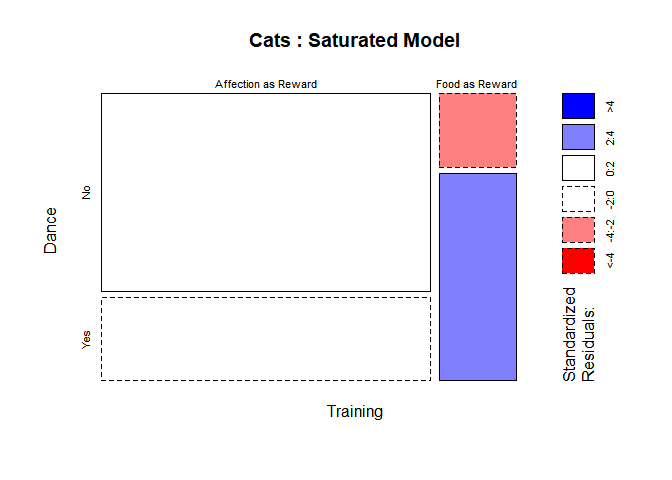
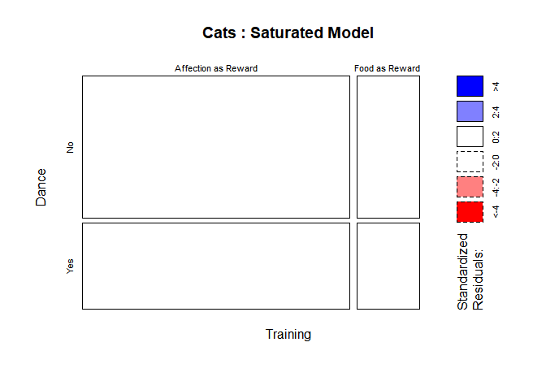
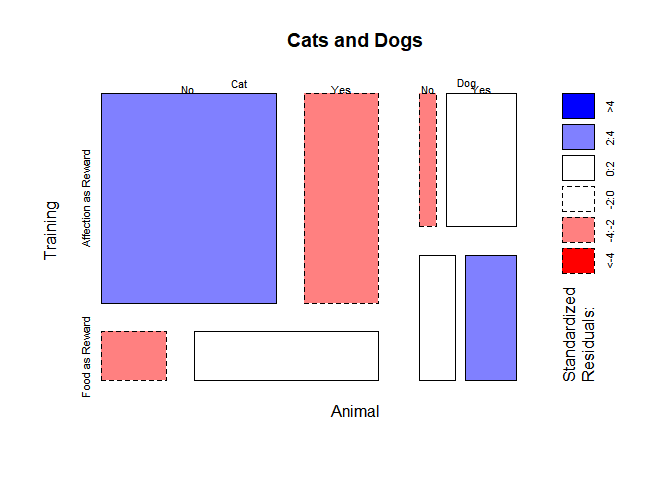

ch018\_1(범주형자료)
================
jakinpilla
2020-03-17

  - [이번 장에서 배우는 내용](#이번-장에서-배우는-내용)
  - [범주형 자료의 분석](#범주형-자료의-분석)
  - [범주형자료 분석의 이론](#범주형자료-분석의-이론)
      - [피어슨의 카이제곱 검정](#피어슨의-카이제곱-검정)
  - [피셔의 정확검정](#피셔의-정확검정)
  - [가능도비](#가능도비)
  - [예이츠의 수정](#예이츠의-수정)
  - [카이제곱 검정의 가정들](#카이제곱-검정의-가정들)
  - [R을 이용한 카이제곱 검정 실행](#r을-이용한-카이제곱-검정-실행)
      - [자료입력](#자료입력)
  - [CrossTable() 의 출력](#crosstable-의-출력)
  - [카이제곱 검정의 유의한 결과를 표준화잔차로 분해](#카이제곱-검정의-유의한-결과를-표준화잔차로-분해)
  - [효과크기의 계산](#효과크기의-계산)
  - [카이제곱 검정 결과의 보고](#카이제곱-검정-결과의-보고)
  - [셋 이상의 범주형변수: 로그선형분석](#셋-이상의-범주형변수-로그선형분석)
  - [회귀분석으로의 카이제곱](#회귀분석으로의-카이제곱)
  - [로그선형분석](#로그선형분석)
  - [로그선형분석의 가정들](#로그선형분석의-가정들)
  - [R을 이용한 로그선형분석](#r을-이용한-로그선형분석)
  - [초기 고려사항](#초기-고려사항)
  - [카이제곱 검정으로서의 로그선형분석](#카이제곱-검정으로서의-로그선형분석)
  - [카이제곱 검정으로서의 로그선형분석 결과](#카이제곱-검정으로서의-로그선형분석-결과)
  - [로그선형분석](#로그선형분석-1)
  - [로그선형분석의 후속 분석](#로그선형분석의-후속-분석)
  - [로그선형분석의 효과크기](#로그선형분석의-효과크기)
  - [로그선형분석 결과의 보고](#로그선형분석-결과의-보고)

``` r
library(ez)
library(ggplot2)
library(nlme)
library(pastecs)
library(reshape2)
library(WRS)
library(clinfun)
library(pgirmess)
library(car)
library(tidyverse)
# install.packages('mvoutlier')
library(mvoutlier)
library(gmodels)
library(MASS)
```

#### 이번 장에서 배우는 내용

어떤 사건들의 도수(빈도)만 알고 자료는 분석하는 것이다.

#### 범주형 자료의 분석

이번 장은 범주형 변수들 자체의 관계를 살펴본다.

#### 범주형자료 분석의 이론

두 개의 범주형 변수를 생각하자.

##### 피어슨의 카이제곱 검정

카이제곱 검정: 특정 범주들에서 관측한 도수들을 그 범주들에서 우연히 발생할 수 있는 도수들과 비교한다는 점에 착안한 통계량

색인 ij는 분할표의 i행 j열 항목을 가르킨다. 관측값은 도수이다. 범주형자료의 분석에서 모형은 기대도수(expected
frequency)들로 이루어진다.

기대도수를 구하는 한 방법은 개체 수를 범주 개수로 나누는 것이다. 고양이가 200마리이고 범주가 넷이면 각 범주의 기대도수는
그냥 200/4 = 50이다.

보통의 경우, 표의 칸마다 행의 총계외 열의 총계를 이용해서 기대도수를 구해야 한다.

이러한 모형값들을 구한 후 표의 각 칸에 대해 그 칸의 값을 해당 모형값에서 뺀 차이를 제곱해서 모형값을 나눈다. 그런 다음 그
값들을 모두 더하면 카이제곱이 나온다.

이 통계량들을 성질들이 알려진 분포에서 뽑은 임계값과 비교해서 검정의 유의성을 판정한다.

이러한 임계값을 구하려면 자유도가 필요한데, 자유도는 (r-1)(c-1)이다. df=1에 대한 임계값을 조회해보면, 유의수준 p
= .05에서의 임계값은 3.84이고 유의수준 p = .01에서의 임계값은 6.63이다. 관측된 카이제곱은 그 두 임계값보다
크므로, 두 변수는 p \< .01에서 유의하게 상관되어 있다.

#### 피셔의 정확검정

카이제곱 검정에는 검정통계량의 표집분포가 근사적으로 카이제곱 분포라는 문제점이 있다. 표본이 클 때에는 이것이 단지 근사적인
카이제곱 분포라는 것이 문제가 되지 않는다. 그러나 표본이 작을 때는 표집분포가 카이제곱 분포와 충분히 비슷하지 않아서
카이제곱 분포에 근거한 유의성 판정이 부정확해진다.

피셔는 표본 크기가 작을 때도 카이제곱 통계량의 정확한 확률을 계산하는 방법을 고안했다. 그 방법을 피셔의 정확성 검정이라 한다.

#### 가능도비

피어슨의 카이제곱 대신 사용할 수 있는 검정통계량으로 가능도비(likelihood ratio)가 있다. 이것은
최대가능도(최대우도) 이론에 기초한 것이다.

최대가능도 이론에 바탕에 있는 사상을 간단히 설명하면 다음과 같다. 자료를 수집하고, 그러한 자료가 얻어질 확률이 최대가 되는
모형을 만든다. 그런 다음에는 그 모형을 귀무가설 하에서 그러한 자료가 얻어질 확률과 비교한다.

가능도비를 구하는 공식은 다음과 같다.

이 통계량도 카이제곱 분포를 따르며, 자유도도 같다. 해당 자유도로 카이제곱 분포 확률표에서 임계값을 찾고, 그것을 관측된
가능도비와 비교한다. 검정의 결과는 유의하다. 작은 표본에서는 가능도비를 사용하는 것이 좋다.

#### 예이츠의 수정

분할표가 2x2일때 피어슨의 카이제곱 검정은 실제보다 작은 유의확률을 산출하는 경향이 있다. 즉, 제1종 오류를 범하는 경향이
있다. 그래서 고안된 것이 예이츠의 연속성 수정이다.

자료의 모형의 차이를 그대로 제곱하는 대신, 차이의 절대값에서 .5를 뺀 후에 제곱하는 것이 전부이다.

예이츠의 수정에 의해 카이제곱 통계량이 이전보다 작아졌다. 즉 덜 유의해졌다.

#### 카이제곱 검정의 가정들

  - 독립성 가정…카이제곱 검정이 의미가 있으려면 각 참가자가 분할표의 오직 한 칸에만 기여해야 한다.

  - 기대도수들이 5 이상이어야 한다.

#### R을 이용한 카이제곱 검정 실행

##### 자료입력

``` r
catsData <- read.delim('cats.dat', header = T)
catsData %>% head
```

    ##         Training Dance
    ## 1 Food as Reward   Yes
    ## 2 Food as Reward   Yes
    ## 3 Food as Reward   Yes
    ## 4 Food as Reward   Yes
    ## 5 Food as Reward   Yes
    ## 6 Food as Reward   Yes

자료입력: 분할표

``` r
catsData %>%
  group_by(Training, Dance) %>%
  count() %>%
  ungroup() %>%
  spread(Training, n) -> cross.tbl


cross.tbl[, 2:3] -> cross.tbl_1
colnames(cross.tbl_1) <- c('food', 'affection')

catsTable <- cross.tbl_1 %>% as.matrix()
catsTable
```

    ##      food affection
    ## [1,]  114        10
    ## [2,]   48        28

카이제곱 검정을 수행하자…

``` r
CrossTable(catsData$Training, catsData$Dance, 
           fisher = T, 
           chisq = T, 
           expected = T, 
           sresid = T, 
           format = 'SPSS')
```

    ## 
    ##    Cell Contents
    ## |-------------------------|
    ## |                   Count |
    ## |         Expected Values |
    ## | Chi-square contribution |
    ## |             Row Percent |
    ## |          Column Percent |
    ## |           Total Percent |
    ## |            Std Residual |
    ## |-------------------------|
    ## 
    ## Total Observations in Table:  200 
    ## 
    ##                     | catsData$Dance 
    ##   catsData$Training |       No  |      Yes  | Row Total | 
    ## --------------------|-----------|-----------|-----------|
    ## Affection as Reward |      114  |       48  |      162  | 
    ##                     |  100.440  |   61.560  |           | 
    ##                     |    1.831  |    2.987  |           | 
    ##                     |   70.370% |   29.630% |   81.000% | 
    ##                     |   91.935% |   63.158% |           | 
    ##                     |   57.000% |   24.000% |           | 
    ##                     |    1.353  |   -1.728  |           | 
    ## --------------------|-----------|-----------|-----------|
    ##      Food as Reward |       10  |       28  |       38  | 
    ##                     |   23.560  |   14.440  |           | 
    ##                     |    7.804  |   12.734  |           | 
    ##                     |   26.316% |   73.684% |   19.000% | 
    ##                     |    8.065% |   36.842% |           | 
    ##                     |    5.000% |   14.000% |           | 
    ##                     |   -2.794  |    3.568  |           | 
    ## --------------------|-----------|-----------|-----------|
    ##        Column Total |      124  |       76  |      200  | 
    ##                     |   62.000% |   38.000% |           | 
    ## --------------------|-----------|-----------|-----------|
    ## 
    ##  
    ## Statistics for All Table Factors
    ## 
    ## 
    ## Pearson's Chi-squared test 
    ## ------------------------------------------------------------
    ## Chi^2 =  25.35569     d.f. =  1     p =  4.767434e-07 
    ## 
    ## Pearson's Chi-squared test with Yates' continuity correction 
    ## ------------------------------------------------------------
    ## Chi^2 =  23.52028     d.f. =  1     p =  1.236041e-06 
    ## 
    ##  
    ## Fisher's Exact Test for Count Data
    ## ------------------------------------------------------------
    ## Sample estimate odds ratio:  6.579265 
    ## 
    ## Alternative hypothesis: true odds ratio is not equal to 1
    ## p =  1.311709e-06 
    ## 95% confidence interval:  2.837773 16.42969 
    ## 
    ## Alternative hypothesis: true odds ratio is less than 1
    ## p =  0.9999999 
    ## 95% confidence interval:  0 14.25436 
    ## 
    ## Alternative hypothesis: true odds ratio is greater than 1
    ## p =  7.7122e-07 
    ## 95% confidence interval:  3.193221 Inf 
    ## 
    ## 
    ##  
    ##        Minimum expected frequency: 14.44

분할표 자료를 이용해 검정을 수행하자

``` r
CrossTable(catsTable, 
           fisher = T, chisq = T, expected = T, sresid = T, format = 'SPSS')
```

    ## 
    ##    Cell Contents
    ## |-------------------------|
    ## |                   Count |
    ## |         Expected Values |
    ## | Chi-square contribution |
    ## |             Row Percent |
    ## |          Column Percent |
    ## |           Total Percent |
    ## |            Std Residual |
    ## |-------------------------|
    ## 
    ## Total Observations in Table:  200 
    ## 
    ##              |  
    ##              |      food  | affection  | Row Total | 
    ## -------------|-----------|-----------|-----------|
    ##         [1,] |      114  |       10  |      124  | 
    ##              |  100.440  |   23.560  |           | 
    ##              |    1.831  |    7.804  |           | 
    ##              |   91.935% |    8.065% |   62.000% | 
    ##              |   70.370% |   26.316% |           | 
    ##              |   57.000% |    5.000% |           | 
    ##              |    1.353  |   -2.794  |           | 
    ## -------------|-----------|-----------|-----------|
    ##         [2,] |       48  |       28  |       76  | 
    ##              |   61.560  |   14.440  |           | 
    ##              |    2.987  |   12.734  |           | 
    ##              |   63.158% |   36.842% |   38.000% | 
    ##              |   29.630% |   73.684% |           | 
    ##              |   24.000% |   14.000% |           | 
    ##              |   -1.728  |    3.568  |           | 
    ## -------------|-----------|-----------|-----------|
    ## Column Total |      162  |       38  |      200  | 
    ##              |   81.000% |   19.000% |           | 
    ## -------------|-----------|-----------|-----------|
    ## 
    ##  
    ## Statistics for All Table Factors
    ## 
    ## 
    ## Pearson's Chi-squared test 
    ## ------------------------------------------------------------
    ## Chi^2 =  25.35569     d.f. =  1     p =  4.767434e-07 
    ## 
    ## Pearson's Chi-squared test with Yates' continuity correction 
    ## ------------------------------------------------------------
    ## Chi^2 =  23.52028     d.f. =  1     p =  1.236041e-06 
    ## 
    ##  
    ## Fisher's Exact Test for Count Data
    ## ------------------------------------------------------------
    ## Sample estimate odds ratio:  6.579265 
    ## 
    ## Alternative hypothesis: true odds ratio is not equal to 1
    ## p =  1.311709e-06 
    ## 95% confidence interval:  2.837773 16.42969 
    ## 
    ## Alternative hypothesis: true odds ratio is less than 1
    ## p =  0.9999999 
    ## 95% confidence interval:  0 14.25436 
    ## 
    ## Alternative hypothesis: true odds ratio is greater than 1
    ## p =  7.7122e-07 
    ## 95% confidence interval:  3.193221 Inf 
    ## 
    ## 
    ##  
    ##        Minimum expected frequency: 14.44

#### CrossTable() 의 출력

``` r
CrossTable(catsData$Training, catsData$Dance, 
           fisher = T, 
           chisq = T, 
           expected = T, 
           sresid = T, # 표준화 잔차
           format = 'SPSS')
```

    ## 
    ##    Cell Contents
    ## |-------------------------|
    ## |                   Count |
    ## |         Expected Values |
    ## | Chi-square contribution |
    ## |             Row Percent |
    ## |          Column Percent |
    ## |           Total Percent |
    ## |            Std Residual |
    ## |-------------------------|
    ## 
    ## Total Observations in Table:  200 
    ## 
    ##                     | catsData$Dance 
    ##   catsData$Training |       No  |      Yes  | Row Total | 
    ## --------------------|-----------|-----------|-----------|
    ## Affection as Reward |      114  |       48  |      162  | 
    ##                     |  100.440  |   61.560  |           | 
    ##                     |    1.831  |    2.987  |           | 
    ##                     |   70.370% |   29.630% |   81.000% | 
    ##                     |   91.935% |   63.158% |           | 
    ##                     |   57.000% |   24.000% |           | 
    ##                     |    1.353  |   -1.728  |           | 
    ## --------------------|-----------|-----------|-----------|
    ##      Food as Reward |       10  |       28  |       38  | 
    ##                     |   23.560  |   14.440  |           | 
    ##                     |    7.804  |   12.734  |           | 
    ##                     |   26.316% |   73.684% |   19.000% | 
    ##                     |    8.065% |   36.842% |           | 
    ##                     |    5.000% |   14.000% |           | 
    ##                     |   -2.794  |    3.568  |           | 
    ## --------------------|-----------|-----------|-----------|
    ##        Column Total |      124  |       76  |      200  | 
    ##                     |   62.000% |   38.000% |           | 
    ## --------------------|-----------|-----------|-----------|
    ## 
    ##  
    ## Statistics for All Table Factors
    ## 
    ## 
    ## Pearson's Chi-squared test 
    ## ------------------------------------------------------------
    ## Chi^2 =  25.35569     d.f. =  1     p =  4.767434e-07 
    ## 
    ## Pearson's Chi-squared test with Yates' continuity correction 
    ## ------------------------------------------------------------
    ## Chi^2 =  23.52028     d.f. =  1     p =  1.236041e-06 
    ## 
    ##  
    ## Fisher's Exact Test for Count Data
    ## ------------------------------------------------------------
    ## Sample estimate odds ratio:  6.579265 
    ## 
    ## Alternative hypothesis: true odds ratio is not equal to 1
    ## p =  1.311709e-06 
    ## 95% confidence interval:  2.837773 16.42969 
    ## 
    ## Alternative hypothesis: true odds ratio is less than 1
    ## p =  0.9999999 
    ## 95% confidence interval:  0 14.25436 
    ## 
    ## Alternative hypothesis: true odds ratio is greater than 1
    ## p =  7.7122e-07 
    ## 95% confidence interval:  3.193221 Inf 
    ## 
    ## 
    ##  
    ##        Minimum expected frequency: 14.44

각 칸의 다섯째 수치는 해당 춤 학습 여부에 속하는 고양이들의 비율이고, 넷째 수치는 해당 훈련 방법에 속하는 고양이들의
비율이다.

먹이를 보상으로 훈련한 고양이 중 73.7%는 춤을 추었고 26.3%는 그렇지 못했다.

애정표현을 보상으로 훈련한 고양이 중 29.6%만 춤을 추었고 70.4%는 그렇지 못했다.

점검할 가정은 모든 기대도수가 .5보다 커야 한다는 것이다. 출력에서 두 번째 수치가 기대도수이다. 가장 작은 기대도수가
14.44이므로 가정을 만족한다.

피어스의 카이제곱 검정은 두 변수가 독립이라는 귀무가설을 검증한다.

p값이 충분히 작다면 두 변수가 독립이라는 귀무가설이 기각되며, 따라서 두 변수는 어떤 방식으로든 상관되어 있다고 할 수 있다.

출력의 전반부에 나온 분할표에는 각 칸의 카이제곱 기여도가 있는데, 그 수치들을 합하면 카이제곱 검정통계량이 나온다. 1.831
+ 2.987 + 7.804 + 12.734 = 25.356 이다.

출력의 마지막 부분은 피셔의 정확검정이다. p = .0000013이다. 따라서, 피셔의 정확검정 역시 귀무가설을 기각해야 한다는
결과가 나왔다.

이처럼 고도한 유의한 결과가 나왔다는 것은 훈련 방법과 춤 학습 여부가 연관성이 있음을 암시한다.

#### 카이제곱 검정의 유의한 결과를 표준화잔차로 분해

  
  

  - 카이제곱 검정의 통계량은 이러한 표준화잔차들의 합에 기초하므로, 카이제곱 검정통계량이 나타내는 전반적인 연관성에 기여하는
    요소들을 분해하는 데에는 카이제곱 검정통계량과 직접 관련된 개별 표준화잔차들을 살펴보는 것이 유의하다.

  - 표준화잔차들은 마치 z 점수들처럼 그 습성이 표준적이다. 이는 아주 유용한 특징인데, 예를 들어 그냥 표준화잔차의 값만
    봐도 그 유의성을 평가할 수 있다.

#### 효과크기의 계산

범주형자료에 대한 효과크기의 측도로 가장 유용한 것 중에 하나는 승산비이다.

먹이를 보상으로 주었을 때 고양이가 춤을 출 승산

  
  

  
  

애정표현을 보상으로 사용했을 때 고양이가 춤을 출 승산

  
  

  
  

승산비

  
  

정교한 방법으로 계산한 승산비(fisher = T) Sample estimate odds ratio: 6.579265

신뢰구간 : 5% confidence interval: 2.837773 16.42969

승산비의 신뢰구간에서 중요한 것은 1이 포함되어 있는가이다.

#### 카이제곱 검정 결과의 보고

  - 훈련 방법의 종류와 고양이가 춤을 추었는지의 여부 사이에는  = 25.36, p \< .001")로 유의한 연관성이 존재했다. 승산비에 따르면, 이러한
    유의성은 먹이로 훈련한 고양이가 춤을 출 승산(16.48)이 애정표현으로 훈련한 고양이가 춤을 출
    승산(2.84)보다 6.58배라는 사실을 반영한 것으로 보인다.

#### 셋 이상의 범주형변수: 로그선형분석

loglinear analysis

#### 회귀분석으로의 카이제곱

범주형 자료를 사용하므로 모형이 선형모델이 되려면 실제로는 로그값들을 사용해야 한다.

  
 = (b_{0} + b_{1} Training_{j} + b_{2} Dance_{j} + b_{3} Interaction_{ij}) + ln(\\epsilon_{ij})")  

고양이에게 먹이를 보상으로 사용했고 고양이가 정말로 라인댄스를 춘 상황이라고 한다면

  
 = b_{0} + (b_{1} \\times 0) + (b_{2} \\times 0) + (b_{3} \\times 0)")  

  
  

모든 변수가 0인 조합(고양이가 먹이를 받았으며 춤을 춘)을 기저 범주로 두면 될 것이다.

애정표현을 보상으로 사용했을 때 춤을 춘 고양이들을 살펴보자.

  
 = b_{0} + (b_{1} \\times 1) + (b_{2} \\times 0) + (b_{3} \\times 0)")  

  
 = b_{0} + b_{1} ")  

  
 - b_{0} ")  

  
 - ln(28) = .539 ")  

먹이를 보상으로 사용했으나 춤을 추지 않은 고양이들을 살펴보자.

  
 = b_{0} + (b_{1} \\times 0) + (b_{2} \\times 1) + (b_{3} \\times 0)")  

  
 - b_{0} ")  

  
 - ln(O_{food and then yes}) = ln(10) - ln(28)  = -1.029")  

는 먹이를
받고 춤을 춘 고양이들의 관측도수의 로그와 먹이를 받고 춤을 추지 않은 고양이들의 관측도수의 로그의 차이이다. 이 계수는
먹이를 보상으로 받은 고양이들의 그룹 안에서 춤을 추지 않은 고양이들과 춤을 춘 고양이들의 차이를 나타낸다.

마지막으로 애정표현을 받고 춤을 추지 않은 고양이들을 살펴보자.

  
 = b_{0} + (b_{1} \\times 1) + (b_{2} \\times 1) + (b_{3} \\times 1)")  

  
 = ln(O_{F, Y}) + (ln(O_{A, Y}) - ln(O_{F, Y})) + (ln(O_{F, N}) - ln(O_{F, Y})) + b_{3}")  

  
  

는 춤을 추지
않은 고양이들의 그룹 안에서의 훈련 방법에 따른 차이를 춤을 춘 고양이들의 그룹 안에서의 훈련 방법에 따른 차이와 비교한 것이다.
즉, 춤을 추었을 때의 Training의 효과가 고양이가 춤을 추지 않았을 때의 Training의 효과의 차이에 해당한다.

최종모형은 다음과 같다.

  
 = 3.332 + .539 Training - 1.029 Dance + 1.895 Interaction + ln(\\epsilon_{ij}) ")  

주목할 점은 수치들을 로그로 변환한다는 점만 빼고는 모든 것이 요인 분산분석과 동일하다는 점이다.

``` r
read.delim('CatRegression.dat') %>% 
  as_tibble() -> cat_data

cat_data %>% str()
```

    ## Classes 'tbl_df', 'tbl' and 'data.frame':    200 obs. of  7 variables:
    ##  $ Training   : int  0 0 0 0 0 0 0 0 0 0 ...
    ##  $ Dance      : int  0 0 0 0 0 0 0 0 0 0 ...
    ##  $ Interaction: int  0 0 0 0 0 0 0 0 0 0 ...
    ##  $ Observed   : int  28 28 28 28 28 28 28 28 28 28 ...
    ##  $ Expected   : num  14.4 14.4 14.4 14.4 14.4 ...
    ##  $ LnObserved : num  3.33 3.33 3.33 3.33 3.33 ...
    ##  $ LnExpected : num  2.67 2.67 2.67 2.67 2.67 ...

``` r
m_cat <- lm(LnObserved ~ Training + Dance + Interaction, data = cat_data)
m_cat %>% summary()
```

    ## 
    ## Call:
    ## lm(formula = LnObserved ~ Training + Dance + Interaction, data = cat_data)
    ## 
    ## Residuals:
    ##        Min         1Q     Median         3Q        Max 
    ## -6.546e-14  0.000e+00  0.000e+00  0.000e+00  4.728e-14 
    ## 
    ## Coefficients:
    ##               Estimate Std. Error    t value Pr(>|t|)    
    ## (Intercept)  3.332e+00  1.193e-15  2.792e+15   <2e-16 ***
    ## Training     5.390e-01  1.502e-15  3.590e+14   <2e-16 ***
    ## Dance       -1.030e+00  2.326e-15 -4.426e+14   <2e-16 ***
    ## Interaction  1.895e+00  2.567e-15  7.380e+14   <2e-16 ***
    ## ---
    ## Signif. codes:  0 '***' 0.001 '**' 0.01 '*' 0.05 '.' 0.1 ' ' 1
    ## 
    ## Residual standard error: 6.314e-15 on 196 degrees of freedom
    ## Multiple R-squared:      1,  Adjusted R-squared:      1 
    ## F-statistic: 7.945e+29 on 3 and 196 DF,  p-value: < 2.2e-16

회귀분석으로서의 카이제곱 검정에 대한 논의를 완성하려면 추가적인 수정이 필요하다. 이 검정은 두 변수의 결합된 효과는 관심이 없고
두 변수의 유일한 효과에만 관심을 둔다. 즉 상호작용항을 제거해야 한다.

  
 = b_{0} + b_{1} Training  + b_{2} Dance_{j} ")  

``` r
m_cat_2 <- lm(LnExpected ~ Training + Dance, data = cat_data)
m_cat_2 %>% summary()
```

    ## 
    ## Call:
    ## lm(formula = LnExpected ~ Training + Dance, data = cat_data)
    ## 
    ## Residuals:
    ##        Min         1Q     Median         3Q        Max 
    ## -1.045e-14 -4.200e-17  1.800e-17  1.800e-17  1.878e-13 
    ## 
    ## Coefficients:
    ##              Estimate Std. Error   t value Pr(>|t|)    
    ## (Intercept) 2.670e+00  2.427e-15 1.100e+15   <2e-16 ***
    ## Training    1.450e+00  2.797e-15 5.183e+14   <2e-16 ***
    ## Dance       4.895e-01  2.261e-15 2.165e+14   <2e-16 ***
    ## ---
    ## Signif. codes:  0 '***' 0.001 '**' 0.01 '*' 0.05 '.' 0.1 ' ' 1
    ## 
    ## Residual standard error: 1.45e-14 on 197 degrees of freedom
    ## Multiple R-squared:      1,  Adjusted R-squared:      1 
    ## F-statistic: 2.264e+29 on 2 and 197 DF,  p-value: < 2.2e-16

분산분석에서는 그 베타 값들이 특정 범주의 평균과 기저 범주의 평균의 차이를 나타내지만, 범주형 자료에서는 베타 값들이 평균이
아니라 기댓값들의 차이를 나타낸다.

#### 로그선형분석

표준오차가 모두 0, 포화모형…

변수가 두 개인 간단한 범주형 자료의 분석을 선형보형으로 표현할 수 있다면, 변수가 셋 이상인 범주형 자료의 분석을 선형모형으로
표현하는 것도 개념적으로 어려운 일이 아니다. 그냥 선형모형에 변수들과 관련된 상호작용 항들을 더 추가하면 된다.

결국, 범주형 자료의 분석에 변수가 세 개일 때 모형은 다음과 같은 것이다.

  
 = (b_{0} + b_{1} A_{i} + b_{2} B_{j} + b_{3} C_{k} + b_{4} AB_{ij} + b_{5} AC_{ik} + b_{6} BC_{jk} + b_{7} ABC_{ijk})  + ln(\\epsilon_{ij})")  

이것이 로그선형분석에 깔린 원리이다.

자료가 범주형이고 모든 가능한 항(주 효과들과 그 상호작용들)을 모형에 포함하면 오차가 나오지 않는다. 즉, 예측 변수들은
결과(기대값)를 완벽하게 예측한다. 즉, 가능한 가장 복잡한 모형으로 시작하면 오차는 없다. 로그선형분석의 임무는
예측력을 크게 잃지 않고도 자료를 예측할 수 있는 좀 더 단순한 모형을 찾는 것이다.

그래서 후진제거 원리에 기초한다.

제거는 위계적으로 진행된다. 가장 차수가 높은 상호작용 항을 제거하고 그 제거의 효과를 평가한다. 그리고 다음 차수의 항으로
넘어간다.

모형을 평가할 때는 가능도비 통계량을 사용한다.

#### 로그선형분석의 가정들

로그선형분석은 카이제곱 검정의 한 확장이므로 가정들도 카이제곱 검정과 비슷하다. 죽 각 객체가 분할표의 한 칸에만 속해야 하며
신뢰성 있는 분석 결과가 나오려면 기대도수들이 적절히 큰 값이어야 한다.

변수를 제거애서 자료를 축약할 땐 다음 사항을 고려해야 한다.

  - 최고차 상호작용이 유의하지 않아야 한다.
  - 삭제할 변수가 관여하는 그 보다 낮은 차수의 상호작용 항 중 적어도 하나가 유의하지 않아야 한다.

#### R을 이용한 로그선형분석

#### 초기 고려사항

``` r
catsDogs <- read.delim('CatsandDogs.dat', header = T) %>% as_tibble()
catsDogs %>% head
```

    ## # A tibble: 6 x 3
    ##   Animal Training       Dance
    ##   <fct>  <fct>          <fct>
    ## 1 Cat    Food as Reward Yes  
    ## 2 Cat    Food as Reward Yes  
    ## 3 Cat    Food as Reward Yes  
    ## 4 Cat    Food as Reward Yes  
    ## 5 Cat    Food as Reward Yes  
    ## 6 Cat    Food as Reward Yes

``` r
catsDogs %>% glimpse()
```

    ## Observations: 270
    ## Variables: 3
    ## $ Animal   <fct> Cat, Cat, Cat, Cat, Cat, Cat, Cat, Cat, Cat, Cat, Cat...
    ## $ Training <fct> Food as Reward, Food as Reward, Food as Reward, Food ...
    ## $ Dance    <fct> Yes, Yes, Yes, Yes, Yes, Yes, Yes, Yes, Yes, Yes, Yes...

``` r
catsDogs %>%
  filter(Animal == 'Cat') -> justCats

catsDogs %>%
  filter(Animal == 'Dog') -> justDogs


CrossTable(justCats$Training, justCats$Dance, 
           sresid = T, 
           prop.t = F, 
           prop.c = F, 
           prop.chisq = F, 
           format = 'SPSS')
```

    ## 
    ##    Cell Contents
    ## |-------------------------|
    ## |                   Count |
    ## |             Row Percent |
    ## |            Std Residual |
    ## |-------------------------|
    ## 
    ## Total Observations in Table:  200 
    ## 
    ##                     | justCats$Dance 
    ##   justCats$Training |       No  |      Yes  | Row Total | 
    ## --------------------|-----------|-----------|-----------|
    ## Affection as Reward |      114  |       48  |      162  | 
    ##                     |   70.370% |   29.630% |   81.000% | 
    ##                     |    1.353  |   -1.728  |           | 
    ## --------------------|-----------|-----------|-----------|
    ##      Food as Reward |       10  |       28  |       38  | 
    ##                     |   26.316% |   73.684% |   19.000% | 
    ##                     |   -2.794  |    3.568  |           | 
    ## --------------------|-----------|-----------|-----------|
    ##        Column Total |      124  |       76  |      200  | 
    ## --------------------|-----------|-----------|-----------|
    ## 
    ## 

``` r
CrossTable(justDogs$Training, justDogs$Dance, 
           sresid = T, 
           prop.t = F, 
           prop.c = F, 
           prop.chisq = F, 
           format = 'SPSS')
```

    ## 
    ##    Cell Contents
    ## |-------------------------|
    ## |                   Count |
    ## |             Row Percent |
    ## |            Std Residual |
    ## |-------------------------|
    ## 
    ## Total Observations in Table:  70 
    ## 
    ##                     | justDogs$Dance 
    ##   justDogs$Training |       No  |      Yes  | Row Total | 
    ## --------------------|-----------|-----------|-----------|
    ## Affection as Reward |        7  |       29  |       36  | 
    ##                     |   19.444% |   80.556% |   51.429% | 
    ##                     |   -1.156  |    0.757  |           | 
    ## --------------------|-----------|-----------|-----------|
    ##      Food as Reward |       14  |       20  |       34  | 
    ##                     |   41.176% |   58.824% |   48.571% | 
    ##                     |    1.190  |   -0.779  |           | 
    ## --------------------|-----------|-----------|-----------|
    ##        Column Total |       21  |       49  |       70  | 
    ## --------------------|-----------|-----------|-----------|
    ## 
    ## 

#### 카이제곱 검정으로서의 로그선형분석

로그선형분석을 위해서는 `loglm()` 이라는 함수를 사용한다. 이 함수를 사용하려면 먼저 분할표를 준비해야 한다.
`xtabs()` 함수로 준비한다.

``` r
catTable <- xtabs(~ Training + Dance, data = justCats); catTable
```

    ##                      Dance
    ## Training               No Yes
    ##   Affection as Reward 114  48
    ##   Food as Reward       10  28

로그선형분석에서는 예측변수들의 서로 다른 조합에 속하는 사례들의 도수(빈도)를 예측하므로 결과변수(종속변수)가 없다. 따라서
틸더(\~) 연산자 좌변은 그냥 비워 두어야 한다.

``` r
catSaturated <- loglm(~ Training + Dance + Training:Dance, data = catTable, fit = T)

catSaturated
```

    ## Call:
    ## loglm(formula = ~Training + Dance + Training:Dance, data = catTable, 
    ##     fit = T)
    ## 
    ## Statistics:
    ##                  X^2 df P(> X^2)
    ## Likelihood Ratio   0  0        1
    ## Pearson            0  0        1

``` r
catNoInteraction <- loglm(~ Training + Dance, data = catTable, fit = T)

catNoInteraction 
```

    ## Call:
    ## loglm(formula = ~Training + Dance, data = catTable, fit = T)
    ## 
    ## Statistics:
    ##                       X^2 df     P(> X^2)
    ## Likelihood Ratio 24.93159  1 5.940113e-07
    ## Pearson          25.35569  1 4.767434e-07

모자이크 그림들을 보면 서로 다른 범주들의 상대적 도수를 파악할 수 있다.

``` r
mosaicplot(catSaturated$fitted, shade = T, main = 'Cats : Saturated Model')
```

<!-- -->

#### 카이제곱 검정으로서의 로그선형분석 결과

포화모형

``` r
catSaturated
```

    ## Call:
    ## loglm(formula = ~Training + Dance + Training:Dance, data = catTable, 
    ##     fit = T)
    ## 
    ## Statistics:
    ##                  X^2 df P(> X^2)
    ## Likelihood Ratio   0  0        1
    ## Pearson            0  0        1

이 모형은 유의하지 않다. 검정 결과가 유의하다는 것은 모형이 자료에 잘 적합한다는 뜻이다. 둘째 모형은 상호작용 항이 생략된
것이다.

``` r
catNoInteraction
```

    ## Call:
    ## loglm(formula = ~Training + Dance, data = catTable, fit = T)
    ## 
    ## Statistics:
    ##                       X^2 df     P(> X^2)
    ## Likelihood Ratio 24.93159  1 5.940113e-07
    ## Pearson          25.35569  1 4.767434e-07

모형의 요약을 보면 가능도비와 피어슨 카이제곱 검정통계량이 아주 비슷하며, 둘 다 고도로 유의하다 따라서 모형은 자료와 유의하게
다르다. 즉, Dance와 Training의 상호작용을 제거하고 나니 모형이 이전보다 자료에 잘 적합하지 않게 되었다.

우리가 궁극적으로 찾으려는 것은 자료와 유의하게 다르지 않으면서 가장 간단한 모형이다.

``` r
mosaicplot(catSaturated$fitted, shade = T, main = 'Cats : Saturated Model')
```

<!-- -->

이것은 포화모형을 요약한 모자이크 그림이다. 색상은 표준화 잔차에 관한 정보를 제공한다. 표준화 잔차는 약 2보다 크거나 -2보다
작으면 유의하다. 따라서 색이 칠해진 사각형들은 유의한 범주 조합에 해당한다.

왼쪽 아래 사각형을 보면 애정표현을 보상으로 사용했을 때 춤을 춘 고양이는 기대한 것보다 적으며(테두리가 점선이므로), 그 차이는
유의하지 않다.(사각형이 흰 색이므로)

오른쪽 위의 분홍색 사각형으로 볼 때, 먹이를 주었을 때 춤을 추지 않은 고양이들은 기대한 것보다 적으며(테두리가 점선이므로),
그 차이는 유의하다.(사각형에 색이 있으므로)

다음으로 상호작용 항을 제거한 모형의 기댓값들로 그린 모자이크 그림이다.

``` r
mosaicplot(catNoInteraction$fitted, shade = T, main = 'Cats : Saturated Model')
```

<!-- -->

이 경우에는 모든 잔차가 0이다.(모든 사각형이 흰색이고 테두리가 실선이므로). 이 그래프는 먹이를 주든 애정표현을 하든 춤을 춘
고양이의 비율과 그렇지 않은 고양이의 비율이 동일함을 보여준다.

#### 로그선형분석

로그선형분석은 주로 변수가 셋 이상인 자료에 대해 수행한다.

포화모형에서 시작해서 모형이 유의하게 나빠질 때까지 효과들을 제거해 나가는 것이 로그선형분석의 원리이다.

``` r
CatDogContingencyTable <- xtabs(~ Animal + Training + Dance, data = catsDogs)
```

포화모형 caturated를 만들어서 평가한다.

``` r
caturated <- loglm( ~ Animal*Training*Dance, data = CatDogContingencyTable)
caturated %>% summary()
```

    ## Formula:
    ## ~Animal * Training * Dance
    ## attr(,"variables")
    ## list(Animal, Training, Dance)
    ## attr(,"factors")
    ##          Animal Training Dance Animal:Training Animal:Dance Training:Dance
    ## Animal        1        0     0               1            1              0
    ## Training      0        1     0               1            0              1
    ## Dance         0        0     1               0            1              1
    ##          Animal:Training:Dance
    ## Animal                       1
    ## Training                     1
    ## Dance                        1
    ## attr(,"term.labels")
    ## [1] "Animal"                "Training"              "Dance"                
    ## [4] "Animal:Training"       "Animal:Dance"          "Training:Dance"       
    ## [7] "Animal:Training:Dance"
    ## attr(,"order")
    ## [1] 1 1 1 2 2 2 3
    ## attr(,"intercept")
    ## [1] 1
    ## attr(,"response")
    ## [1] 0
    ## attr(,".Environment")
    ## <environment: R_GlobalEnv>
    ## 
    ## Statistics:
    ##                  X^2 df P(> X^2)
    ## Likelihood Ratio   0  0        1
    ## Pearson            0  0        1

다음으로는 모든 주 효과와 이원 상호작용으로 모형을 적합시킨다. 삼원(three-way) 상호작용을 제거했을 때 어떤 효과가
생기는지에 관한 것이므로, threeWay라고 부르자.

``` r
threeWay <- loglm(~ Animal + Training + Dance + Animal:Training + Animal:Dance + Dance:Training, 
                  data = CatDogContingencyTable)
```

update() 함수를 이용해 동일한 모델을 생성할 수 있다.

``` r
threeWay <- update(caturated, .~. -Animal:Training:Dance)
threeWay %>% summary()
```

    ## Formula:
    ## . ~ Animal + Training + Dance + Animal:Training + Animal:Dance + 
    ##     Training:Dance
    ## attr(,"variables")
    ## list(., Animal, Training, Dance)
    ## attr(,"factors")
    ##          Animal Training Dance Animal:Training Animal:Dance Training:Dance
    ## .             0        0     0               0            0              0
    ## Animal        1        0     0               1            1              0
    ## Training      0        1     0               1            0              1
    ## Dance         0        0     1               0            1              1
    ## attr(,"term.labels")
    ## [1] "Animal"          "Training"        "Dance"           "Animal:Training"
    ## [5] "Animal:Dance"    "Training:Dance" 
    ## attr(,"order")
    ## [1] 1 1 1 2 2 2
    ## attr(,"intercept")
    ## [1] 1
    ## attr(,"response")
    ## [1] 1
    ## attr(,".Environment")
    ## <environment: R_GlobalEnv>
    ## 
    ## Statistics:
    ##                       X^2 df     P(> X^2)
    ## Likelihood Ratio 20.30491  1 6.603088e-06
    ## Pearson          20.77759  1 5.158318e-06

``` r
anova(caturated, threeWay)
```

    ## LR tests for hierarchical log-linear models
    ## 
    ## Model 1:
    ##  . ~ Animal + Training + Dance + Animal:Training + Animal:Dance + Training:Dance 
    ## Model 2:
    ##  ~Animal * Training * Dance 
    ## 
    ##           Deviance df Delta(Dev) Delta(df) P(> Delta(Dev)
    ## Model 1   20.30491  1                                    
    ## Model 2    0.00000  0   20.30491         1          1e-05
    ## Saturated  0.00000  0    0.00000         0          1e+00

가능도의 차이는 20.30 - 0 = 20.30, 자유도의 차이는 1 - 0 = 1 이다.

p-value 가 .001보다 작으므로, 두 모형의 차이는 아주 유의하다. 이 차이가 유의하다는 것은 삼원 상호작용을 제거했을 때
자료에 대한 모형의 적합도가 유의하게 나빠졌다는 뜻이다.

즉, 모형 선택 과정을 중단하고 삼원 상호작용이 유의하다는 결론을 내린 후 그 효과를 해석해야 한다.

이번에는 이원 상호작용들을 체계적으로 제거해서 모형들을 생성한다.

``` r
trainingDance <- update(threeWay, .~. -Training:Dance)
animalDance <- update(threeWay, .~. -Animal:Dance)
animalTraining <- update(threeWay, .~. -Animal:Training)
```

다음으로 이 모형들을 `anova()`를 이용해서 삼원 상호작용만 없는 모형과 각각 비교한다.

``` r
anova(threeWay, trainingDance)
```

    ## LR tests for hierarchical log-linear models
    ## 
    ## Model 1:
    ##  . ~ Animal + Training + Dance + Animal:Training + Animal:Dance 
    ## Model 2:
    ##  . ~ Animal + Training + Dance + Animal:Training + Animal:Dance + Training:Dance 
    ## 
    ##           Deviance df Delta(Dev) Delta(df) P(> Delta(Dev)
    ## Model 1   28.91551  2                                    
    ## Model 2   20.30491  1   8.610596         1        0.00334
    ## Saturated  0.00000  0  20.304911         1        0.00001

Training X Dance 상호작용을 제거한 효과를 보여주는데, 가능도비 차이(델타)는 28.9 - 20.3 = 8.6 이고
자유도 차이는 2 - 1 = 1 이다. p = .003이므로 유의하다. 따라서 Training X Dance 상호작용을
제거하면 모형의 적합도가 유의하게 나빠진다.

``` r
anova(threeWay, animalDance)
```

    ## LR tests for hierarchical log-linear models
    ## 
    ## Model 1:
    ##  . ~ Animal + Training + Dance + Animal:Training + Training:Dance 
    ## Model 2:
    ##  . ~ Animal + Training + Dance + Animal:Training + Animal:Dance + Training:Dance 
    ## 
    ##           Deviance df Delta(Dev) Delta(df) P(> Delta(Dev)
    ## Model 1   34.05329  2                                    
    ## Model 2   20.30491  1   13.74838         1        0.00021
    ## Saturated  0.00000  0   20.30491         1        0.00001

이 역시 유의하므로 Animal X Dance를 제거해도 모형의 적합도가 유의하게 나빠진다.

``` r
anova(threeWay, animalTraining)
```

    ## LR tests for hierarchical log-linear models
    ## 
    ## Model 1:
    ##  . ~ Animal + Training + Dance + Animal:Dance + Training:Dance 
    ## Model 2:
    ##  . ~ Animal + Training + Dance + Animal:Training + Animal:Dance + Training:Dance 
    ## 
    ##           Deviance df Delta(Dev) Delta(df) P(> Delta(Dev)
    ## Model 1   34.06486  2                                    
    ## Model 2   20.30491  1   13.75995         1        0.00021
    ## Saturated  0.00000  0   20.30491         1        0.00001

이 역시 유의하므로 Animal X Training 을 제거해도 모형의 적합도가 유의하게 나빠진다.

``` r
mosaicplot(CatDogContingencyTable, shade = T, main = 'Cats and Dogs')
```

<!-- -->

#### 로그선형분석의 후속 분석

Animal X Training X Dance 상호작용을 해석하려면 개와 고양이에 대해 따로 Training과 Dance에 대한
카이제곱 검정을 수행하면 된다.

``` r
justCats <- subset(catsDogs, Animal == 'Cat')
justDogs <- subset(catsDogs, Animal == 'Dog')


CrossTable(justCats$Training, justCats$Dance, chisq = T, fisher = T, sresid =  T, 
           format = 'SPSS')
```

    ## 
    ##    Cell Contents
    ## |-------------------------|
    ## |                   Count |
    ## | Chi-square contribution |
    ## |             Row Percent |
    ## |          Column Percent |
    ## |           Total Percent |
    ## |            Std Residual |
    ## |-------------------------|
    ## 
    ## Total Observations in Table:  200 
    ## 
    ##                     | justCats$Dance 
    ##   justCats$Training |       No  |      Yes  | Row Total | 
    ## --------------------|-----------|-----------|-----------|
    ## Affection as Reward |      114  |       48  |      162  | 
    ##                     |    1.831  |    2.987  |           | 
    ##                     |   70.370% |   29.630% |   81.000% | 
    ##                     |   91.935% |   63.158% |           | 
    ##                     |   57.000% |   24.000% |           | 
    ##                     |    1.353  |   -1.728  |           | 
    ## --------------------|-----------|-----------|-----------|
    ##      Food as Reward |       10  |       28  |       38  | 
    ##                     |    7.804  |   12.734  |           | 
    ##                     |   26.316% |   73.684% |   19.000% | 
    ##                     |    8.065% |   36.842% |           | 
    ##                     |    5.000% |   14.000% |           | 
    ##                     |   -2.794  |    3.568  |           | 
    ## --------------------|-----------|-----------|-----------|
    ##        Column Total |      124  |       76  |      200  | 
    ##                     |   62.000% |   38.000% |           | 
    ## --------------------|-----------|-----------|-----------|
    ## 
    ##  
    ## Statistics for All Table Factors
    ## 
    ## 
    ## Pearson's Chi-squared test 
    ## ------------------------------------------------------------
    ## Chi^2 =  25.35569     d.f. =  1     p =  4.767434e-07 
    ## 
    ## Pearson's Chi-squared test with Yates' continuity correction 
    ## ------------------------------------------------------------
    ## Chi^2 =  23.52028     d.f. =  1     p =  1.236041e-06 
    ## 
    ##  
    ## Fisher's Exact Test for Count Data
    ## ------------------------------------------------------------
    ## Sample estimate odds ratio:  6.579265 
    ## 
    ## Alternative hypothesis: true odds ratio is not equal to 1
    ## p =  1.311709e-06 
    ## 95% confidence interval:  2.837773 16.42969 
    ## 
    ## Alternative hypothesis: true odds ratio is less than 1
    ## p =  0.9999999 
    ## 95% confidence interval:  0 14.25436 
    ## 
    ## Alternative hypothesis: true odds ratio is greater than 1
    ## p =  7.7122e-07 
    ## 95% confidence interval:  3.193221 Inf 
    ## 
    ## 
    ##  
    ##        Minimum expected frequency: 14.44

``` r
CrossTable(justDogs$Training, justDogs$Dance, chisq = T, fisher = T, sresid =  T, 
           format = 'SPSS')
```

    ## 
    ##    Cell Contents
    ## |-------------------------|
    ## |                   Count |
    ## | Chi-square contribution |
    ## |             Row Percent |
    ## |          Column Percent |
    ## |           Total Percent |
    ## |            Std Residual |
    ## |-------------------------|
    ## 
    ## Total Observations in Table:  70 
    ## 
    ##                     | justDogs$Dance 
    ##   justDogs$Training |       No  |      Yes  | Row Total | 
    ## --------------------|-----------|-----------|-----------|
    ## Affection as Reward |        7  |       29  |       36  | 
    ##                     |    1.337  |    0.573  |           | 
    ##                     |   19.444% |   80.556% |   51.429% | 
    ##                     |   33.333% |   59.184% |           | 
    ##                     |   10.000% |   41.429% |           | 
    ##                     |   -1.156  |    0.757  |           | 
    ## --------------------|-----------|-----------|-----------|
    ##      Food as Reward |       14  |       20  |       34  | 
    ##                     |    1.416  |    0.607  |           | 
    ##                     |   41.176% |   58.824% |   48.571% | 
    ##                     |   66.667% |   40.816% |           | 
    ##                     |   20.000% |   28.571% |           | 
    ##                     |    1.190  |   -0.779  |           | 
    ## --------------------|-----------|-----------|-----------|
    ##        Column Total |       21  |       49  |       70  | 
    ##                     |   30.000% |   70.000% |           | 
    ## --------------------|-----------|-----------|-----------|
    ## 
    ##  
    ## Statistics for All Table Factors
    ## 
    ## 
    ## Pearson's Chi-squared test 
    ## ------------------------------------------------------------
    ## Chi^2 =  3.932462     d.f. =  1     p =  0.04736256 
    ## 
    ## Pearson's Chi-squared test with Yates' continuity correction 
    ## ------------------------------------------------------------
    ## Chi^2 =  2.965686     d.f. =  1     p =  0.08504836 
    ## 
    ##  
    ## Fisher's Exact Test for Count Data
    ## ------------------------------------------------------------
    ## Sample estimate odds ratio:  0.3502677 
    ## 
    ## Alternative hypothesis: true odds ratio is not equal to 1
    ## p =  0.06797422 
    ## 95% confidence interval:  0.1001861 1.127025 
    ## 
    ## Alternative hypothesis: true odds ratio is less than 1
    ## p =  0.04208209 
    ## 95% confidence interval:  0 0.9586623 
    ## 
    ## Alternative hypothesis: true odds ratio is greater than 1
    ## p =  0.9880647 
    ## 95% confidence interval:  0.1208492 Inf 
    ## 
    ## 
    ##  
    ##        Minimum expected frequency: 10.2

개들의 경우에도 훈련 방법과 춤 학습 여부의 관계가 유의하지만, 고양이들보다는 관계가 약하다. (고양이는 카이제곱이 25.4이지만
개는 3.93이다.) 이는 고양이들과는 반대로 개들은 먹이보다는 애정표현에 대해 더 많이 춤을 추었다는 사실을 반영한다.

#### 로그선형분석의 효과크기

효과의 크기를 측정하는 가장 우아한 방법 중 하나는 승산비(odds ratio)를 계산하는 것이다.

승산비는 2X2 분할표로 구하는 것이 가장 이해하기 쉽다.

``` r
CatDogContingencyTable
```

    ## , , Dance = No
    ## 
    ##       Training
    ## Animal Affection as Reward Food as Reward
    ##    Cat                 114             10
    ##    Dog                   7             14
    ## 
    ## , , Dance = Yes
    ## 
    ##       Training
    ## Animal Affection as Reward Food as Reward
    ##    Cat                  48             28
    ##    Dog                  29             20

개들에 대한 승산비

``` r
odds_dancing_after_food <- 20/14
odds_dancing_after_food
```

    ## [1] 1.428571

``` r
odds_dancing_after_affection <- 29/7
odds_dancing_after_affection
```

    ## [1] 4.142857

``` r
odds_ratio <- odds_dancing_after_food / odds_dancing_after_affection
odds_ratio
```

    ## [1] 0.3448276

.35라는 승산비는 먹이로 훈련했을 때 개가 춤을 출 승산이 애정표현으로 훈련했을 때 춤을 출 승산의 .35배임을 뜻한다.

뒤집어 말하면, 개들을 애정 표현으로 훈련했을 때 춤을 출 승산이 먹이로 훈련했을 때 춤을 출 승산의 1..35 =
2.90배이다.

고양이들의 경우는 먹이로 훈련했을 때 춤을 출 승산이 애정표현으로 훈련했을 때 춤을 출 승산의 6.58배였다.

#### 로그선형분석 결과의 보고

  - 삼원 로그선형분석을 통해서, 모든 효과를 포함하는 최종 모형을 선택했다. 이 모형의 가능도비는  = 0")이고 이었다.
    이는 최고차 상호작용(Animal X Training X Dance)이  = 20.31, p \< .001")로 유의함을 뜻한다.

  - 고양이의 경우 훈련 방법과 춤 학습 여부에  = 25.36, p \< .001")로 유의한 연관성이 존재했다.

  - 그리고 개들의 경우에도 그러한 연관성이  = 3.93, p \< .05")로 유의했다.

  - 승산비들을 보면, 고양이들의 경우 애정표현에 비해 먹이를 사용했을 때의 춤 출 승산이 6.58배 높았지만 개들의 경우에는
    .35배였다. (즉, 개들의 경우 애정표현에 비해 먹이를 사용했을 때의 춤 출 승산이 2.90배 낮았다.)

  - 따라서, 이 분석은 고양이들은 애정표현보다는 먹이를 위해 춤을 출 가능성이 크지만 개들은 먹이보다는 애정표현을 위해 춤을
    출 가능성이 더 크다는 고양이와 개의 근본적인 차이를 말해주는 것으로 보인다.
