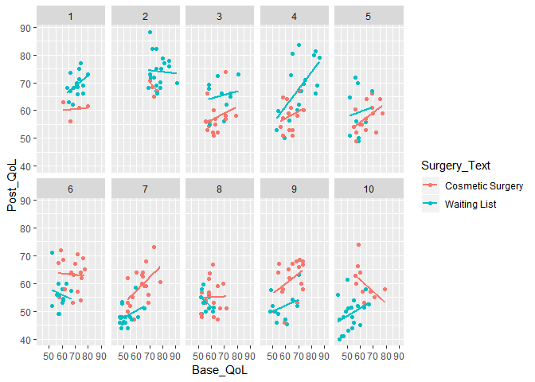

ch019\_1(다층선형모형)
================
jakinpilla
2020-03-25

  - [다층 선형모형](#다층-선형모형)
  - [위계적 자료](#위계적-자료)
  - [급내상관계수(ICC)](#급내상관계수icc)
  - [다층모형의 장점](#다층모형의-장점)
  - [고정계수와 확률계수](#고정계수와-확률계수)
  - [확률절편 모형](#확률절편-모형)
  - [확률기울기 모형](#확률기울기-모형)
  - [확률절편 및 기울기 모형](#확률절편-및-기울기-모형)
  - [다층모형](#다층모형)
  - [다층모형의 적합도 평가와 비교](#다층모형의-적합도-평가와-비교)
  - [공분산구조의 종류](#공분산구조의-종류)
  - [자료의 위계구조를 고려하지 않은 분산분석](#자료의-위계구조를-고려하지-않은-분산분석)
  - [다층모형의 필요성 평가](#다층모형의-필요성-평가)
  - [확률기울기의 도입](#확률기울기의-도입)
  - [성장모형](#성장모형)
  - [성장곡선(다항식)](#성장곡선다항식)
  - [예제 하나: 밀월기](#예제-하나-밀월기)
  - [자료의 구조 바꾸기](#자료의-구조-바꾸기)
  - [시간을 고정효과로 추가](#시간을-고정효과로-추가)
  - [공분산구조의 모형화](#공분산구조의-모형화)
  - [모형들의 비교](#모형들의-비교)
  - [고차다항식의 추가](#고차다항식의-추가)
  - [핵심정리](#핵심정리)
  - [다층모형의 보고](#다층모형의-보고)

``` r
library(ez)
library(ggplot2)
library(nlme)
library(pastecs)
library(reshape2)
library(WRS)
library(clinfun)
library(pgirmess)
library(car)
library(tidyverse)
# install.packages('mvoutlier')
library(mvoutlier)
library(gmodels)
library(MASS)
library(nlme) # 다층모형을 위해
```

#### 다층 선형모형

#### 위계적 자료

위계적 자료란 변수들이 다른 변수 안에 내포되어 있는 형태의 자료를 말한다.

#### 급내상관계수(ICC)

위계구조에 존재하는 맥락변수들 때문에 자료에 의존관계가 생긴다. 위계적 자료에는 잔차들 사이에 상관관계가 존재한다.

거의 모든 검정은 한 아동의 잔차 점수와 다른 아동의 잔차 점수가 완전히 무관하다고 가정한다. 그러나 같은 맥락에 속하는 개체들로
이루어진 표본에서는 그러한 독립성이 성립하지 않을 가능성이 크다.

비독립적 관측값들의 문제는 맥락변수들을 식별해서 분석 시 고려함으로써 극복할 수 있다. 그러한 방법의 하나는
ICC(intraclass correlation coefficient)를 활용하는 것이다.

한 맥락변수의 수준들 안의 변동은 작지만 수준들 사이의 변동은 크다.

결론적으로 ICC는 주어진 맥락변수가 결과에 얼마나 영향을 미치는지를 잘 측정하는 측도이다.

#### 다층모형의 장점

다층 선형모형(multilevel linear model)에는 여러 장점들이 있다.

  - **회귀선 기울기들의 동질성에 관한 가정은 잊어도 된다. ** 다층모형에서는 회귀선 기울기들의 변동을 명시적으로 고려한다.

  - **독립성 가정도 옛 이야기이다.**

  - **결측자료는 애들 장난이다.** 다층모형은 자료 집합의 완결성을 요구하지 않으므로, 한 시점의 자료가 없다고 해도 임의로
    채워넣거나 해당 사례를 삭제할 필요가 없다.

\#\#\#\# 다층 선형모형의 이론

\#\#\#\# 예제 하나

``` r
surgery <- read.delim('Cosmetic Surgery.dat', header = T) %>% as_tibble() 
surgery %>% head
```

    ## # A tibble: 6 x 12
    ##   particnu Post_QoL Base_QoL Clinic Surgery Reason   Age Gender   BDI
    ##      <int>    <dbl>    <int>  <int>   <int>  <int> <int>  <int> <int>
    ## 1        1     71.3       73      1       0      0    31      0    12
    ## 2        2     77         74      1       0      0    32      0    16
    ## 3        3     73         80      1       0      0    33      0    13
    ## 4        4     68.9       76      1       0      0    59      1    11
    ## 5        5     69         71      1       0      0    61      1    11
    ## 6        6     68.5       72      1       0      1    32      0    10
    ## # ... with 3 more variables: Surgery_Text <fct>, Reason_Text <fct>,
    ## #   Gender_Text <fct>

  - Post\_QoL: 미용성형수술 이후의 삶의 질
  - Base\_QoL: 수술 전 삶의 질
  - BDI : 백 우울척도(Beck Depression Inventory), 평상시 우울 수준
  - Reason: 외모목적은 0, 신체문제는 1

위계적 모형들로 분석을 수행할 때는 가장 간단한 모형에서 시작해서 좀 더 복잡한 모형으로 나아가는 상향식 접근 방식을 사용한다.

#### 고정계수와 확률계수

고정효과, 확률효과

연구자가 관심을 두는 모든 가능한 처리 조건이 실험에 나타날 때, 그러한 실험의 효과를 가리켜 고정효과라고 부른다. 반대로 가능한
처리 조건 중 임의의 일부만 실험에 나타나는 경우에는 효과를 확률효과라고 부른다.

고정효과는 오직 그 실험의 상황에만 일반화 할 수 있지만, 확률효과는 실험의 처리조건들 이상으로 일반화할 수 있다.

고정변수는 시간에 따라 변하지 않으리라고 간주되는 변수이다.

확률변수는 시간에 따라 변할 수 있는 변수이다.

#### 확률절편 모형

#### 확률기울기 모형

#### 확률절편 및 기울기 모형

#### 다층모형

삶의 질 모형에 확률절편을 포함해보자. 절편의 변동을 나타내는 성분인
를
절편에 더하면 된다.

  
![Y\_{ij} = (b\_{0} + u\_{0j}) + b\_{1} X\_{ij} +
\\epsilon\_{ij\]](https://latex.codecogs.com/png.latex?Y_%7Bij%7D%20%3D%20%28b_%7B0%7D%20%2B%20u_%7B0j%7D%29%20%2B%20b_%7B1%7D%20X_%7Bij%7D%20%2B%20%5Cepsilon_%7Bij%5D
"Y_{ij} = (b_{0} + u_{0j}) + b_{1} X_{ij} + \\epsilon_{ij]")  

위의 방정식에서 j는 절편의 변화량을 결정한다.

  
![Y\_{ij} = b\_{0j} + b\_{1} X\_{ij} +
\\epsilon\_{ij\]](https://latex.codecogs.com/png.latex?Y_%7Bij%7D%20%3D%20b_%7B0j%7D%20%2B%20b_%7B1%7D%20X_%7Bij%7D%20%2B%20%5Cepsilon_%7Bij%5D
"Y_{ij} = b_{0j} + b_{1} X_{ij} + \\epsilon_{ij]")  

  
  

마찬가지 방식으로, 삶의 질에 대한 수술 여부의 효과에 확률기울기를 포함하고 싶다면, 전체적인 모형의 기울기에 기울기의 변이성을
나타내는 성본 를 더하면 된다.

  
![Y\_{ij} = b\_{0} + (b\_{1} + u\_{1j}) X\_{ij} +
\\epsilon\_{ij\]](https://latex.codecogs.com/png.latex?Y_%7Bij%7D%20%3D%20b_%7B0%7D%20%2B%20%28b_%7B1%7D%20%2B%20u_%7B1j%7D%29%20X_%7Bij%7D%20%2B%20%5Cepsilon_%7Bij%5D
"Y_{ij} = b_{0} + (b_{1} + u_{1j}) X_{ij} + \\epsilon_{ij]")  

  
![Y\_{ij} = b\_{0} + b\_{1j} X\_{ij} +
\\epsilon\_{ij\]](https://latex.codecogs.com/png.latex?Y_%7Bij%7D%20%3D%20b_%7B0%7D%20%2B%20b_%7B1j%7D%20X_%7Bij%7D%20%2B%20%5Cepsilon_%7Bij%5D
"Y_{ij} = b_{0} + b_{1j} X_{ij} + \\epsilon_{ij]")  

  
  

더 나아가서, 기울기와 절편 모두 가변적인 모형을 원한다면, 위의 두 모형을 결합하면 된다.

  
 + (b_{1} + u_{1j}) X_{ij} + \\epsilon_{ij}")  

  
  

  
  

  
  

다층모형은 회귀모형을 조금 확장해서 절편이나 기울기를 맥락에 따라 다를 수 있게 한 것일 뿐이다.

#### 다층모형의 적합도 평가와 비교

다층모형의 전체적인 적합도는 카이제곱 가능도비 검정을 이용해서 검사한다.

R은 로그가능도 값을 두 가지 방식으로 수정한 값들도 산출한다.

  - 아카이케 정보기준(AIC) : 모형의 복잡도에 맞게 수정된 적합도. 추정된 매개변수 개수를 고려해서 적합도를 수정한다.

  - 슈바르츠의 베이즈 정보기준(BIC) : 좀 더 보수적이다. 표본 크기가 크고 매개변수가 적을 때 사용해야 한다.

어떤 경우이든, 값이 작을수록 모형의 적합도가 좋은 것이다.

여러 저자는 모든 매개변수가 고정된 ‘기본’ 모형으로 시작해서 적절히 확률 계수들을 추가해 가면서 중첩변수들을 탐색하는 식으로
다층모형들을 구축하는 방법을 권장한다. 이런 방식의 한 가지 장점은, 차츰 매개변수들을 가변적으로 만들거나 변수를 더
추가해 가면서 모형의 적합도를 비교할 수 있다는 것이다.

모형들을 비교할 때는 다음처럼 기존 모형의 로그가능도에서 새 모형의 로그가능도를 빼면 된다.

#### 공분산구조의 종류

다층모형에 확률효과나 반복측정 변수가 있다면, 자료의 공분산구조를 결정해야 한다.

각 확률효과나 반복측정 변수에 대해 개별적인 공분산구조를 지정할 수 있다.

공분산구조는 그냥 분산-공분산 행렬(대각성분이 분산이고 비대각성분이 공분산인 행렬)의 형태를 말한다.

너무 단순한 공분산구조를 지정하면 제1종 오류(실제로는 유의하지 않은 매개변수를 유의하다고 오판하는 것)를 범할 가능성이 커지고,
너무 복잡한 공분산구조를 지정하면 제2종 오류(실제로는 유의한 매개변수를 유의하지 않다고 오판하는 것)를 범할 가능성이 커진다.

R은 다양한 종류의 공분산구조를 지원한다.

  - 분산성분(variance component): 모든 확률효과가 서로 독립이라고 가정한다. 그래서 행렬의 모든 공분산 성분이
    0이다. 확률효과의 분산은 모두 같으며(그래서 행렬의 모든 분산 성분이 1이다.), 그 분산들의 합은 결과변수의 분산과
    같다. 이 공분산구조를 독립모형이라고 부른다.

  
  

  - 대각(diagonal): 이 공분산구조는 앞의 분산성분 구조와 비슷하되, 분산들이 모두 같다고 가정하지는 않는다. 그래서
    행렬의 대각성분들이 서로 다른 분산 항들로 되어 있다. 모든 확률효과가 서로 독립이라고 가정한다.

  
  

  - AR(1): AR은 autoregressive(자기회귀)의 약자이고, (1)은 이것이 일차 자기회귀 구조임을 뜻한다.
    자기회귀 구조에서는 분산들의 관계가 체계적인 방식으로 변한다. 행렬의 행들과 열들을 시간상의 시점들이고,
    반복측정 변수들 사이의 상관계수가 인접한 시점들 사이에서 가장 크다고 가정하자. 인접한 두 시점의 점수들의
    상관관계는 이고, 한 시점 떨어져 있는 두 시점의 점수들의 상관관계는
    , 두 시점의 떨어져 있는 두 시점의 점수들의 상관관계는
    이다. 이 구조는 분산들이 동질적이라고 가정 하지만, 공분산들은 이질적일 수 있다고 가정한다.
    반복측정 자료에 자주 쓰인다.

  
  

  - 비구조적(unstructured): 이 공분산구조는 완전히 일반적이다. 이 구조는 공분산들을 전혀 예측할 수 없다고
    가정한다.

핵심정리

  - 다층모형은 위계적 구조를 가진 자료를 분석할 때 사용해야 한다.

  - 위계적 모형은 회귀모형과 같되, 매개변수들이 가변적일 수 있다는 점이 다르다. 그런 매개변수를 확률효과라고 부른다.

  - 선형모형을 표본 전체가 아니라 각 맥락 안에서 추정할 때는 그 모형들의 절편이 가변적이거나(확률절편모형), 모형들의
    기울기가 다를 수 있거나(확률기울기 모형), 또는 절편과 기울기 둘 가 가변적이라고 가정할 수 있다.

  -  값의 차이를
    이용해서 모형들을 비교할 수 있다. 단, 두 모형은 매개변수가 하나 추가되었다는 점만 달라야 한다.

  - 만들어진 모형의 공분산구조를 가정해야 한다. 확률절편 모형에 대해서는 기본 구조인 분산성분 구조가 적당하지만, 기울기가
    가변적일 때는 비구조적 공분산구조를 가정할 때가 많다. 자료를 시간에 따라 반복측정한 경우에는
    자기회귀주고(AR(1))를 가정한다.

\#\#\#\# 분석실행 관련 고려사항

\#\#\#\# 가정

다층모형에서는 사례들의 독립성 문제와 오차들의 독립성 문제가 저절로 해결될 수 있다.

확률계수와 관련된 다층모형에는 확률계수들이 모형 전체에서 정규분포를 따라야 한다는 추가적인 가정이 있다. 즉, 확률절편 모형에서
서로 다른 맥락의 절편들은 모형 전체에서 정규 분포에 따라 분포되어야 하고, 확률기울기 모형에서는 서로 다른 맥락의 기울기들이
모형 전체에서 정규분포에 따라 분포되어야 한다.

또한, 다층모형에서는 자료 위계구조의 수준들을 넘나드는 상호작용(수준 간 상호작용)이 존재하면 다중공선성이 특히나 문제될 수
있다는 점도 유의해야 한다. 이런 문제는 예측변수의 중심화가 아주 크게 도움이 된다.

\#\#\#\# 표본 크기와 검정력

표본 크기가 클수록 좋다. 모형에 더 많은 수준을 추가할수록 추정해야 할 매개변수가 늘어나며, 표본도 더 커야 한다.

고차 변수의 맥락이 20개 이상인 것이 바람직하며, 그룹 크기가 너무 작아서는 안 된다.

다층 분석에 너무 많은 요인이 관여하면 의미 있는 일반 법칙을 이끌어내는 것이 불가능하다

계산된 표본 크기를 조심스럽게 해석해야 한다.

\#\#\#\# 변수의 중심화

중심화(centering): 한 변수의 점수들을 어떤 고정점 주변으로 이동하는 것

다층모형에 흔히 쓰이는 중심화는 두 종류인데, 하나는 총평균 중심화(grand mean centering)이고 다른 하나는 그룹
평균 중심화(group mean centering)이다.

모든 예측변수를 해당 평균으로 중심화하면 절편은 모든 예측변수가 그 평균값일 때의 결과가 된다. 따라서 중심화는 예측변수의 값이
0이라는 것이 무의미할 때 유용한 도구로 작용한다.

예측변수들의 원본 점수들에 적합시킨 다층모형과 예측변수들을 해당 총평균으로 중심화한 결과에 적합시킨 다층모형은 동등하다.

그룹 평균 중심화는 사정이 복잡하다. 이 경우 원본 점수에 대한 모형과 중심화된 모형은 모형의 고정된 부분에서나 가변적인(확률)
부분에서나 동등하지 않다. 한 가지 예외는 절편만 가변적일 때는 그룹 평균들이 수준 2변수로서 모형에 재도입된다는 것이다.

중심화를 적용하기로 했다면, 총평균 중심화가 나은지 아니면, 그룹 평균 중심화가 나은지 결정해야 한다.

  - 주된 관심사가 수준 1에서 측정한 변수들의 연관성(이를테면 수술 여부와 수술 후 삷의 질의 관계)이라면 그룹 평균 중심화를
    사용해야 한다.

  - 주된 관심사가 수준 2 변수이지만 수준 1 공변량을 통제하고 싶으면(예를 들어 수술 여부를 통제하면서 수술 후 삶의 질에
    대한 병원의 효과를 살펴보고 싶으면) 총평균 중심화가 적당하다.

  - 수준 1과 수준 2에서 어떤 변수의 서로 다른 영향을 살펴보는(예를 들어 수술 후 삶의 질에 대한 수술 여부의 효과가 병원
    수준과 참가자 수준에서 어떻게 다른 지 살펴보는) 데에는 두 종류의 중심화 모두 사용할 수 있다.

  - 수준단 상호작용(이를 테면 수술 후 삶의 질에 대한 병원과 수술 여부의 상호작용의 효과)을 조사하는 데는 그룹 평균
    중심화가 낫다.

\#\#\#\# R을 이용한 다층분석

``` r
surgeryData = read.delim('Cosmetic Surgery.dat', header = T)

surgeryData %>%
  ggplot(aes(Base_QoL, Post_QoL)) +
  geom_point(aes(colour = Surgery_Text)) +
  geom_smooth(aes(colour = Surgery_Text), method = 'lm', se = F) +
  facet_wrap(~ Clinic, ncol = 5)
```

<!-- -->

#### 자료의 위계구조를 고려하지 않은 분산분석

``` r
surgeryANOVA <- aov(Post_QoL ~ Surgery, data = surgeryData)
summary(surgeryANOVA)
```

    ##              Df Sum Sq Mean Sq F value Pr(>F)
    ## Surgery       1     29   28.62    0.33  0.566
    ## Residuals   274  23748   86.67

 = .33, p \> .05")로 유의하지 않다.

이러한 분산분석을 그룹 소속도(Surgery)로부터 결과(Post\_QoL)를 예측하는 일반선형모형으로 간주할 수도 있다. 따라서
같은 모형을 `lm()` 함수로 적합시킬수도 있다.

``` r
surgeryLinearModel <- lm(Post_QoL ~ Surgery, data = surgeryData)
surgeryLinearModel %>% summary()
```

    ## 
    ## Call:
    ## lm(formula = Post_QoL ~ Surgery, data = surgeryData)
    ## 
    ## Residuals:
    ##     Min      1Q  Median      3Q     Max 
    ## -19.916  -7.271  -1.271   7.084  28.284 
    ## 
    ## Coefficients:
    ##             Estimate Std. Error t value Pr(>|t|)    
    ## (Intercept)  59.9159     0.7731  77.498   <2e-16 ***
    ## Surgery      -0.6449     1.1222  -0.575    0.566    
    ## ---
    ## Signif. codes:  0 '***' 0.001 '**' 0.01 '*' 0.05 '.' 0.1 ' ' 1
    ## 
    ## Residual standard error: 9.31 on 274 degrees of freedom
    ## Multiple R-squared:  0.001204,   Adjusted R-squared:  -0.002442 
    ## F-statistic: 0.3302 on 1 and 274 DF,  p-value: 0.566

자료의 위계구조를 고려하지 않은 공분산분석

``` r
surgeryANOVA <- aov(Post_QoL ~ Base_QoL + Surgery, data = surgeryData)
surgeryANOVA %>% summary()
```

    ##              Df Sum Sq Mean Sq F value Pr(>F)    
    ## Base_QoL      1  10291   10291 211.432 <2e-16 ***
    ## Surgery       1    197     197   4.043 0.0453 *  
    ## Residuals   273  13288      49                   
    ## ---
    ## Signif. codes:  0 '***' 0.001 '**' 0.01 '*' 0.05 '.' 0.1 ' ' 1

``` r
Anova(surgeryANOVA, type = 'III')
```

    ## Anova Table (Type III tests)
    ## 
    ## Response: Post_QoL
    ##              Sum Sq  Df  F value    Pr(>F)    
    ## (Intercept)  1896.0   1  38.9513 1.653e-09 ***
    ## Base_QoL    10459.6   1 214.8876 < 2.2e-16 ***
    ## Surgery       196.8   1   4.0435   0.04533 *  
    ## Residuals   13288.3 273                       
    ## ---
    ## Signif. codes:  0 '***' 0.001 '**' 0.01 '*' 0.05 '.' 0.1 ' ' 1

수술 후 삶의 질에 대한 수술 여부의 효과가 유의하다는 결과가 나왔다.  = 4.04, p \< .05")

기저 삶의 질 역기 수술 후 삶의 질을 유의하게 예측한다.  = 214.89, p \< .001")

lm() 함수로도 적합할 수 있다.

``` r
surgeryLinearModel <- lm(Post_QoL ~ Surgery + Base_QoL, data = surgeryData)
surgeryLinearModel %>% summary()
```

    ## 
    ## Call:
    ## lm(formula = Post_QoL ~ Surgery + Base_QoL, data = surgeryData)
    ## 
    ## Residuals:
    ##      Min       1Q   Median       3Q      Max 
    ## -13.4142  -5.1326  -0.6495   4.0540  23.5005 
    ## 
    ## Coefficients:
    ##             Estimate Std. Error t value Pr(>|t|)    
    ## (Intercept) 18.14702    2.90767   6.241 1.65e-09 ***
    ## Surgery     -1.69723    0.84404  -2.011   0.0453 *  
    ## Base_QoL     0.66504    0.04537  14.659  < 2e-16 ***
    ## ---
    ## Signif. codes:  0 '***' 0.001 '**' 0.01 '*' 0.05 '.' 0.1 ' ' 1
    ## 
    ## Residual standard error: 6.977 on 273 degrees of freedom
    ## Multiple R-squared:  0.4411, Adjusted R-squared:  0.437 
    ## F-statistic: 107.7 on 2 and 273 DF,  p-value: < 2.2e-16

#### 다층모형의 필요성 평가

애초에 맥락에 따른 변이성이 충분하지 않다면, 다층모형을 사용하는 것은 그냥 쓸데없이 자신의 뇌를 혹사하는 것일 뿐이다.

맥락에 따른 변이성 추정: 절편만 있는 기저 모형을 자료에 적합한다. 그 다음 절편이 가변적일 수 있는 모형을 적합시켜서 두
모형을 비교한다. 만일 확률절편 덕분에 모형의 적합도가 개선되었다면 다층모형이 필요한 것이고, 그렇지 않다면 더 간단한
분석 방법으로 충분하다.

``` r
interceptOnly <- gls(Post_QoL ~ 1, data = surgeryData, method = 'ML')
interceptOnly %>% summary()
```

    ## Generalized least squares fit by maximum likelihood
    ##   Model: Post_QoL ~ 1 
    ##   Data: surgeryData 
    ##        AIC      BIC    logLik
    ##   2017.124 2024.365 -1006.562
    ## 
    ## Coefficients:
    ##                Value Std.Error  t-value p-value
    ## (Intercept) 59.60978 0.5596972 106.5036       0
    ## 
    ## Standardized residuals:
    ##        Min         Q1        Med         Q3        Max 
    ## -2.1127754 -0.7875625 -0.1734394  0.7962286  3.0803354 
    ## 
    ## Residual standard error: 9.281527 
    ## Degrees of freedom: 276 total; 275 residual

다음으로는 그 모형의 절편을 확률절편으로 바꾸어서, 즉 절편이 맥락에 따라 다를 수 있게 해서 다시 자료에 적합시킨다. 이는
`lme()`를 이용한다.(lme: linear mixed effect)

이 함수는  형태의 옵션을 이용해서 모형의 가변적 부분을 지정한다. x는 모형의 기변적 부분을 서술하는 부분이고
y는 맥락변수, 즉 그러한 변동을 모형화하고자 하는 변수이다.

``` r
randomInterceptOnly <- lme(Post_QoL ~ 1, data = surgeryData, random = ~1|Clinic, 
                           method = 'ML')

randomInterceptOnly %>% summary()
```

    ## Linear mixed-effects model fit by maximum likelihood
    ##  Data: surgeryData 
    ##        AIC      BIC    logLik
    ##   1911.473 1922.334 -952.7364
    ## 
    ## Random effects:
    ##  Formula: ~1 | Clinic
    ##         (Intercept) Residual
    ## StdDev:    5.909691 7.238677
    ## 
    ## Fixed effects: Post_QoL ~ 1 
    ##                Value Std.Error  DF  t-value p-value
    ## (Intercept) 60.08377  1.923283 266 31.24022       0
    ## 
    ## Standardized Within-Group Residuals:
    ##        Min         Q1        Med         Q3        Max 
    ## -1.8828507 -0.7606631 -0.1378732  0.7075242  2.8607949 
    ## 
    ## Number of Observations: 276
    ## Number of Groups: 10

절편을 가변적으로 했을 때 모형의 적합도가 개선되었는지 파악하는 방법 중 하나는 AIC와 BIC 같은 지수를 이용해서 모형의
적합도를 비교하는 것이다.

BIC가 작을수록 모형이 자료에 더 잘 적합하는 것이므로, 절편ㅇ르 가변적으로 만들었을 때 모형의 적합도가 개선되었다고 보아도 될
것이다. 그러한 개선이 유의한지는 아직 알 수 없다.

다른 방법은 의 변화를 보는
것이다. 이 방법을 사용하려면 (1) 반드시 제한되지 않은 최대가능도 추정법을 사용해야 하고, (2) 새 모형이 기존 모형의 모든
효과를 포함해야 한다.

``` r
logLik(interceptOnly)*-2
```

    ## 'log Lik.' 2013.124 (df=2)

``` r
logLik(randomInterceptOnly)*-2
```

    ## 'log Lik.' 1905.473 (df=3)

  
  

  
  

자유도가 1일 때의 카이제곱 통계량 임계값을 찾아보면 각각 3.84(p \< .05)와 6.63(p \< .01)이다. 이 차이는
고도로 유의하다.

``` r
anova(interceptOnly, randomInterceptOnly)
```

    ##                     Model df      AIC      BIC     logLik   Test  L.Ratio
    ## interceptOnly           1  2 2017.124 2024.365 -1006.5622                
    ## randomInterceptOnly     2  3 1911.473 1922.334  -952.7364 1 vs 2 107.6517
    ##                     p-value
    ## interceptOnly              
    ## randomInterceptOnly  <.0001

 = 107.65, p \< .0001")이므로 절편들이 서로 다른 병원에 대해 유의하게 다르다.

``` r
randomInterceptSurgery <- lme(Post_QoL ~ Surgery, data = surgeryData, random = ~1|Clinic, method = 'ML')

randomInterceptSurgery %>% summary()
```

    ## Linear mixed-effects model fit by maximum likelihood
    ##  Data: surgeryData 
    ##        AIC      BIC    logLik
    ##   1910.137 1924.619 -951.0686
    ## 
    ## Random effects:
    ##  Formula: ~1 | Clinic
    ##         (Intercept) Residual
    ## StdDev:    6.099513  7.18542
    ## 
    ## Fixed effects: Post_QoL ~ Surgery 
    ##                Value Std.Error  DF  t-value p-value
    ## (Intercept) 59.30517 2.0299632 265 29.21490   0.000
    ## Surgery      1.66583 0.9091314 265  1.83233   0.068
    ##  Correlation: 
    ##         (Intr)
    ## Surgery -0.21 
    ## 
    ## Standardized Within-Group Residuals:
    ##        Min         Q1        Med         Q3        Max 
    ## -1.8904290 -0.7191399 -0.1420998  0.7177762  2.8644538 
    ## 
    ## Number of Observations: 276
    ## Number of Groups: 10

BIC 값이 증가했다. (1922 -\> 1924)

Surgery를 추가해도 모형의 적합도가 개선되지 않았다. 이러한 해석은 Surgery의 고정효과가  = -1.83, p = .068")로 유의하지 않다는 점과도 부합한다.

Surgery가 유의한 예측변수는 아닌 것으로 보이지만, 최종 모형은 기저 삶의 질도 포함하므로, 그 변수의 고정 효과도 살펴볼
필요가 있겠다.

``` r
randomInterceptSurgeryQoL <- lme(Post_QoL ~ Surgery + Base_QoL, data = surgeryData, 
                                 random = ~ 1|Clinic, method = 'ML')
```

만약 결측값이 있다면 다음의 옵션을 준다.

``` r
randomInterceptSurgeryQoL <- lme(Post_QoL ~ Surgery + Base_QoL, data = surgeryData, 
                                 random = ~ 1|Clinic, method = 'ML',
                                 na.action = na.exclude)

randomInterceptSurgeryQoL %>% summary()
```

    ## Linear mixed-effects model fit by maximum likelihood
    ##  Data: surgeryData 
    ##       AIC      BIC   logLik
    ##   1847.49 1865.592 -918.745
    ## 
    ## Random effects:
    ##  Formula: ~1 | Clinic
    ##         (Intercept) Residual
    ## StdDev:    3.039264 6.518986
    ## 
    ## Fixed effects: Post_QoL ~ Surgery + Base_QoL 
    ##                 Value Std.Error  DF   t-value p-value
    ## (Intercept) 29.563601  3.471879 264  8.515160  0.0000
    ## Surgery     -0.312999  0.843145 264 -0.371228  0.7108
    ## Base_QoL     0.478630  0.052774 264  9.069465  0.0000
    ##  Correlation: 
    ##          (Intr) Surgry
    ## Surgery   0.102       
    ## Base_QoL -0.947 -0.222
    ## 
    ## Standardized Within-Group Residuals:
    ##        Min         Q1        Med         Q3        Max 
    ## -1.8872666 -0.7537675 -0.0954987  0.5657241  3.0020852 
    ## 
    ## Number of Observations: 276
    ## Number of Groups: 10

BIC 값이 줄어들었다. 이는 이 최종모형이 이전 모형보다 자료에 더 적합하다는 뜻이다.

``` r
anova(randomInterceptOnly, randomInterceptSurgery, randomInterceptSurgeryQoL)
```

    ##                           Model df      AIC      BIC    logLik   Test
    ## randomInterceptOnly           1  3 1911.473 1922.334 -952.7364       
    ## randomInterceptSurgery        2  4 1910.137 1924.619 -951.0686 1 vs 2
    ## randomInterceptSurgeryQoL     3  5 1847.490 1865.592 -918.7450 2 vs 3
    ##                            L.Ratio p-value
    ## randomInterceptOnly                       
    ## randomInterceptSurgery     3.33564  0.0678
    ## randomInterceptSurgeryQoL 64.64721  <.0001

모형 3은 기저 삷의 질의 효과까지 추가한 것인데 이 덕분에 모형이 크게 개선되었다. 로 매우 유의했다.

#### 확률기울기의 도입

모형의 가변적 부분을 서술하는  옵션을 으로 바꾼다.

``` r
addRandomSlope <- lme(Post_QoL ~ Surgery + Base_QoL, data = surgeryData, 
                      random = ~ Surgery|Clinic, method = 'ML')


addRandomSlope %>% summary()
```

    ## Linear mixed-effects model fit by maximum likelihood
    ##  Data: surgeryData 
    ##        AIC      BIC    logLik
    ##   1812.624 1837.967 -899.3119
    ## 
    ## Random effects:
    ##  Formula: ~Surgery | Clinic
    ##  Structure: General positive-definite, Log-Cholesky parametrization
    ##             StdDev   Corr  
    ## (Intercept) 6.132655 (Intr)
    ## Surgery     6.197489 -0.965
    ## Residual    5.912335       
    ## 
    ## Fixed effects: Post_QoL ~ Surgery + Base_QoL 
    ##                Value Std.Error  DF   t-value p-value
    ## (Intercept) 40.10253  3.892945 264 10.301334  0.0000
    ## Surgery     -0.65453  2.110917 264 -0.310069  0.7568
    ## Base_QoL     0.31022  0.053506 264  5.797812  0.0000
    ##  Correlation: 
    ##          (Intr) Surgry
    ## Surgery  -0.430       
    ## Base_QoL -0.855 -0.063
    ## 
    ## Standardized Within-Group Residuals:
    ##        Min         Q1        Med         Q3        Max 
    ## -2.4114778 -0.6628574 -0.1138411  0.6833110  2.8334730 
    ## 
    ## Number of Observations: 276
    ## Number of Groups: 10

``` r
anova(randomInterceptSurgeryQoL, addRandomSlope)
```

    ##                           Model df      AIC      BIC    logLik   Test
    ## randomInterceptSurgeryQoL     1  5 1847.490 1865.592 -918.7450       
    ## addRandomSlope                2  7 1812.624 1837.966 -899.3119 1 vs 2
    ##                            L.Ratio p-value
    ## randomInterceptSurgeryQoL                 
    ## addRandomSlope            38.86626  <.0001

BIC가 1865 -\> 1837로 줄었고
의 차이가
 = 38.87, p \< .00001")로 유의함을 알 수 있다.

결국, 수술 여부와 수술 후 삶의 질 사이의 관계(기저 삶의 질을 통제할 때의)에 대한 확률절편과 확률기울기의 병원에 따른
차이들은 둘 다 유의했다.

``` r
addReason <- lme(Post_QoL ~ Surgery + Base_QoL + Reason, data = surgeryData, 
                 random = ~Surgery|Clinic, method = 'ML')
```

위 모형에 상호작용항 Surgery:Reason을 추가하여 보자

``` r
finalModel <- lme(Post_QoL ~ Surgery + Base_QoL + Reason + Surgery:Reason, 
                  data = surgeryData, random= ~Surgery|Clinic, 
                  method = 'ML')

anova(addRandomSlope, addReason, finalModel)
```

    ##                Model df      AIC      BIC    logLik   Test  L.Ratio
    ## addRandomSlope     1  7 1812.624 1837.966 -899.3119                
    ## addReason          2  8 1810.825 1839.788 -897.4124 1 vs 2 3.798961
    ## finalModel         3  9 1807.045 1839.629 -894.5226 2 vs 3 5.779555
    ##                p-value
    ## addRandomSlope        
    ## addReason       0.0513
    ## finalModel      0.0162

``` r
finalModel %>% summary()
```

    ## Linear mixed-effects model fit by maximum likelihood
    ##  Data: surgeryData 
    ##        AIC      BIC    logLik
    ##   1807.045 1839.629 -894.5226
    ## 
    ## Random effects:
    ##  Formula: ~Surgery | Clinic
    ##  Structure: General positive-definite, Log-Cholesky parametrization
    ##             StdDev   Corr  
    ## (Intercept) 5.482359 (Intr)
    ## Surgery     5.417495 -0.946
    ## Residual    5.818911       
    ## 
    ## Fixed effects: Post_QoL ~ Surgery + Base_QoL + Reason + Surgery:Reason 
    ##                   Value Std.Error  DF   t-value p-value
    ## (Intercept)    42.51781  3.875317 262 10.971441  0.0000
    ## Surgery        -3.18768  2.185367 262 -1.458646  0.1459
    ## Base_QoL        0.30536  0.053125 262  5.747835  0.0000
    ## Reason         -3.51515  1.140934 262 -3.080939  0.0023
    ## Surgery:Reason  4.22129  1.700269 262  2.482718  0.0137
    ##  Correlation: 
    ##                (Intr) Surgry Bas_QL Reason
    ## Surgery        -0.356                     
    ## Base_QoL       -0.865 -0.078              
    ## Reason         -0.233  0.306  0.065       
    ## Surgery:Reason  0.096 -0.505  0.024 -0.661
    ## 
    ## Standardized Within-Group Residuals:
    ##        Min         Q1        Med         Q3        Max 
    ## -2.2331483 -0.6972193 -0.1541073  0.6326387  3.1641799 
    ## 
    ## Number of Observations: 276
    ## Number of Groups: 10

수술 전 삶의 질은 수술 후 삶의 질을 유의하게 예측했다.  = 5.75, p \< .001")이다. 수술 여부는 이번에도 수술 후 삶의 질을 유의하게 예측하지 못했다.
 = -1.46, p = .15")이다. 그러나 수술 이유는  = -3.08, p \< .01")로, 수술 이유와 수술 여부의 상호작용은  = 2.48, p \< .05")로 수술 후 삶의 질을 유의하게 예측했다.

``` r
intervals(finalModel, .90)
```

    ## Approximate 90% confidence intervals
    ## 
    ##  Fixed effects:
    ##                     lower       est.      upper
    ## (Intercept)    36.1790732 42.5178133 48.8565533
    ## Surgery        -6.7622174 -3.1876776  0.3868621
    ## Base_QoL        0.2184606  0.3053562  0.3922519
    ## Reason         -5.3813407 -3.5151488 -1.6489569
    ## Surgery:Reason  1.4402097  4.2212894  7.0023692
    ## attr(,"label")
    ## [1] "Fixed effects:"
    ## 
    ##  Random Effects:
    ##   Level: Clinic 
    ##                               lower       est.      upper
    ## sd((Intercept))           3.5924910  5.4823585  8.3664108
    ## sd(Surgery)               3.4207696  5.4174947  8.5797207
    ## cor((Intercept),Surgery) -0.9911707 -0.9455544 -0.6997947
    ## 
    ##  Within-group standard error:
    ##    lower     est.    upper 
    ## 5.406777 5.818911 6.262460

``` r
intervals(finalModel, .95)
```

    ## Approximate 95% confidence intervals
    ## 
    ##  Fixed effects:
    ##                     lower       est.      upper
    ## (Intercept)    34.9565174 42.5178133 50.0791092
    ## Surgery        -7.4516406 -3.1876776  1.0762854
    ## Base_QoL        0.2017009  0.3053562  0.4090115
    ## Reason         -5.7412741 -3.5151488 -1.2890236
    ## Surgery:Reason  0.9038215  4.2212894  7.5387574
    ## attr(,"label")
    ## [1] "Fixed effects:"
    ## 
    ##  Random Effects:
    ##   Level: Clinic 
    ##                               lower       est.     upper
    ## sd((Intercept))           3.3130516  5.4823585  9.072076
    ## sd(Surgery)               3.1323585  5.4174947  9.369697
    ## cor((Intercept),Surgery) -0.9937882 -0.9455544 -0.598258
    ## 
    ##  Within-group standard error:
    ##    lower     est.    upper 
    ## 5.331220 5.818911 6.351214

``` r
intervals(finalModel, .99)
```

    ## Approximate 99% confidence intervals
    ## 
    ##  Fixed effects:
    ##                     lower       est.      upper
    ## (Intercept)    32.5539321 42.5178133 52.4816944
    ## Surgery        -8.8065055 -3.1876776  2.4311503
    ## Base_QoL        0.1687647  0.3053562  0.4419478
    ## Reason         -6.4486205 -3.5151488 -0.5816772
    ## Surgery:Reason -0.1502967  4.2212894  8.5928756
    ## attr(,"label")
    ## [1] "Fixed effects:"
    ## 
    ##  Random Effects:
    ##   Level: Clinic 
    ##                               lower       est.      upper
    ## sd((Intercept))           2.8281039  5.4823585 10.6277056
    ## sd(Surgery)               2.6369954  5.4174947 11.1298066
    ## cor((Intercept),Surgery) -0.9968788 -0.9455544 -0.3324075
    ## 
    ##  Within-group standard error:
    ##    lower     est.    upper 
    ## 5.186584 5.818911 6.528328

예를 들어 Surgery는 
이고 95% 신뢰구간은 -7.45(하계)에서 1.08(상계)이다.이 신뢰구간에 0이 포함되어 있으므로 b 값은  수준에서
유의하지 않다.

상호작용 항을 분해하려면 두 가지 ’이유 그룹’에 대해 각각 분석을 수행하면 된다. 물론 이 분석에서는 상호작용항과 Reason의
주 효과를 제거해야 한다.

일단 신체적 문제 때문에 수술을 받은 사람에 대해 TRUE를, 외모 변경을 위한 사람에 대해서는 FALSE를 돌려주는 변수를
정의하자.

``` r
physicalSubset <- surgeryData$Reason == 1

cosmeticSubset <- surgeryData$Reason == 0 
```

수술 이유가 신체적 문제 해결인 참가자들에 대한 모형을 생성하자.

``` r
physicalModel <- lme(Post_QoL ~ Surgery + Base_QoL, data = surgeryData, 
                     random =~ Surgery|Clinic, subset = physicalSubset, 
                     method = 'ML')


cosmeticModel <- lme(Post_QoL ~ Surgery + Base_QoL, data = surgeryData, 
                     random = ~ Surgery|Clinic, 
                     subset = cosmeticSubset, 
                     method = 'ML')


physicalModel %>% summary()
```

    ## Linear mixed-effects model fit by maximum likelihood
    ##  Data: surgeryData 
    ##   Subset: physicalSubset 
    ##       AIC      BIC    logLik
    ##   1172.56 1194.832 -579.2798
    ## 
    ## Random effects:
    ##  Formula: ~Surgery | Clinic
    ##  Structure: General positive-definite, Log-Cholesky parametrization
    ##             StdDev   Corr  
    ## (Intercept) 5.773827 (Intr)
    ## Surgery     5.804865 -0.948
    ## Residual    5.798764       
    ## 
    ## Fixed effects: Post_QoL ~ Surgery + Base_QoL 
    ##                Value Std.Error  DF  t-value p-value
    ## (Intercept) 38.02079  4.705980 166 8.079250  0.0000
    ## Surgery      1.19655  2.099769 166 0.569848  0.5696
    ## Base_QoL     0.31771  0.069471 166 4.573271  0.0000
    ##  Correlation: 
    ##          (Intr) Surgry
    ## Surgery  -0.306       
    ## Base_QoL -0.908 -0.078
    ## 
    ## Standardized Within-Group Residuals:
    ##        Min         Q1        Med         Q3        Max 
    ## -2.2447342 -0.6505340 -0.1264188  0.6111506  2.9472101 
    ## 
    ## Number of Observations: 178
    ## Number of Groups: 10

``` r
cosmeticModel %>% summary()
```

    ## Linear mixed-effects model fit by maximum likelihood
    ##  Data: surgeryData 
    ##   Subset: cosmeticSubset 
    ##        AIC      BIC    logLik
    ##   650.9469 669.0417 -318.4734
    ## 
    ## Random effects:
    ##  Formula: ~Surgery | Clinic
    ##  Structure: General positive-definite, Log-Cholesky parametrization
    ##             StdDev   Corr  
    ## (Intercept) 5.006026 (Intr)
    ## Surgery     5.292027 -0.969
    ## Residual    5.738551       
    ## 
    ## Fixed effects: Post_QoL ~ Surgery + Base_QoL 
    ##                Value Std.Error DF   t-value p-value
    ## (Intercept) 41.78605  5.573849 87  7.496802  0.0000
    ## Surgery     -4.30702  2.275002 87 -1.893193  0.0617
    ## Base_QoL     0.33849  0.080274 87  4.216720  0.0001
    ##  Correlation: 
    ##          (Intr) Surgry
    ## Surgery  -0.252       
    ## Base_QoL -0.937 -0.058
    ## 
    ## Standardized Within-Group Residuals:
    ##        Min         Q1        Med         Q3        Max 
    ## -1.8945645 -0.6616222 -0.1461451  0.6460834  2.6741347 
    ## 
    ## Number of Observations: 98
    ## Number of Groups: 9

상호작용 효과는 신체적 문제 해결을 위해 수술을 받은 사람들의 삶의 질을 예측하는 변수로서의 수술 여부의 기울기(그리 크지 않은
양수)와 그냥 외모를 바꾸기 위해 수술을 받은 사람들의 삶의 질을 예측하는 변수로서의 수술 여부의 기울기의 차이를 반영한다고
할 수 있다.

수술 전 삶의 질을 통제할 때, 외모변경을 위해 성형수술을 받은 사람들의 수술 수 삶의 질이 신체적 문제를 해결하기 위해
성형수술을 받은 사람들의 수술 후 삶의 질보다 낮았다고 할 수 있다.

핵심정리

  -  의 차이를 이용해서
    매개변수 하나만 다른 모형들을 비교할 수 있다. AIC와 BIC 역시 모형들을 비교하는데 사용할 수 있다.

  - 고정효과 표(Fixed effects)를 보면 예측변수들이 결과변수를 유의하게 예측하는지 알 수 있다.
    유의확률(p-value)이 .05보다 작으면 해당 효과가 유의한 것이다.

  - 상관계수들(Correlation)과 그 신뢰구간들로 효과의 본성을 해석할 수 있다. 계수들의 부호는 예측변수와 결과변수가
    양의 상관관계인지 아니면 음의 상관관계인지를 말해준다. 신뢰구간들은 `intervals()` 함수를 이용해서 따로
    구해야 한다.

  - 확률효과들의 표준편차(Random effects)는 수준 1 변수의 절편과 기울기에 존재하는 변이성을 말해준다. 이
    추정값들의 유의성은 intervals() 함수로 구한 신뢰구간들로 파악할 수 있다.

#### 성장모형

백혈구 수, 방사성 붕괴, 이익의 변화율 등

#### 성장곡선(다항식)

#### 예제 하나: 밀월기

``` r
satisfactionData <- read.delim('Honeymoon Period.dat', header = T) %>% as_tibble()
satisfactionData
```

    ## # A tibble: 115 x 6
    ##    Person Satisfaction_Ba~ Satisfaction_6_~ Satisfaction_12~
    ##     <int>            <int>            <int>            <int>
    ##  1      1                6                6                5
    ##  2      2                7                7                8
    ##  3      3                4                6                2
    ##  4      4                6                9                4
    ##  5      5                6                7                6
    ##  6      6                5               10                4
    ##  7      7                6                6                4
    ##  8      8                2                5                4
    ##  9      9               10                9                5
    ## 10     10               10               10               10
    ## # ... with 105 more rows, and 2 more variables:
    ## #   Satisfaction_18_Months <int>, Gender <int>

#### 자료의 구조 바꾸기

``` r
satisfactionData %>%
  gather(Time, Life_Satisfaction, -Person, -Gender) -> restructuredData

restructuredData$Time %>% unique()
```

    ## [1] "Satisfaction_Base"      "Satisfaction_6_Months" 
    ## [3] "Satisfaction_12_Months" "Satisfaction_18_Months"

``` r
restructuredData %>%
  mutate(Time = case_when(Time == "Satisfaction_Base" ~ 0, 
                          Time == "Satisfaction_6_Months" ~ 1, 
                          Time == "Satisfaction_12_Months" ~ 2, 
                          Time == "Satisfaction_18_Months" ~ 3)) -> restructuredData


restructuredData %>% str()
```

    ## Classes 'tbl_df', 'tbl' and 'data.frame':    460 obs. of  4 variables:
    ##  $ Person           : int  1 2 3 4 5 6 7 8 9 10 ...
    ##  $ Gender           : int  0 1 1 0 0 1 0 0 0 0 ...
    ##  $ Time             : num  0 0 0 0 0 0 0 0 0 0 ...
    ##  $ Life_Satisfaction: int  6 7 4 6 6 5 6 2 10 10 ...

우선 절편만 포함한 기저모형을 자료에 적합한다.

``` r
intercept <- gls(Life_Satisfaction ~ 1, data = restructuredData, 
                 method = 'ML', 
                 na.action = na.exclude)
```

다음으로 기저 모형과 같되 절편이 맥락에 따라 가변적인 모형을 만든다.

``` r
randomIntercept <- lme(Life_Satisfaction ~ 1, data = restructuredData,
                      random = ~1|Person,
                      method = 'ML', 
                      na.action = na.exclude, 
                      control = list(opt = 'optim'))
```

#### 시간을 고정효과로 추가

``` r
timeRI <- update(randomIntercept, .~. + Time)
```

확률 기울기의 도입

``` r
timeRS <- update(timeRI, random = ~Time|Person)
```

#### 공분산구조의 모형화

  - 
  - corAR1(): 이것은 1차 자기회귀 공분산구조에 해당한다. 시점들 사이의 간격이 일정할 때 사용해야 한다.

  - corCAR1(): 시점 공변량이 연속일 때 쓰인다. 시점들의 간격이 일정하지 않다면 기본적으로 이 구조를 사용해야 한다.

  - corARMA(): 이 역시 자기회귀 오차 구조이나, 오차 분산의 이동평균을 지원한다. \`\`

<!-- end list -->

``` r
ARModel <- update(timeRS, 
                  correlation = corAR1(0, form = ~Time|Person))
```

#### 모형들의 비교

``` r
anova(intercept, randomIntercept, timeRI, timeRS, ARModel)
```

    ##                 Model df      AIC      BIC     logLik   Test   L.Ratio
    ## intercept           1  2 2064.053 2072.217 -1030.0263                 
    ## randomIntercept     2  3 1991.396 2003.642  -992.6978 1 vs 2  74.65704
    ## timeRI              3  4 1871.728 1888.057  -931.8642 2 vs 3 121.66714
    ## timeRS              4  6 1874.626 1899.120  -931.3131 3 vs 4   1.10224
    ## ARModel             5  7 1872.891 1901.466  -929.4453 4 vs 5   3.73564
    ##                 p-value
    ## intercept              
    ## randomIntercept  <.0001
    ## timeRI           <.0001
    ## timeRS           0.5763
    ## ARModel          0.0533

``` r
summary(ARModel)
```

    ## Linear mixed-effects model fit by maximum likelihood
    ##  Data: restructuredData 
    ##        AIC      BIC    logLik
    ##   1872.891 1901.466 -929.4453
    ## 
    ## Random effects:
    ##  Formula: ~Time | Person
    ##  Structure: General positive-definite, Log-Cholesky parametrization
    ##             StdDev     Corr  
    ## (Intercept) 1.62767553 (Intr)
    ## Time        0.04782877 -0.062
    ## Residual    1.74812486       
    ## 
    ## Correlation Structure: AR(1)
    ##  Formula: ~Time | Person 
    ##  Parameter estimate(s):
    ##       Phi 
    ## 0.2147812 
    ## Fixed effects: Life_Satisfaction ~ Time 
    ##                 Value  Std.Error  DF   t-value p-value
    ## (Intercept)  7.131470 0.21260192 322  33.54377       0
    ## Time        -0.870087 0.07929275 322 -10.97310       0
    ##  Correlation: 
    ##      (Intr)
    ## Time -0.527
    ## 
    ## Standardized Within-Group Residuals:
    ##         Min          Q1         Med          Q3         Max 
    ## -2.08400991 -0.62083911  0.06392492  0.59512953  2.49161500 
    ## 
    ## Number of Observations: 438
    ## Number of Groups: 115

``` r
intervals(ARModel)
```

    ## Approximate 95% confidence intervals
    ## 
    ##  Fixed effects:
    ##                 lower       est.      upper
    ## (Intercept)  6.714162  7.1314700  7.5487782
    ## Time        -1.025728 -0.8700874 -0.7144467
    ## attr(,"label")
    ## [1] "Fixed effects:"
    ## 
    ##  Random Effects:
    ##   Level: Person 
    ##                               lower        est.       upper
    ## sd((Intercept))        1.310444e+00  1.62767553   2.0217029
    ## sd(Time)               7.649915e-06  0.04782877 299.0348406
    ## cor((Intercept),Time) -8.423499e-01 -0.06192455   0.8023598
    ## 
    ##  Correlation structure:
    ##           lower      est.     upper
    ## Phi 0.005057104 0.2147812 0.4064069
    ## attr(,"label")
    ## [1] "Correlation structure:"
    ## 
    ##  Within-group standard error:
    ##    lower     est.    upper 
    ## 1.544750 1.748125 1.978276

시간의 효과는 , t(322) = -10.97, p \< .001")로 매우 유의했다. 이는 18개월
도안 삶의 만족도가 유의하게 변했음을 뜻한다.

#### 고차다항식의 추가

``` r
timeQuadratic <- update(ARModel, .~. + I(Time^2))

timeCubic <- update(timeQuadratic, .~. + I(Time^3))

summary(timeCubic)
```

    ## Linear mixed-effects model fit by maximum likelihood
    ##  Data: restructuredData 
    ##        AIC      BIC    logLik
    ##   1816.162 1852.902 -899.0808
    ## 
    ## Random effects:
    ##  Formula: ~Time | Person
    ##  Structure: General positive-definite, Log-Cholesky parametrization
    ##             StdDev    Corr  
    ## (Intercept) 1.8826725 (Intr)
    ## Time        0.4051351 -0.346
    ## Residual    1.4572374       
    ## 
    ## Correlation Structure: AR(1)
    ##  Formula: ~Time | Person 
    ##  Parameter estimate(s):
    ##       Phi 
    ## 0.1326346 
    ## Fixed effects: Life_Satisfaction ~ Time + I(Time^2) + I(Time^3) 
    ##                 Value Std.Error  DF   t-value p-value
    ## (Intercept)  6.634783 0.2230273 320 29.748744  0.0000
    ## Time         1.546635 0.4772221 320  3.240913  0.0013
    ## I(Time^2)   -1.326426 0.4209411 320 -3.151098  0.0018
    ## I(Time^3)    0.171096 0.0929297 320  1.841131  0.0665
    ##  Correlation: 
    ##           (Intr) Time   I(T^2)
    ## Time      -0.278              
    ## I(Time^2)  0.139 -0.951       
    ## I(Time^3) -0.098  0.896 -0.987
    ## 
    ## Standardized Within-Group Residuals:
    ##         Min          Q1         Med          Q3         Max 
    ## -2.58597365 -0.54411056 -0.04373592  0.50525444  2.78413461 
    ## 
    ## Number of Observations: 438
    ## Number of Groups: 115

``` r
intervals(timeCubic)
```

    ## Approximate 95% confidence intervals
    ## 
    ##  Fixed effects:
    ##                  lower       est.      upper
    ## (Intercept)  6.1980057  6.6347826  7.0715595
    ## Time         0.6120429  1.5466350  2.4812271
    ## I(Time^2)   -2.1507978 -1.3264264 -0.5020551
    ## I(Time^3)   -0.0108979  0.1710958  0.3530895
    ## attr(,"label")
    ## [1] "Fixed effects:"
    ## 
    ##  Random Effects:
    ##   Level: Person 
    ##                            lower       est.      upper
    ## sd((Intercept))        1.4852030  1.8826725 2.38651276
    ## sd(Time)               0.1705194  0.4051351 0.96255585
    ## cor((Intercept),Time) -0.6738687 -0.3461486 0.09538264
    ## 
    ##  Correlation structure:
    ##          lower      est.     upper
    ## Phi -0.1856231 0.1326346 0.4257069
    ## attr(,"label")
    ## [1] "Correlation structure:"
    ## 
    ##  Within-group standard error:
    ##    lower     est.    upper 
    ## 1.173241 1.457237 1.809978

선형추세는 , t(320)= 3.24, p \< .01"), 이차 추세는 , t(320) = -3.15, p \< .01")이다. 이는 둘 다 시간에 따른
자료의 변화 패턴을 유의하게 잘 서술했음을 뜻한다.

삼차추세는 , t(320) = 1.84, p \> .05")로 유의하지 않았다.

확률절편들의 표준편차는 1.88(1.49, 2.39)이다. 신뢰구간에 0이 포함되지 않았다는 사실은 기저 시점에서의 삶의 만족도가
사람에 따라 유의하게 다르다는 가정이 옳았음을 암시한다.

시간의 기울기도 사람에 따라 유의하게 변했다. 이 경우 표준편차는 ")이다. 이번에도 0이 포함되지 않았는데, 이는 시간에 따른 삶의 만족도 변화도 사람에 따라 유의하게
달랐음을 암시한다.

``` r
polyModel <- update(ARModel, .~ poly(Time, 3))
polyModel %>% summary()
```

    ## Linear mixed-effects model fit by maximum likelihood
    ##  Data: restructuredData 
    ##        AIC      BIC    logLik
    ##   1816.162 1852.902 -899.0808
    ## 
    ## Random effects:
    ##  Formula: ~Time | Person
    ##  Structure: General positive-definite, Log-Cholesky parametrization
    ##             StdDev    Corr  
    ## (Intercept) 1.8826725 (Intr)
    ## Time        0.4051351 -0.346
    ## Residual    1.4572374       
    ## 
    ## Correlation Structure: AR(1)
    ##  Formula: ~Time | Person 
    ##  Parameter estimate(s):
    ##       Phi 
    ## 0.1326346 
    ## Fixed effects: Life_Satisfaction ~ poly(Time, 3) 
    ##                     Value Std.Error  DF   t-value p-value
    ## (Intercept)      5.938943  0.182953 320  32.46157  0.0000
    ## poly(Time, 3)1 -20.615766  1.759420 320 -11.71736  0.0000
    ## poly(Time, 3)2 -11.682913  1.418904 320  -8.23376  0.0000
    ## poly(Time, 3)3   2.439191  1.324833 320   1.84113  0.0665
    ##  Correlation: 
    ##                (Intr) p(T,3)1 p(T,3)2
    ## poly(Time, 3)1 -0.009                
    ## poly(Time, 3)2 -0.016  0.027         
    ## poly(Time, 3)3  0.004 -0.035   0.014 
    ## 
    ## Standardized Within-Group Residuals:
    ##         Min          Q1         Med          Q3         Max 
    ## -2.58597365 -0.54411056 -0.04373592  0.50525444  2.78413461 
    ## 
    ## Number of Observations: 438
    ## Number of Groups: 115

#### 핵심정리

  - 성장모형은 다층모형의 하나로, 시간의 변화에 따른 결과변수의 변화를 잠재적 성장 패턴을 이용해서 모형화한다.

  - 그러한 성장 패턴은 선형(1차), 2차, 3차, 로그, 지수 등의 다양한 곡선으로 서술된다.

  - 성장곡선 분석에서 자료의 위계구조는 시점들이 사람들(또는 다른 개체들) 안에 내포된 형태이다. 그런 만큼, 성장곡선 분석은
    위계구조를 가진 반복측정 자료를 분석하는 한 방법이다.

  - anova() 함수로 위계적 모형들의 전반적인 적합도를 비교할 수 있다. 함수가 출력한 로그가능도 값들의 차이와 그
    유의확률을 보고 모형의 적합도가 유의하게 개선되었는지 판정한다. 로그가능도 값 대신 AIC와 BIC를 비교할
    수도 있다.

고정효과들을(Fixed Effect) 보면, 모형에 도입한 성장함수가 결과변수를 유의하게 예측했는지 알 수 있다. 만일 해당 p
값이 .05보다 작으면 그 효과가 유의한 것이다.

intervals() 함수로 모형 매개변수들의 신뢰구간들을 알아낼 수 있다. 이 신뢰구간들을 보면 절편들과 기울기들이 수준 1
변수에 따라 변했는지, 그리고 그러한 변동이 유의한지 알 수 있다.

성장모형이 서술하는 자료처럼 시간에 따라 변하는 자료에 대해서는 AR(1), 즉 1차 자기회귀 공분산구조를 가정하는 경우가 많다.

#### 다층모형의 보고

수술 전 삶의 질은 수술 후 삶의 질을  = 5.75, p \< .001")로 유의하게 예측했지만, 수술 여부는  = -1.46, p = .15")로 유의하게 예측하지 못했다. 그러나 수술 이유는  = -3.08, p , .01")로 그리고 수술 이유와 수술 여부의 상호작용은  = 2.48, p \< .05")로 수술 후 삶의 질을 유의하게 예측했다.

후자의 상호작용을 분해해서 신체적 문제 해결에 대한 다층모형과 외모 변경에 대한 다층모형으로 따로 분석했다. 이 모형들은 원래의
모형과 같되, 수술 이유의 주 효과 및 수술 이유가 관여하는 상호작용 항을 제외한 것이다. 이들의 분석에 따르면, 단지 외모를
바꾸기 위해 수술을 받은 사람들의 경우 수술 여부가 수술 후 삶의 질을  = -1.89, p = .06")으로 거의 유의하게 예측했다. 이들의 수술 후 삶의 질은
대조군보다 낮았따. 그러나 신체적 문제의 해결을 위해 수술을 받은 사람들의 경우에는 수술 여부가 수술 후 삶의
질을  = .57, p = .57")로 유의하게 예측하지 못했다. 따라서, 상호작용 항의 효과는 수술
삶의 질의 예측변수로서의 수술 여부 변수의 수술 이유에 따른 기울기 차이를 반영한다고 할 수 있다.(신체적 문제 해결을
위한 사람들의 경우 기울기가 작은 양수이고, 외모변경을 위한 사람들의 경우 기울기는 음수이다.)
